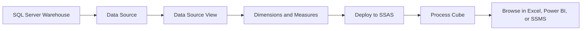
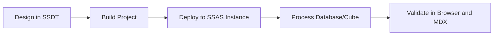
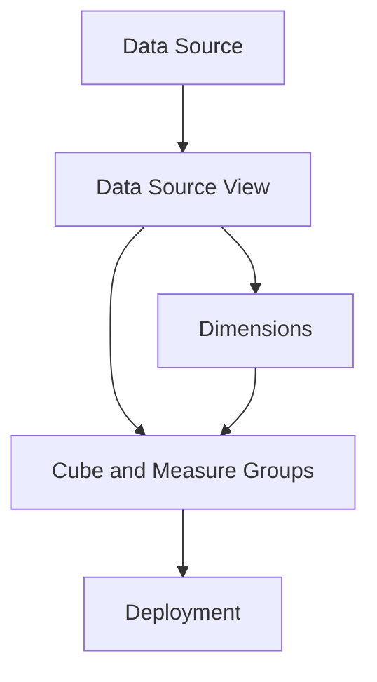
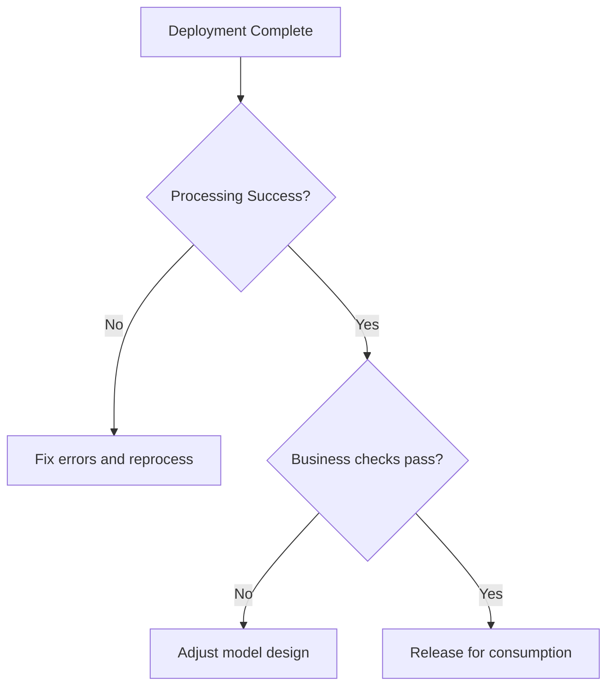
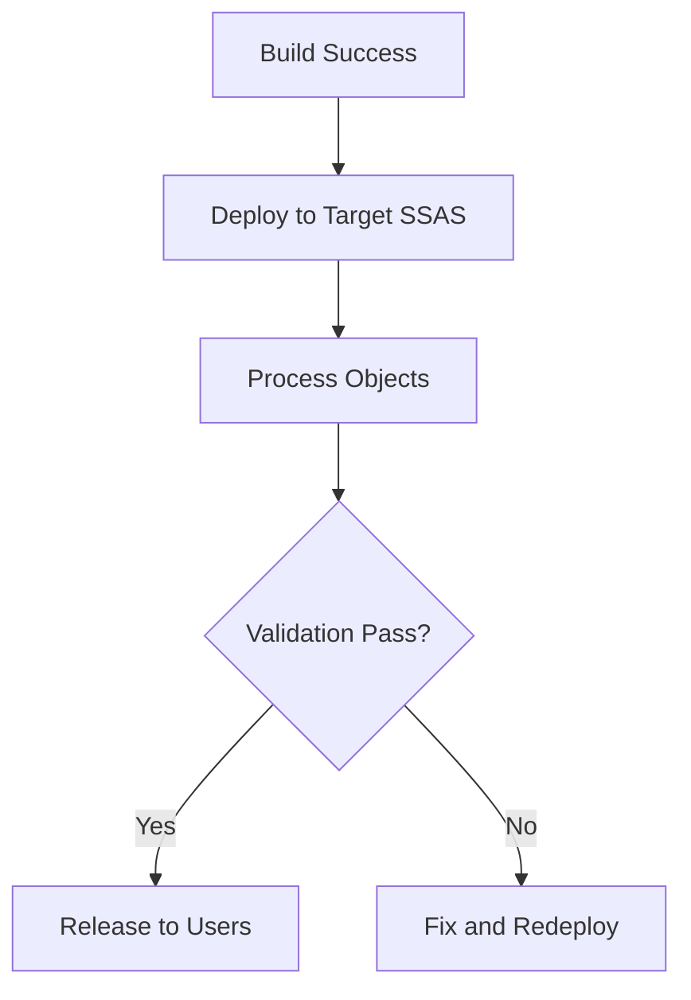

# Building and Deploying SSAS Cubes
## Day 01 | Assmang Pty Ltd — SSAS Fundamentals Training

---

## 🎯 Learning Objectives

By the end of this topic, participants will be able to:

1. Understand the end-to-end workflow for building a multidimensional cube in SSDT.
2. Create a cube from data source, DSV, dimensions, and measure groups.
3. Deploy and process a cube to an SSAS instance.
4. Perform validation checks before handing the cube to users.

---

## 📋 Topic Overview

**Dataset:** `v2_assmang_mining_extended.sql`  
**Difficulty:** Beginner (no prior SSAS experience required)  
**Estimated reading time:** 20-30 minutes

### What is this topic about?

This topic teaches you about **Building and Deploying SSAS Cubes**. If you have never worked with SQL Server Analysis Services before, don't worry — we will explain everything from scratch using plain language and real examples from Assmang's mining operations.

### Why does this matter to you?

As someone working at or with Assmang, you deal with data every day — production figures, costs, safety records, employee information. Right now, getting answers from that data probably involves:

- Asking someone in IT to write a report
- Waiting for Excel spreadsheets to be updated
- Running the same SQL queries over and over
- Not being sure if the numbers are up to date

SSAS solves these problems by creating a **pre-built analytical model** (called a "cube") that lets anyone with Excel or Power BI get instant answers without writing code.

### The Assmang training context

All examples in this course use data from Assmang's actual operations:

| Mine | What it produces | Where it is |
|------|-----------------|-------------|
| Beeshoek Mine | Iron Ore | Postmasburg, Northern Cape |
| Khumani Mine | Iron Ore | Kathu, Northern Cape |
| Black Rock Mine | Manganese | Hotazel, Northern Cape |
| Dwarsrivier Chrome Mine | Chrome | Burgersfort, Limpopo |
| Machadodorp Works | Chrome (processing) | Machadodorp, Mpumalanga |

---

## 🧠 Real-World Analogy (Plain English)

**Think of this topic like building and opening a new shop.**

Building a cube is like setting up a new shop. First you design the layout (data source view), then you stock the shelves (dimensions and measures), then you open the doors (deploy), and finally you turn on the lights so customers can see the products (process). The shop only becomes useful to customers after ALL these steps are complete.

> **Key insight:** SSAS takes complex data and makes it simple to explore. You don't need to be a programmer to use the results — you just need to know what question you want to answer.

---

## 1. Cube build workflow

### 💬 In plain English

Let's break down **cube build workflow** in the simplest possible terms:

**→** A typical workflow moves from relational source -> data source -> data source view -> dimensions -> cube -> deployment -> processing.

**→** Each stage introduces metadata that shapes the analytical experience.

### 📚 Detailed explanation

This concept is important because it directly affects how well the cube works for business users. Here is a deeper look:

**Point 1: A typical workflow moves from relational source -> data source -> data source view -> dimensions -> cube -> deployment -> processing.**

What this means in practice: When you apply this at Assmang, it means that a typical workflow moves from relational source -> data source -> data source view -> dimensions -> cube -> deployment -> processing. This is not just a technical exercise — it directly helps managers, engineers, and executives get better information faster.

**Point 2: Each stage introduces metadata that shapes the analytical experience.**

What this means in practice: When you apply this at Assmang, it means that each stage introduces metadata that shapes the analytical experience. This is not just a technical exercise — it directly helps managers, engineers, and executives get better information faster.

### 🏭 Assmang scenario

**Situation:** A production manager at Khumani Mine asks: "Can I see this month's iron ore output compared to last month, broken down by shift?"

**How cube build workflow helps:** Because the cube already has the right structure (dimensions for time and mine, measures for production), this question can be answered in seconds using Excel or Power BI — no SQL coding needed, no waiting for IT.

### ❓ Frequently Asked Questions

**Q: Do I need to be a programmer to understand cube build workflow?**  
A: No. This concept is about business logic and design thinking. The tools (SSDT) provide visual interfaces for most of the work.

**Q: What happens if we get cube build workflow wrong?**  
A: The cube will still work technically, but users may get confusing results, slow performance, or missing data. That's why we follow best practices from the start.

**Q: How long does it take to set up cube build workflow for a real project?**  
A: For a project the size of Assmang's training cube, this typically takes a few hours of design work plus a few hours of implementation and testing.

---

## 2. Data source and DSV

### 💬 In plain English

Let's break down **data source and dsv** in the simplest possible terms:

**→** The data source defines how SSDT connects to SQL Server.

**→** The Data Source View is the logical modelling layer that selects tables and relationships.

**→** A clean DSV makes later cube design easier and clearer.

### 📚 Detailed explanation

This concept is important because it directly affects how well the cube works for business users. Here is a deeper look:

**Point 1: The data source defines how SSDT connects to SQL Server.**

What this means in practice: When you apply this at Assmang, it means that the data source defines how ssdt connects to sql server. This is not just a technical exercise — it directly helps managers, engineers, and executives get better information faster.

**Point 2: The Data Source View is the logical modelling layer that selects tables and relationships.**

What this means in practice: When you apply this at Assmang, it means that the data source view is the logical modelling layer that selects tables and relationships. This is not just a technical exercise — it directly helps managers, engineers, and executives get better information faster.

**Point 3: A clean DSV makes later cube design easier and clearer.**

What this means in practice: When you apply this at Assmang, it means that a clean dsv makes later cube design easier and clearer. This is not just a technical exercise — it directly helps managers, engineers, and executives get better information faster.

### 🏭 Assmang scenario

**Situation:** A production manager at Khumani Mine asks: "Can I see this month's iron ore output compared to last month, broken down by shift?"

**How data source and dsv helps:** Because the cube already has the right structure (dimensions for time and mine, measures for production), this question can be answered in seconds using Excel or Power BI — no SQL coding needed, no waiting for IT.

### ❓ Frequently Asked Questions

**Q: Do I need to be a programmer to understand data source and dsv?**  
A: No. This concept is about business logic and design thinking. The tools (SSDT) provide visual interfaces for most of the work.

**Q: What happens if we get data source and dsv wrong?**  
A: The cube will still work technically, but users may get confusing results, slow performance, or missing data. That's why we follow best practices from the start.

**Q: How long does it take to set up data source and dsv for a real project?**  
A: For a project the size of Assmang's training cube, this typically takes a few hours of design work plus a few hours of implementation and testing.

---

## 3. Deployment and processing

### 💬 In plain English

Let's break down **deployment and processing** in the simplest possible terms:

**→** Deployment pushes the project metadata to an SSAS server.

**→** Processing loads data and builds the structures users actually query.

**→** Without successful processing, a deployed cube is not analytically usable.

### 📚 Detailed explanation

This concept is important because it directly affects how well the cube works for business users. Here is a deeper look:

**Point 1: Deployment pushes the project metadata to an SSAS server.**

What this means in practice: When you apply this at Assmang, it means that deployment pushes the project metadata to an ssas server. This is not just a technical exercise — it directly helps managers, engineers, and executives get better information faster.

**Point 2: Processing loads data and builds the structures users actually query.**

What this means in practice: When you apply this at Assmang, it means that processing loads data and builds the structures users actually query. This is not just a technical exercise — it directly helps managers, engineers, and executives get better information faster.

**Point 3: Without successful processing, a deployed cube is not analytically usable.**

What this means in practice: When you apply this at Assmang, it means that without successful processing, a deployed cube is not analytically usable. This is not just a technical exercise — it directly helps managers, engineers, and executives get better information faster.

### 🏭 Assmang scenario

**Situation:** A production manager at Khumani Mine asks: "Can I see this month's iron ore output compared to last month, broken down by shift?"

**How deployment and processing helps:** Because the cube already has the right structure (dimensions for time and mine, measures for production), this question can be answered in seconds using Excel or Power BI — no SQL coding needed, no waiting for IT.

### ❓ Frequently Asked Questions

**Q: Do I need to be a programmer to understand deployment and processing?**  
A: No. This concept is about business logic and design thinking. The tools (SSDT) provide visual interfaces for most of the work.

**Q: What happens if we get deployment and processing wrong?**  
A: The cube will still work technically, but users may get confusing results, slow performance, or missing data. That's why we follow best practices from the start.

**Q: How long does it take to set up deployment and processing for a real project?**  
A: For a project the size of Assmang's training cube, this typically takes a few hours of design work plus a few hours of implementation and testing.

---

## 4. Validation and readiness

### 💬 In plain English

Let's break down **validation and readiness** in the simplest possible terms:

**→** Validate measure totals, hierarchy browsing, key attributes, and security assumptions.

**→** A cube should be tested with both SSDT browser checks and client tool connectivity.

### 📚 Detailed explanation

This concept is important because it directly affects how well the cube works for business users. Here is a deeper look:

**Point 1: Validate measure totals, hierarchy browsing, key attributes, and security assumptions.**

What this means in practice: When you apply this at Assmang, it means that validate measure totals, hierarchy browsing, key attributes, and security assumptions. This is not just a technical exercise — it directly helps managers, engineers, and executives get better information faster.

**Point 2: A cube should be tested with both SSDT browser checks and client tool connectivity.**

What this means in practice: When you apply this at Assmang, it means that a cube should be tested with both ssdt browser checks and client tool connectivity. This is not just a technical exercise — it directly helps managers, engineers, and executives get better information faster.

### 🏭 Assmang scenario

**Situation:** A production manager at Khumani Mine asks: "Can I see this month's iron ore output compared to last month, broken down by shift?"

**How validation and readiness helps:** Because the cube already has the right structure (dimensions for time and mine, measures for production), this question can be answered in seconds using Excel or Power BI — no SQL coding needed, no waiting for IT.

### ❓ Frequently Asked Questions

**Q: Do I need to be a programmer to understand validation and readiness?**  
A: No. This concept is about business logic and design thinking. The tools (SSDT) provide visual interfaces for most of the work.

**Q: What happens if we get validation and readiness wrong?**  
A: The cube will still work technically, but users may get confusing results, slow performance, or missing data. That's why we follow best practices from the start.

**Q: How long does it take to set up validation and readiness for a real project?**  
A: For a project the size of Assmang's training cube, this typically takes a few hours of design work plus a few hours of implementation and testing.

---

## 📊 Architecture / Concept Diagram

The following diagram shows how this topic fits into the bigger picture:

### How to read this diagram

- **Left side:** Where your raw data lives (SQL Server database tables containing production, cost, safety, and employee data).
- **Middle:** Where SSAS transforms that raw data into an analytical structure (the cube with its dimensions, hierarchies, and measures).
- **Right side:** Where business users access the results (Excel pivot tables, Power BI dashboards, or MDX query results in SSMS).

### Why this matters

Without SSAS (the middle layer), every time a manager wants an answer, someone has to write SQL code against the raw database. With SSAS, the analytical structure is pre-built, so users can explore data independently using familiar tools like Excel.

---

## 📖 Key Terminology Reference

Here are the most important terms for this topic. Don't worry about memorising them all — you will learn them naturally through practice:

| Term | Plain English Definition | Example at Assmang |
|------|------------------------|-------------------|
| **Cube** | A pre-built analytical structure that lets users explore data from many angles | The "Assmang Mining Analytics" cube containing all production and cost data |
| **Dimension** | A category you use to slice data (like filters in Excel) | Mine, Date, Department, Employee — these are the "by what" categories |
| **Hierarchy** | A drill-down path from general to specific | Year → Quarter → Month → Day (time hierarchy) |
| **Member** | One specific value within a dimension | "Beeshoek Mine" is a member of the Mine dimension |
| **Measure** | A number you want to analyse | Tonnes Produced, Revenue in ZAR, Cost Per Tonne |
| **Measure Group** | A collection of related measures from one business area | Production Measures (tonnes + grade + revenue) |
| **Fact Table** | The database table that stores the raw numbers | FactProduction, FactOperatingCosts |
| **Processing** | Loading data into the cube and building pre-calculated summaries | Running a nightly job that refreshes yesterday's production data |
| **Aggregation** | A pre-calculated total or average stored for speed | Total tonnes per mine per month (calculated once, queried many times) |
| **MDX** | The query language used to ask questions of a cube | Similar to SQL, but designed for multidimensional analysis |
| **MOLAP** | Storage mode where data is stored inside the cube for maximum speed | Default choice for Assmang — gives sub-second query times |
| **ROLAP** | Storage mode where data stays in SQL Server (slower but always fresh) | Used when real-time data is more important than speed |
| **KPI** | A traffic-light indicator showing whether a target is being met | Production KPI: Green if >= 90% of target, Red if < 70% |
| **SSDT** | SQL Server Data Tools — the IDE where you design and build cubes | Visual Studio with the SSAS project templates |
| **SSMS** | SQL Server Management Studio — for administration and testing | Where you deploy cubes and run MDX queries |
| **Data Source View (DSV)** | A logical view of which database tables the cube uses | Selecting Dim_Mine, Dim_Date, FactProduction for inclusion |
| **Deployment** | Pushing your cube design from your computer to the SSAS server | Like publishing a website — makes it available to users |

---

## 🧭 Additional Diagrams

### Diagram 1: Build and Deploy Pipeline

### Diagram 2: Deployment Dependencies

### Diagram 3: Validation Gate

## 📌 Topic-Specific Summary

This topic turns design into a usable analytical product. The core lesson is simple: if build, deploy, and process are not done in the correct order, even a well-designed cube can appear broken to business users.

In a real project, deployment is not a single click activity. It is a controlled handover from developer intent to server reality, followed by validation that the numbers still match business expectations.

## Deep Dive in Layman Terms

Think of this like opening a new branch office. You do not just unlock the door. You set up power, verify systems, test phones, and only then allow customers in. SSAS deployment is the same sequence:

1. Build checks if your design compiles.
2. Deploy publishes objects to the server.
3. Process loads data into cube structures.
4. Validation confirms the output is trustworthy.

### Why this matters at Assmang

- Operations teams rely on daily and weekly summaries.
- If processing fails quietly, executives can make decisions on stale numbers.
- A disciplined deployment checklist protects business credibility.

### Clarity diagram: Safe release path

