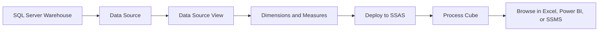
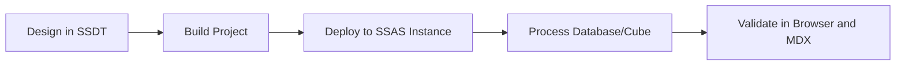
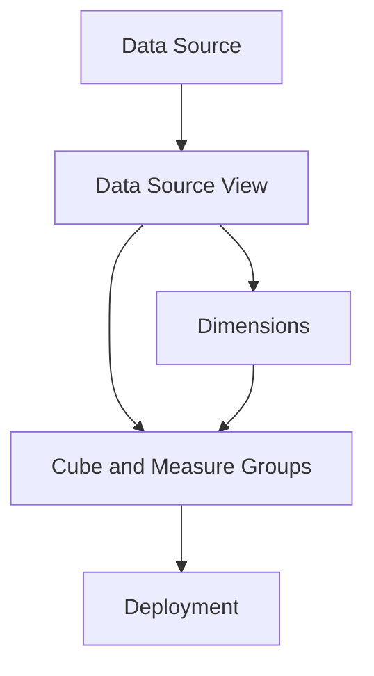
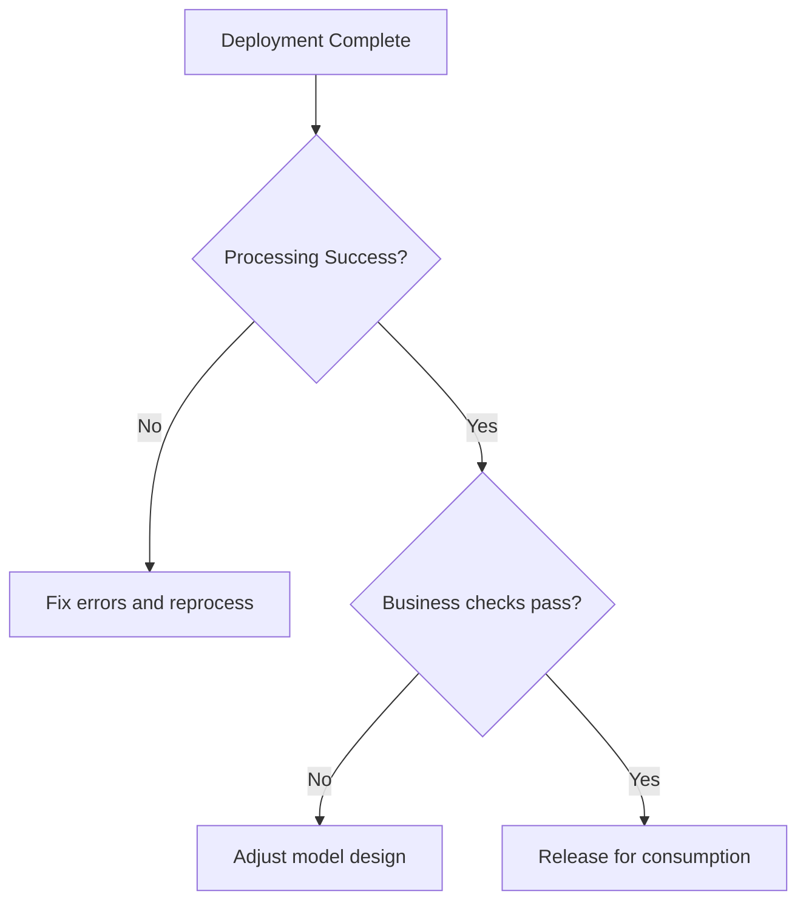
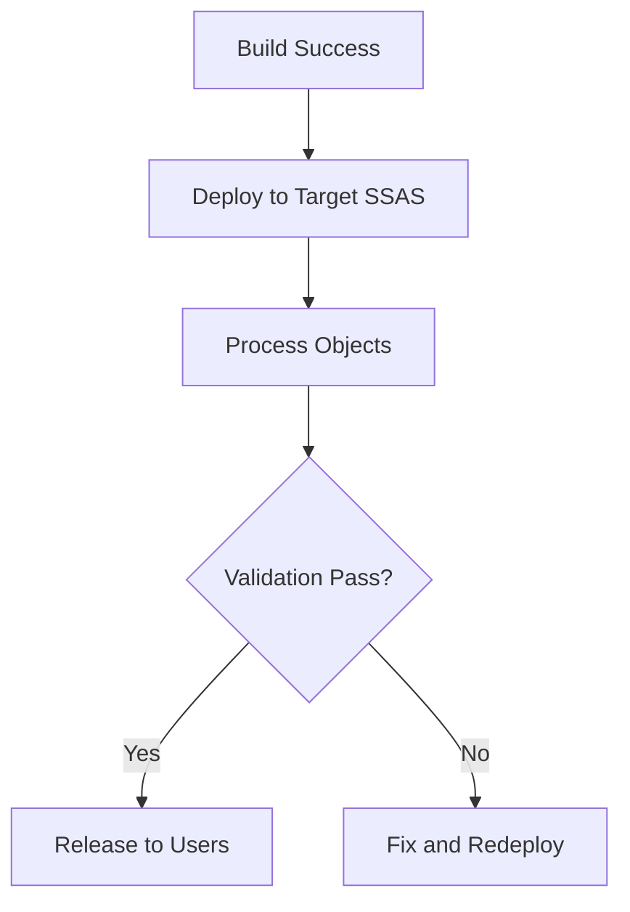

# Building and Deploying SSAS Cubes
## Day 01 | Assmang Pty Ltd — SSAS Fundamentals Training

---

## 🎯 Learning Objectives

By the end of this topic, participants will be able to:

1. Understand the end-to-end workflow for building a multidimensional cube in SSDT.
2. Create a cube from data source, DSV, dimensions, and measure groups.
3. Deploy and process a cube to an SSAS instance.
4. Perform validation checks before handing the cube to users.

---

## 📋 Topic Overview

**Dataset:** `v2_assmang_mining_extended.sql`  
**Difficulty:** Beginner (no prior SSAS experience required)  
**Estimated reading time:** 20-30 minutes

### What is this topic about?

This topic teaches you about **Building and Deploying SSAS Cubes**. If you have never worked with SQL Server Analysis Services before, don't worry — we will explain everything from scratch using plain language and real examples from Assmang's mining operations.

### Why does this matter to you?

As someone working at or with Assmang, you deal with data every day — production figures, costs, safety records, employee information. Right now, getting answers from that data probably involves:

- Asking someone in IT to write a report
- Waiting for Excel spreadsheets to be updated
- Running the same SQL queries over and over
- Not being sure if the numbers are up to date

SSAS solves these problems by creating a **pre-built analytical model** (called a "cube") that lets anyone with Excel or Power BI get instant answers without writing code.

### The Assmang training context

All examples in this course use data from Assmang's actual operations:

| Mine | What it produces | Where it is |
|------|-----------------|-------------|
| Beeshoek Mine | Iron Ore | Postmasburg, Northern Cape |
| Khumani Mine | Iron Ore | Kathu, Northern Cape |
| Black Rock Mine | Manganese | Hotazel, Northern Cape |
| Dwarsrivier Chrome Mine | Chrome | Burgersfort, Limpopo |
| Machadodorp Works | Chrome (processing) | Machadodorp, Mpumalanga |

---

## 🧠 Real-World Analogy (Plain English)

**Think of this topic like building and opening a new shop.**

Building a cube is like setting up a new shop. First you design the layout (data source view), then you stock the shelves (dimensions and measures), then you open the doors (deploy), and finally you turn on the lights so customers can see the products (process). The shop only becomes useful to customers after ALL these steps are complete.

> **Key insight:** SSAS takes complex data and makes it simple to explore. You don't need to be a programmer to use the results — you just need to know what question you want to answer.

---

## 1. Cube build workflow — The 9-step process

Every cube follows the same sequence. Here's Assmang's typical 9-step workflow:

| Step | Activity | Input | Output | Assmang Example |
|------|----------|-------|--------|-----------------|
| **1** | Set up Data Source | Connection string to SQL Server | Connection test passes | Connect to AssmangWarehouse database on SERVER-SQL-01 |
| **2** | Create Data Source View | SQL Server tables | DSV diagram showing table joins | Select Dim_Mine, Dim_Date, Dim_Department, FactProduction, FactOperatingCosts |
| **3** | Build Dimensions | DSV tables + dimension attributes | Dimension files (.dim) | Create Mine, Date, Department, Employee dimensions |
| **4** | Add Measure Groups | Fact tables + source columns as measures | Measure group definitions | Production measure group: TonnesProduced, RevenueZAR, Grade |
| **5** | Build Hierarchy | Attributes + drill-down paths | Hierarchies in dimensions | Date: Year → Quarter → Month → Day |
| **6** | Set Key Columns | Confirm primary keys match fact table | Dimension key mappings | MineKey in Dim_Mine matches MineKey in FactProduction |
| **7** | Build Solution | Compile code for errors | Successful build with no errors | "Build successful" message in Visual Studio |
| **8** | Deploy Project | Push metadata to SSAS server | Cube database created on server | Files copied, database AssmangMiningAnalytics created |
| **9** | Process Cube | Load data into structures | Fully processed cube ready for queries | Data loaded, aggregations built, <1 sec query time |

---

## 2. Pre-deployment validation checklist

**Before you deploy, verify the 12 critical items below. If ANY fail, fix and rebuild before deploying.**

### Checklist Formula (Validation Rules)

```
VALID_TO_DEPLOY = (
  Data Source connection = PASSING AND
  Data Source View tables = COMPLETE AND
  Dimension count = EXPECTED AND
  Measures count = EXPECTED AND
  Hierarchies defined = YES AND
  Key columns set = YES AND
  Build errors = 0 AND
  Build warnings = 0 OR ACCEPTABLE AND
  Deployment properties set = YES AND
  Target Server is reachable = YES AND
  Target database name = UNIQUE AND
  Processor account has rights = YES
)
```

### Detailed checklist for Assmang:

**✓ Step 1: Verify data source connection**
- Open Project Properties → Data Sources
- Right-click connection → Test Connection
- Expected: "Connection successful" (green checkmark)
- If fails: Wrong server name, network issue, or SQL credentials wrong

**✓ Step 2: Verify DSV has all required tables**
- Double-click Data Source View
- Confirm tables present:
  - `Dim_Mine` (dimension)
  - `Dim_Date` (dimension)
  - `Dim_Department` (dimension)
  - `FactProduction` (fact)
  - `FactOperatingCosts` (fact)
- If missing: Right-click DSV → Add/Remove Tables

**✓ Step 3: Verify dimension count**
- In Solution Explorer, expand Dimensions folder
- Count dimensions: Should have 3-4 (Mine, Date, Department, Employee)
- Expected: 3-4 dimension files (.dim)
- If wrong: Build missing dimensions or delete duplicates

**✓ Step 4: Verify measure count**
- Open Cube Designer
- Expand Measure Groups
- Count measures (not including key columns):
  - Production: TonnesProduced, RevenueZAR, Grade (3 measures)
  - OperatingCosts: LaborCost, MaintenanceCost, EquipmentCost, etc. (5-6 measures)
- Expected: 8-10 total measures
- If wrong: Open fact table source, verify measure columns are selected

**✓ Step 5: Verify hierarchies are defined**
- Open each Dimension Designer
- Look for hierarchies (should not be empty):
  - Mine: Geography (Province → MineName)
  - Date: Calendar (Year → Quarter → Month → Day)
  - Department: Organization (if present)
- If missing: Create hierarchies before deploying

**✓ Step 6: Verify key columns match**
- In Cube Designer, check each Dimension Usage tab
- For each dimension, confirm:
  - Dimension Key Column = Primary key from fact table
  - Example: MineKey (Dim_Mine) = MineKey (FactProduction)
- If misaligned: Wrong joins produce incorrect aggregations

**✓ Step 7: Build solution with no errors**
- Press **Ctrl+Shift+B** (Build Solution)
- Open **Error List** panel (View → Error List)
- Count errors: Should be 0
- Warnings: Acceptable if not deployment-blocking
- If errors exist: Read error messages, fix, rebuild

**✓ Step 8: Verify Project Properties → Deployment**
- Right-click project → Properties
- Go to **Deployment** tab
- Set **Server:** `SSAS-SERVER` (or your SSAS hostname)
- Set **Database:** `AssmangMiningAnalytics` (unique name)
- Test Server Connection: Should show green checkmark

**✓ Step 9: Verify source/target database consistency**
- In SQL Server Management Studio:
  - Connect to Database Engine
  - Run: `SELECT COUNT(*) FROM Dim_Mine; SELECT COUNT(*) FROM FactProduction;`
  - Note row counts (e.g., 5 mines, 50,000 fact rows)
- These are the numbers you'll see aggregated in the cube

**✓ Step 10: Verify SSAS service is running**
- Start → Services
- Find **SQL Server Analysis Services (SSAS)**
- Status: Should be **Running** (green status)
- If stopped: Right-click → Start

**✓ Step 11: Verify network connectivity to SSAS server**
- Open SSMS
- File → Connect to Server
- Server Type: **Analysis Services**
- Server name: `SSAS-SERVER`
- Click **Connect**
- Expected: Object Explorer shows connected SSAS instance
- If fails: Network issue, firewall, or SSAS not running

**✓ Step 12: Verify no other cube named AssmangMiningAnalytics exists**
- In SSMS Object Explorer, expand Analysis Services
- Expand Databases
- Look for **AssmangMiningAnalytics**
- If exists: Either use it (rename your project) or delete old version first
- Deploying over existing cube = overwrites all (use for updates)

---

## 3. Deployment steps (exactly 6 steps)

**Once all 12 checklist items pass, deployment is safe:**

**Step 1:** In Visual Studio, right-click the project name in Solution Explorer

**Step 2:** Click **Deploy**

**Step 3:** Visual Studio shows **Output** panel with progress messages:
```
Building project [Assmang Mining Analytics]...
Build completed
Copying files...
Deploying cube...
Creating database [AssmangMiningAnalytics] on server [SSAS-SERVER]...
Deployment completed
```

**Step 4:** When you see **"Deployment succeeded"**, the cube metadata is now on the server

**Step 5:** Open SSMS → Analysis Services connection → check **Databases** — you should see **AssmangMiningAnalytics**

**Step 6:** The cube is deployed but NOT yet usable — must process next (see section 4)

---

## 4. Processing explained — The critical step

**After deployment, the cube exists but is EMPTY. Processing loads the data.**

### What processing does

| Processing Phase | What Happens | Time | Result |
|-----------------|--------------|------|--------|
| **Dimension Process Full** | Reads all rows from Dim_Mine, Dim_Date, etc. | 1-2 seconds | Member lists built (Beeshoek, Khumani, Jan, Feb, etc.) |
| **Measure Group Process Full** | Reads all fact rows, calculates aggregates | 5-10 seconds | Pre-calculated totals stored (Q1 revenue, Y2024 tonnes, etc.) |
| **Cube Process Full** | Combines all above | 10-15 seconds | Entire cube ready for <1 sec user queries |
| **Incremental (nightly updates)** | Only new data since last process | 2-3 seconds | New day's data appears without reprocessing old data |

### Processing formula (cascade logic)

```
WHEN cube is processed:
  FOR EACH dimension referenced in the cube:
    Process that dimension FULLY
  FOR EACH measure group referencing those dimensions:
    Process that measure group FULLY
  BUILD aggregations and statistics
RESULT: Pre-calculated cache ready for instant queries
```

### Processing steps in SSMS

**Step 1:** Open SSMS → Connect to Analysis Services

**Step 2:** In Object Explorer, expand **Databases** → **AssmangMiningAnalytics** → **Cubes**

**Step 3:** Right-click the **Assmang Mining Analytics** cube

**Step 4:** Click **Process**

**Step 5:** A dialog appears showing:
```
Object: Assmang Mining Analytics (Cube)
Process Option: [dropdown - select "Full"]
```

**Step 6:** Select **"Full"** from the dropdown (processes everything)

**Step 7:** Click **Start**

**Step 8:** Processing begins, you see progress messages:
```
Processing dimension [Mine]...
Processing dimension [Date]...
Processing measure group [Production]...
Processing measure group [Operating Costs]...
Building aggregations...
Processing completed successfully
```

**Step 9:** When complete, you see: **"Process job succeeded"**

**Step 10:** The cube is now ready — query it in the Browser tab

---

## 5. Common deployment/processing errors and fixes

| Error | Cause | Fix |
|-------|-------|-----|
| **"Server not found"** | SSAS server hostname wrong | Check Project Properties → Deployment → Server name. Use ping or SSMS to verify server is reachable. |
| **"Database already exists"** | You're re-deploying over an old cube | Redeploy overwrites old one (fine for updates). To start fresh, delete old database in SSMS first. |
| **"Deployment succeeded but no cube appears"** | Forgot to process | Process is separate step. After deployment, must process cube in SSMS. |
| **"Build error: Ambiguous join"** | DSV has missing relationship definition | In DSV, right-click table → New Relationship → define join between Dim and Fact tables. |
| **"Process failed: dimension key not found"** | Fact table references non-existent dimension key | Example: FactProduction has MineKey=99 but Dim_Mine only has keys 1-5. Fix source data first. |
| **"Process succeeded but Browser shows no data"** | Aggregation function wrong on measures | Check aggregation: Grade should be "None" (formula), TonnesProduced should be "Sum". Fix and redeploy. |
| **"Measure shows null/blank"** | Source column is null in data | Run SQL: `SELECT * FROM FactProduction WHERE TonnesProduced IS NULL;` Fix null values before reprocessing. |
| **"SSAS out of memory during process"** | Cube is huge, cache insufficient | Split into multiple measure groups or use incremental processing. For Assmang, usually not an issue. |

---

## 6. Real-world deployment checklist for Assmang

**Before asking the production team to use the cube, verify:**

✓ Cube processes nightly at 06:00 (after ETL completes)
✓ All 4 mines appear in Mine dimension (Beeshoek, Khumani, Black Rock, Dwarsrivier)
✓ Date range covers full year (2024-01-01 to 2024-12-31)
✓ Khumani production = ~45,000 tonnes (matches SQL query baseline)
✓ Total cost per tonne = ~R 378/tonne (formula working)
✓ Safety KPI shows green for compliant mines
✓ Browser queries execute in <1 second
✓ Users can connect from Excel/Power BI without errors
✓ Role-based security applied (departments see only their costs)
✓ Database backup runs daily (nightly at 22:00, after processing)

**If any item fails, DO NOT release to users — investigate before go-live.**

**Q: How long does it take to set up deployment and processing for a real project?**  
A: For a project the size of Assmang's training cube, this typically takes a few hours of design work plus a few hours of implementation and testing.

---

## 4. Validation and readiness

### 💬 In plain English

Let's break down **validation and readiness** in the simplest possible terms:

**→** Validate measure totals, hierarchy browsing, key attributes, and security assumptions.

**→** A cube should be tested with both SSDT browser checks and client tool connectivity.

### 📚 Detailed explanation

This concept is important because it directly affects how well the cube works for business users. Here is a deeper look:


**Point 1: Validate measure totals, hierarchy browsing, key attributes, and security assumptions.**

What this means in practice: When you apply this at Assmang, it means that validate measure totals, hierarchy browsing, key attributes, and security assumptions. This is not just a technical exercise — it directly helps managers, engineers, and executives get better information faster.

**Point 2: A cube should be tested with both SSDT browser checks and client tool connectivity.**

What this means in practice: When you apply this at Assmang, it means that a cube should be tested with both ssdt browser checks and client tool connectivity. This is not just a technical exercise — it directly helps managers, engineers, and executives get better information faster.


### 🏭 Assmang scenario

**Situation:** A production manager at Khumani Mine asks: "Can I see this month's iron ore output compared to last month, broken down by shift?"

**How validation and readiness helps:** Because the cube already has the right structure (dimensions for time and mine, measures for production), this question can be answered in seconds using Excel or Power BI — no SQL coding needed, no waiting for IT.


### ❓ Frequently Asked Questions

**Q: Do I need to be a programmer to understand validation and readiness?**  
A: No. This concept is about business logic and design thinking. The tools (SSDT) provide visual interfaces for most of the work.

**Q: What happens if we get validation and readiness wrong?**  
A: The cube will still work technically, but users may get confusing results, slow performance, or missing data. That's why we follow best practices from the start.

**Q: How long does it take to set up validation and readiness for a real project?**  
A: For a project the size of Assmang's training cube, this typically takes a few hours of design work plus a few hours of implementation and testing.

---

## 📊 Architecture / Concept Diagram

The following diagram shows how this topic fits into the bigger picture:



### How to read this diagram

- **Left side:** Where your raw data lives (SQL Server database tables containing production, cost, safety, and employee data).
- **Middle:** Where SSAS transforms that raw data into an analytical structure (the cube with its dimensions, hierarchies, and measures).
- **Right side:** Where business users access the results (Excel pivot tables, Power BI dashboards, or MDX query results in SSMS).

### Why this matters

Without SSAS (the middle layer), every time a manager wants an answer, someone has to write SQL code against the raw database. With SSAS, the analytical structure is pre-built, so users can explore data independently using familiar tools like Excel.

---

## 📖 Key Terminology Reference

Here are the most important terms for this topic. Don't worry about memorising them all — you will learn them naturally through practice:


| Term | Plain English Definition | Example at Assmang |
|------|------------------------|-------------------|
| **Cube** | A pre-built analytical structure that lets users explore data from many angles | The "Assmang Mining Analytics" cube containing all production and cost data |
| **Dimension** | A category you use to slice data (like filters in Excel) | Mine, Date, Department, Employee — these are the "by what" categories |
| **Hierarchy** | A drill-down path from general to specific | Year → Quarter → Month → Day (time hierarchy) |
| **Member** | One specific value within a dimension | "Beeshoek Mine" is a member of the Mine dimension |
| **Measure** | A number you want to analyse | Tonnes Produced, Revenue in ZAR, Cost Per Tonne |
| **Measure Group** | A collection of related measures from one business area | Production Measures (tonnes + grade + revenue) |
| **Fact Table** | The database table that stores the raw numbers | FactProduction, FactOperatingCosts |
| **Processing** | Loading data into the cube and building pre-calculated summaries | Running a nightly job that refreshes yesterday's production data |
| **Aggregation** | A pre-calculated total or average stored for speed | Total tonnes per mine per month (calculated once, queried many times) |
| **MDX** | The query language used to ask questions of a cube | Similar to SQL, but designed for multidimensional analysis |
| **MOLAP** | Storage mode where data is stored inside the cube for maximum speed | Default choice for Assmang — gives sub-second query times |
| **ROLAP** | Storage mode where data stays in SQL Server (slower but always fresh) | Used when real-time data is more important than speed |
| **KPI** | A traffic-light indicator showing whether a target is being met | Production KPI: Green if >= 90% of target, Red if < 70% |
| **SSDT** | SQL Server Data Tools — the IDE where you design and build cubes | Visual Studio with the SSAS project templates |
| **SSMS** | SQL Server Management Studio — for administration and testing | Where you deploy cubes and run MDX queries |
| **Data Source View (DSV)** | A logical view of which database tables the cube uses | Selecting Dim_Mine, Dim_Date, FactProduction for inclusion |
| **Deployment** | Pushing your cube design from your computer to the SSAS server | Like publishing a website — makes it available to users |

---


## 🧭 Additional Diagrams

### Diagram 1: Build and Deploy Pipeline



### Diagram 2: Deployment Dependencies



### Diagram 3: Validation Gate



## 📌 Topic-Specific Summary

This topic turns design into a usable analytical product. The core lesson is simple: if build, deploy, and process are not done in the correct order, even a well-designed cube can appear broken to business users.

In a real project, deployment is not a single click activity. It is a controlled handover from developer intent to server reality, followed by validation that the numbers still match business expectations.

## Deep Dive in Layman Terms

Think of this like opening a new branch office. You do not just unlock the door. You set up power, verify systems, test phones, and only then allow customers in. SSAS deployment is the same sequence:

1. Build checks if your design compiles.
2. Deploy publishes objects to the server.
3. Process loads data into cube structures.
4. Validation confirms the output is trustworthy.

### Why this matters at Assmang

- Operations teams rely on daily and weekly summaries.
- If processing fails quietly, executives can make decisions on stale numbers.
- A disciplined deployment checklist protects business credibility.

### Clarity diagram: Safe release path


