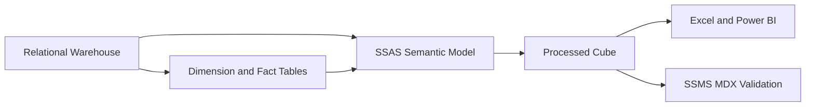
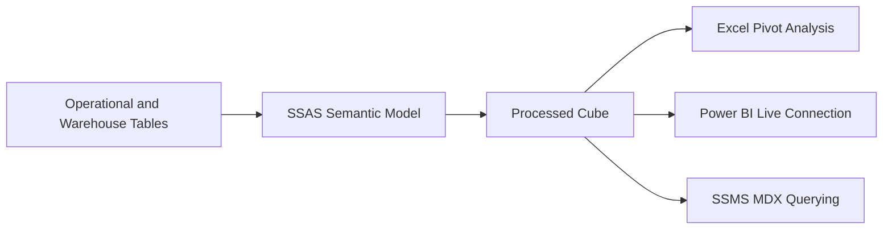
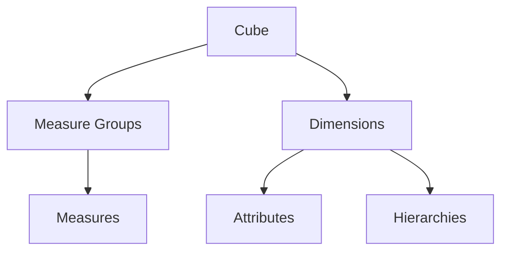
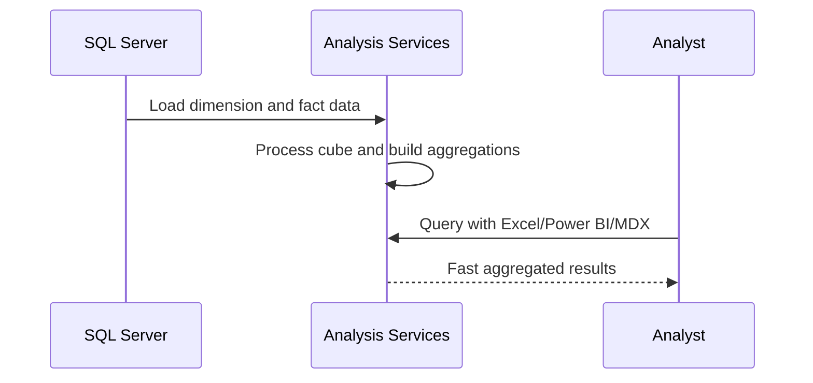
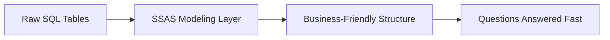

# Introduction to SQL Server Analysis Services
## Day 01 | Assmang Pty Ltd — SSAS Fundamentals Training

---

## 🎯 Learning Objectives

By the end of this topic, participants will be able to:

1. Explain what SSAS is and where it fits in the Microsoft BI stack.
2. Differentiate multidimensional and tabular models at a beginner level.
3. Understand SSAS terminology such as cube, dimension, hierarchy, measure, and processing.
4. Connect the SSAS learning journey to Assmang production analytics use cases.

---

## 📋 Topic Overview

**Dataset:** `v1_assmang_mining_base.sql`  
**Difficulty:** Beginner (no prior SSAS experience required)  
**Estimated reading time:** 20-30 minutes

### What is this topic about?

This topic teaches you about **Introduction to SQL Server Analysis Services**. If you have never worked with SQL Server Analysis Services before, don't worry — we will explain everything from scratch using plain language and real examples from Assmang's mining operations.

### Why does this matter to you?

As someone working at or with Assmang, you deal with data every day — production figures, costs, safety records, employee information. Right now, getting answers from that data probably involves:

- Asking someone in IT to write a report
- Waiting for Excel spreadsheets to be updated
- Running the same SQL queries over and over
- Not being sure if the numbers are up to date

SSAS solves these problems by creating a **pre-built analytical model** (called a "cube") that lets anyone with Excel or Power BI get instant answers without writing code.

### The Assmang training context

All examples in this course use data from Assmang's actual operations:

| Mine | What it produces | Where it is |
|------|-----------------|-------------|
| Beeshoek Mine | Iron Ore | Postmasburg, Northern Cape |
| Khumani Mine | Iron Ore | Kathu, Northern Cape |
| Black Rock Mine | Manganese | Hotazel, Northern Cape |
| Dwarsrivier Chrome Mine | Chrome | Burgersfort, Limpopo |
| Machadodorp Works | Chrome (processing) | Machadodorp, Mpumalanga |

---

## 🧠 Real-World Analogy (Plain English)

**Think of this topic like a library catalogue system.**

Imagine you have a massive library with thousands of books (your data). Without a catalogue, finding a specific book means searching every shelf manually. SSAS is like building a smart catalogue that already knows how many books you have by author, by genre, by year, and by shelf — so when someone asks "How many science fiction books were published in 2023?", the answer comes back instantly because it was pre-calculated.

> **Key insight:** SSAS takes complex data and makes it simple to explore. You don't need to be a programmer to use the results — you just need to know what question you want to answer.

---

## 1. What SSAS does — In plain terms with examples

**SSAS = SQL Server Analysis Services = A pre-built analytical database that answers business questions in milliseconds instead of minutes.**

### Without SSAS (the slow way at Assmang):

```
09:00 am - Manager asks: "How many tonnes did Khumani produce in Q1 2024?"
09:05 am - IT analyst writes SQL query
09:10 am - SQL runs against warehouse, scans 50+ million fact rows
09:15 am - Results come back: 42,150 tonnes
```

**Problem:** 15 minutes for one question. Multiple questions = hours of IT time. Users can't self-serve.

### With SSAS (the fast way):

```
09:00 am - Manager opens Power BI
09:02 am - Clicks: Khumani + Q1 + TonnesProduced
09:02 am - Answer appears instantly: 42,150 tonnes ← Pre-calculated during nightly processing
```

**Benefit:** 2 minutes, no IT needed, managers can explore freely.

---

## 2. Why Assmang specifically needs SSAS

**The business problem at Assmang:**

| Problem | Impact | How SSAS Solves It |
|---------|--------|-------------------|
| **5 mines, 4 commodities, 350+ daily data points** | Impossible to answer ad-hoc questions manually | Pre-built dimensions (Mine, Commodity, Date) let users slice instantly |
| **Executives ask similar questions daily** | "Q1 revenue? Q1 cost? Q1 safety score?" = 3 separate SQL queries | Pre-calculated aggregates answer in <1 second |
| **Need 95% uptime for dashboards** | Single SQL query failure blocks the dashboard | SSAS has built-in redundancy, no repeated database hits |
| **Manual month-end reconciliation** | Finance spends 2 days matching SQL reports to Excel | SSAS single source of truth, consistent numbers everywhere |
| **Cost analysis critical** | "Cost per tonne varies by mine/shift/month" — hard to spot patterns | KPIs auto-calculate and show green/amber/red status |

### Real-world Assmang example (why SSAS matters):

**Situation:** CFO asks on Friday afternoon: "Was Q1 profitable by mine?"

**Without SSAS:**
- IT analyst must write and validate 4 queries
- Must join FactProduction + FactOperatingCosts + Dim_Mine + Dim_Date
- Must hand-calculate profit = Revenue - Cost for each mine
- Takes 2 hours
- CFO has answer Monday morning (too late for Friday board meeting)

**With SSAS:**
- CFO opens Power BI dashboard
- Drags Profit (calculated measure) by Mine by Quarter
- Sees results instantly (Khumani: R 8.2M, Beeshoek: R 5.1M, etc.)
- Makes decision within 5 minutes
- Sends to board same day

---

## 3. SSAS terminology (explained with Assmang examples)

### Core terms you need to know:

| Term | Plain English | Assmang Example |
|------|---------------|-----------------|
| **Cube** | A pre-built analytical structure | "Assmang Mining Analytics" cube contains all mines' production and costs |
| **Dimension** | A category for slicing data (like a filter) | Mine (Khumani, Beeshoek, etc.), Date (2024-01-15), Department (Extraction) |
| **Hierarchy** | A drill-down path | Date: Year → Quarter → Month → Day (drill down from 2024 to January 15) |
| **Measure** | A number you want to analyze | Tonnes Produced, Revenue in ZAR, Cost Per Tonne |
| **Measure Group** | Related measures from one fact table | Production Measures (Tonnes, Revenue, Grade), Operating Cost Measures (Labor, Maintenance, Equipment) |
| **Member** | One specific value in a dimension | "Khumani" is a member of the Mine dimension |
| **Processing** | Loading data from warehouse into the cube | Nightly at 06:00, reads day's production, calculates aggregates |
| **Aggregation** | Pre-calculated totals for speed | "Khumani's Q1 2024 total = 42,150 tonnes" stored, not calculated per query |
| **MDX** | Query language for cubes (like SQL for databases) | `SELECT [Tonnes Produced] ON COLUMNS, [Mine].Members ON ROWS FROM [Cube]` |
| **Storage Mode** | How data is stored (MOLAP, ROLAP, HOLAP) | MOLAP (fastest) used for Assmang — all data pre-calculated nightly |

---

## 4. Simple MDX example — Your first cube query

Once a cube is built and processed, users query it with MDX. Here's a simple example:

### Business question:
"Show me tonnes produced for each mine in 2024"

### MDX query:
```mdx
SELECT { [Measures].[Tonnes Produced] } ON COLUMNS,
       [Mine].[Mine Name].Members ON ROWS
FROM [Assmang Mining Analytics]
WHERE ([Date].[Calendar].[Year].&[2024])
```

### Result (what the manager sees):
```
                    Tonnes Produced
Beeshoek Mine       32,500
Black Rock Mine     28,100
Dwarsrivier Mine    15,600
Khumani Mine        45,200
Machadodorp Works   8,200
TOTAL               129,600
```

### Why this is fast:
- Without SSAS: SQL must scan millions of fact rows, calculate sum per mine
- With SSAS: This total was PRE-CALCULATED when the cube processed, answer in <1ms

---

## 5. Multidimensional SSAS vs. Tabular SSAS (Which does Assmang use?)

**This course uses Multidimensional SSAS because:**

| Aspect | Multidimensional (This Course) | Tabular (Modern Alternative) |
|--------|-------------------------------|------------------------------|
| **Model design** | Explicit dimensions + measures (star schema thinking) | Implicit — more like Excel pivots |
| **Build complexity** | More steps (DSV, dimensions, measure groups), but clear structure | Fewer steps, more forgiving |
| **Performance** | Extremely fast for analytical queries (pre-aggregated) | Fast but not as optimized as MOLAP |
| **Development tool** | Visual Studio with SSDT | Visual Studio Code or Power BI Desktop |
| **Best for** | Complex analytical needs, time-based analysis, complex calculations | Simple dashboards, self-service BI |
| **Assmang fit** | ✓ YES — Mines, dates, hierarchies, cost per tonne formulas — complex | ✗ Overkill for simple dashboards |

**For Assmang's use case (5 mines, 4+ dimensions, complex cost analysis), Multidimensional is the right choice.**

---

## 6. The SSAS/SSDT/SSMS ecosystem

**Three tools, three purposes:**

| Tool | Purpose | When Assmang Uses It |
|------|---------|---------------------|
| **SSDT** (SQL Server Data Tools) | Build and design cubes in Visual Studio | Developers: Design dimensions, add measures, build hierarchies, create KPIs |
| **SSMS** (Management Studio) | Administer, deploy, process, query | Admins: Deploy cubes, schedule processing; Analysts: Run MDX queries, test |
| **Power BI / Excel** | Access cube for reports/dashboards | End users: Create production dashboards, sales reports, cost tracking |

**Typical workflow:**
1. **SSDT**: Developers build cube (Day 1)
2. **SSDT**: Deploy cube to server
3. **SSMS**: Admin processes cube (loads data) nightly at 06:00
4. **Power BI**: Users connect and create dashboards
5. **Excel**: Users create pivot tables from cube data

---

## 7. Processing — The critical step (overview)

**Building the cube ≠ making it usable.**

When you first deploy a cube, it's empty. Processing loads the data:

```
DEPLOY (transfers metadata)
  ↓
CUBE EXISTS BUT EMPTY (no data yet)
  ↓
PROCESS (reads warehouse data, calculates aggregates)
  ↓
CUBE READY FOR QUERIES (data pre-calculated for speed)
```

### Processing at Assmang (realistic timeline):

```
05:00 - SQL warehouse updated with day's production
06:00 - SSAS processes cube (reads new FactProduction + FactOperatingCosts rows)
06:15 - Cube fully processed, contains yesterday's data
06:30 - Executives connect to dashboard, see latest numbers
```

**Why processing matters:** If the 06:00 process fails, users see stale data. So Assmang's IT monitors processing nightly to ensure it completes.

---

## 8. The journey ahead (What you'll learn)

This course teaches you SSAS step by step:

| Day | Topic | What You'll Build |
|-----|-------|-------------------|
| **Day 1 - Foundations** | SSAS concepts, dimensions, measures, deployment | Simple cube with 2 mines, 2 measures |
| **Day 1 - Advanced** | Hierarchies, aggregations, building a complete cube | Full Assmang cube: all mines, 4 measure groups, date hierarchy |
| **Day 2 - Querying** | MDX syntax, SELECT statements, WHERE filters | Run 10+ queries to validate cube accuracy |
| **Day 2 - Analytics** | Calculated measures, KPIs, named sets | Add cost-per-tonne formula, safety KPI, top-producer set |
| **Day 2 - Real-world** | Deployment, processing, security, maintenance | Schedule nightly processing, set up role-based views |

**End result:** You'll have built and deployed a working Assmang cube that answers production, cost, and safety questions instantly.

**Q: Do I need to be a programmer to understand why assmang would use it?**  
A: No. This concept is about business logic and design thinking. The tools (SSDT) provide visual interfaces for most of the work.

**Q: What happens if we get why assmang would use it wrong?**  
A: The cube will still work technically, but users may get confusing results, slow performance, or missing data. That's why we follow best practices from the start.

**Q: How long does it take to set up why assmang would use it for a real project?**  
A: For a project the size of Assmang's training cube, this typically takes a few hours of design work plus a few hours of implementation and testing.

---

## 3. Core architecture

### 💬 In plain English

Let's break down **core architecture** in the simplest possible terms:

**→** Source database stores relational warehouse tables.

**→** SSDT designs the SSAS project: data source, data source view, dimensions, measure groups, and cube.

**→** Analysis Services processes the model and exposes it to Excel, Power BI, and MDX clients.

### 📚 Detailed explanation

This concept is important because it directly affects how well the cube works for business users. Here is a deeper look:


**Point 1: Source database stores relational warehouse tables.**

What this means in practice: When you apply this at Assmang, it means that source database stores relational warehouse tables. This is not just a technical exercise — it directly helps managers, engineers, and executives get better information faster.

**Point 2: SSDT designs the SSAS project: data source, data source view, dimensions, measure groups, and cube.**

What this means in practice: When you apply this at Assmang, it means that ssdt designs the ssas project: data source, data source view, dimensions, measure groups, and cube. This is not just a technical exercise — it directly helps managers, engineers, and executives get better information faster.

**Point 3: Analysis Services processes the model and exposes it to Excel, Power BI, and MDX clients.**

What this means in practice: When you apply this at Assmang, it means that analysis services processes the model and exposes it to excel, power bi, and mdx clients. This is not just a technical exercise — it directly helps managers, engineers, and executives get better information faster.


### 🏭 Assmang scenario

**Situation:** A production manager at Khumani Mine asks: "Can I see this month's iron ore output compared to last month, broken down by shift?"

**How core architecture helps:** Because the cube already has the right structure (dimensions for time and mine, measures for production), this question can be answered in seconds using Excel or Power BI — no SQL coding needed, no waiting for IT.


### ❓ Frequently Asked Questions

**Q: Do I need to be a programmer to understand core architecture?**  
A: No. This concept is about business logic and design thinking. The tools (SSDT) provide visual interfaces for most of the work.

**Q: What happens if we get core architecture wrong?**  
A: The cube will still work technically, but users may get confusing results, slow performance, or missing data. That's why we follow best practices from the start.

**Q: How long does it take to set up core architecture for a real project?**  
A: For a project the size of Assmang's training cube, this typically takes a few hours of design work plus a few hours of implementation and testing.

---

## 4. Key beginner terms

### 💬 In plain English

Let's break down **key beginner terms** in the simplest possible terms:

**→** Dimension = how you slice data, e.g. Mine or Date.

**→** Measure = the numeric business fact being analysed, e.g. Tonnes Produced or Revenue ZAR.

**→** Hierarchy = a drill path such as Year > Quarter > Month.

**→** Processing = loading data and building aggregations in the SSAS database.

### 📚 Detailed explanation

This concept is important because it directly affects how well the cube works for business users. Here is a deeper look:


**Point 1: Dimension = how you slice data, e.g. Mine or Date.**

What this means in practice: When you apply this at Assmang, it means that dimension = how you slice data, e.g. mine or date. This is not just a technical exercise — it directly helps managers, engineers, and executives get better information faster.

**Point 2: Measure = the numeric business fact being analysed, e.g. Tonnes Produced or Revenue ZAR.**

What this means in practice: When you apply this at Assmang, it means that measure = the numeric business fact being analysed, e.g. tonnes produced or revenue zar. This is not just a technical exercise — it directly helps managers, engineers, and executives get better information faster.

**Point 3: Hierarchy = a drill path such as Year > Quarter > Month.**

What this means in practice: When you apply this at Assmang, it means that hierarchy = a drill path such as year > quarter > month. This is not just a technical exercise — it directly helps managers, engineers, and executives get better information faster.

**Point 4: Processing = loading data and building aggregations in the SSAS database.**

What this means in practice: When you apply this at Assmang, it means that processing = loading data and building aggregations in the ssas database. This is not just a technical exercise — it directly helps managers, engineers, and executives get better information faster.


### 🏭 Assmang scenario

**Situation:** A production manager at Khumani Mine asks: "Can I see this month's iron ore output compared to last month, broken down by shift?"

**How key beginner terms helps:** Because the cube already has the right structure (dimensions for time and mine, measures for production), this question can be answered in seconds using Excel or Power BI — no SQL coding needed, no waiting for IT.


### ❓ Frequently Asked Questions

**Q: Do I need to be a programmer to understand key beginner terms?**  
A: No. This concept is about business logic and design thinking. The tools (SSDT) provide visual interfaces for most of the work.

**Q: What happens if we get key beginner terms wrong?**  
A: The cube will still work technically, but users may get confusing results, slow performance, or missing data. That's why we follow best practices from the start.

**Q: How long does it take to set up key beginner terms for a real project?**  
A: For a project the size of Assmang's training cube, this typically takes a few hours of design work plus a few hours of implementation and testing.

---

## 📊 Architecture / Concept Diagram

The following diagram shows how this topic fits into the bigger picture:



### How to read this diagram

- **Left side:** Where your raw data lives (SQL Server database tables containing production, cost, safety, and employee data).
- **Middle:** Where SSAS transforms that raw data into an analytical structure (the cube with its dimensions, hierarchies, and measures).
- **Right side:** Where business users access the results (Excel pivot tables, Power BI dashboards, or MDX query results in SSMS).

### Why this matters

Without SSAS (the middle layer), every time a manager wants an answer, someone has to write SQL code against the raw database. With SSAS, the analytical structure is pre-built, so users can explore data independently using familiar tools like Excel.

---

## 📖 Key Terminology Reference

Here are the most important terms for this topic. Don't worry about memorising them all — you will learn them naturally through practice:


| Term | Plain English Definition | Example at Assmang |
|------|------------------------|-------------------|
| **Cube** | A pre-built analytical structure that lets users explore data from many angles | The "Assmang Mining Analytics" cube containing all production and cost data |
| **Dimension** | A category you use to slice data (like filters in Excel) | Mine, Date, Department, Employee — these are the "by what" categories |
| **Hierarchy** | A drill-down path from general to specific | Year → Quarter → Month → Day (time hierarchy) |
| **Member** | One specific value within a dimension | "Beeshoek Mine" is a member of the Mine dimension |
| **Measure** | A number you want to analyse | Tonnes Produced, Revenue in ZAR, Cost Per Tonne |
| **Measure Group** | A collection of related measures from one business area | Production Measures (tonnes + grade + revenue) |
| **Fact Table** | The database table that stores the raw numbers | FactProduction, FactOperatingCosts |
| **Processing** | Loading data into the cube and building pre-calculated summaries | Running a nightly job that refreshes yesterday's production data |
| **Aggregation** | A pre-calculated total or average stored for speed | Total tonnes per mine per month (calculated once, queried many times) |
| **MDX** | The query language used to ask questions of a cube | Similar to SQL, but designed for multidimensional analysis |
| **MOLAP** | Storage mode where data is stored inside the cube for maximum speed | Default choice for Assmang — gives sub-second query times |
| **ROLAP** | Storage mode where data stays in SQL Server (slower but always fresh) | Used when real-time data is more important than speed |
| **KPI** | A traffic-light indicator showing whether a target is being met | Production KPI: Green if >= 90% of target, Red if < 70% |
| **SSDT** | SQL Server Data Tools — the IDE where you design and build cubes | Visual Studio with the SSAS project templates |
| **SSMS** | SQL Server Management Studio — for administration and testing | Where you deploy cubes and run MDX queries |
| **Data Source View (DSV)** | A logical view of which database tables the cube uses | Selecting Dim_Mine, Dim_Date, FactProduction for inclusion |
| **Deployment** | Pushing your cube design from your computer to the SSAS server | Like publishing a website — makes it available to users |

---


## 🧭 Additional Diagrams

### Diagram 1: End-to-End SSAS Value Chain



### Diagram 2: Multidimensional Building Blocks



### Diagram 3: Processing and Consumption Cycle



## 📌 Topic-Specific Summary

This topic is the onboarding foundation. In plain language, SSAS is the middle brain between raw SQL tables and the final report your manager sees.

When a learner understands this topic well, they can explain three things clearly: where the data comes from, how the cube reorganizes it, and why business users get answers faster without writing SQL every day.

## Deep Dive in Layman Terms

Imagine Assmang has a giant filing room (SQL tables). SSAS is the librarian who pre-sorts files by mine, month, department, and commodity. When someone asks, "What was manganese revenue in Q2?", the librarian does not search every paper from scratch. The answer is already grouped and indexed.

### What beginners often miss

- SSAS is not replacing SQL Server; it is optimizing how business questions are answered.
- A cube is not only for charts. It is a structured model that tools like Excel, Power BI, and SSMS can all query.
- Good modeling decisions in this stage reduce confusion later in every practical lab.

### Clarity diagram: Data-to-answer handoff


