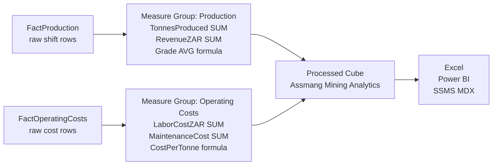
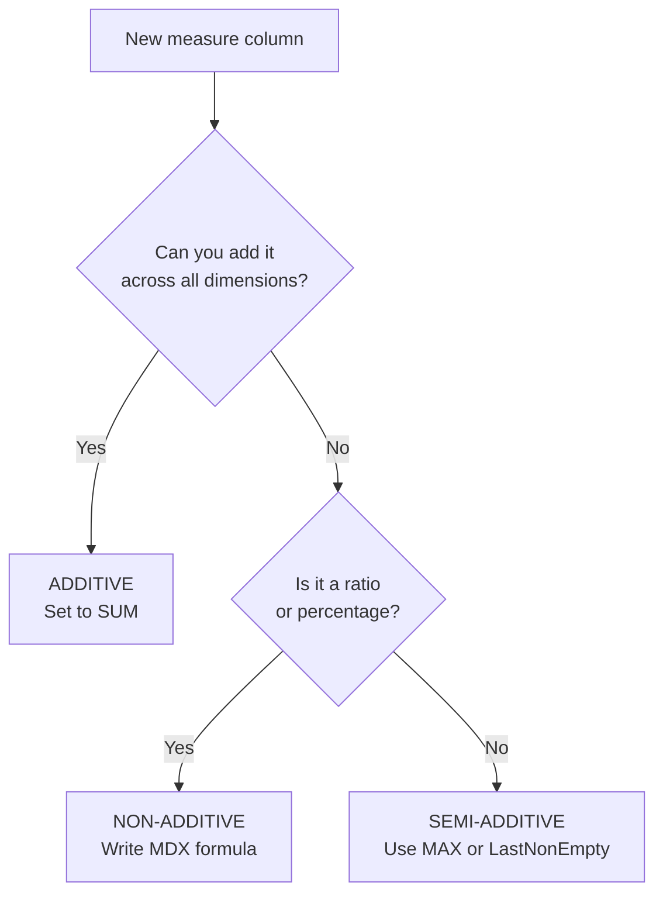
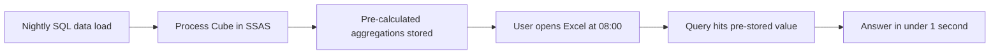

# Measures, Measure Groups, and Aggregations
## Day 01 | Assmang Pty Ltd — SSAS Fundamentals Training

---

## 🎯 What You Will Be Able to Do After This Topic

| # | You will be able to... |
|---|----------------------|
| 1 | Explain what a measure is and give 3 examples from Assmang |
| 2 | Explain what a measure group is and which fact table it comes from |
| 3 | Correctly classify a measure as additive, semi-additive, or non-additive |
| 4 | Explain why wrong aggregation gives wrong business answers |

---

## 📋 Quick Facts

| Item | Detail |
|------|--------|
| Dataset | `v2_assmang_mining_extended.sql` |
| Difficulty | Beginner |
| Reading time | 20 minutes |
| Tools needed | SSMS + Visual Studio (SSDT) |

---

## 🧠 The Big Picture — Before Any Technical Detail

**Imagine you are a production manager at Khumani Iron Ore Mine.**

Every morning at 07:00 your boss asks: *"How many tonnes did we produce yesterday, and what did it cost per tonne?"*

Right now, someone in IT writes a SQL query, exports to Excel, and emails it to you. It takes 2 hours. The data is from yesterday. You cannot drill into it.

**With SSAS, this is what changes:**

1. The raw numbers (tonnes, costs) live in SQL Server
2. SSAS reads them and builds an **analytical cube** overnight
3. You open Excel, connect to the cube, and your answer appears in **under 2 seconds**
4. You can click to see by mine → by department → by day → by shift, without calling IT

**Measures are the numbers you care about. Measure groups organise those numbers. Aggregations make them load fast.**

---

## Part 1 — What Is a Measure?

**A measure is any number you want to analyse.**

At Assmang, measures are things like:

| Measure Name | What it means | Example value |
|-------------|--------------|---------------|
| TonnesProduced | How much ore was dug out | 45,200 tonnes in January |
| RevenueZAR | Money received from selling ore | R 28,500,000 in January |
| LaborCostZAR | Money paid to workers | R 4,200,000 in January |
| MaintenanceCostZAR | Money spent on equipment repairs | R 1,800,000 in January |
| Grade | Percentage of actual mineral in the ore | 64.5% iron content |
| CostPerTonneZAR | How much it costs to produce one tonne | R 375 per tonne |

> **Rule of thumb:** If it is a number and someone at Assmang wants to add it up, average it, or compare it — it is a measure.

---

## Part 2 — What Is a Measure Group?

**A measure group is a collection of related measures that come from the same fact table.**

Think of it like a drawer in a filing cabinet:
- Drawer 1 = "Production" — contains tonnes, grade, revenue
- Drawer 2 = "Operating Costs" — contains labour, maintenance, equipment costs

In SSAS, each fact table in SQL Server becomes one measure group in the cube:

```
SQL Server                          SSAS Cube
─────────────────────────────────────────────────────
FactProduction              →       Measure Group: Production
  - TonnesProduced                    - Tonnes Produced
  - RevenueZAR                        - Revenue ZAR
  - Grade                             - Grade

FactOperatingCosts          →       Measure Group: Operating Costs
  - LaborCostZAR                      - Labor Cost ZAR
  - MaintenanceCostZAR                - Maintenance Cost ZAR
  - EquipmentCostZAR                  - Equipment Cost ZAR
```

Both measure groups live in the **same cube**. A user can build one report that shows production and cost side by side.

---

## Part 3 — What Is Aggregation?

**Aggregation means: how does this number roll up when you zoom out?**

### Example with real numbers

Suppose you have this raw data (one row per shift per mine):

| Mine | Date | Shift | TonnesProduced |
|------|------|-------|----------------|
| Khumani | 1 Jan | Day | 1,500 |
| Khumani | 1 Jan | Night | 1,200 |
| Khumani | 2 Jan | Day | 1,600 |
| Khumani | 2 Jan | Night | 1,100 |

When a manager asks "Total tonnes for Khumani in January?", the answer is **1,500 + 1,200 + 1,600 + 1,100 = 5,400 tonnes**.

That is aggregation — SSAS adds up the detail rows to give a summary.

**But not every number can simply be added. This is where it gets important.**

---

## Part 4 — The Three Types of Aggregation (This Is Critical)

### Type 1: Additive — Safe to SUM across everything

These measures can be added across any dimension (time, mine, department) and the answer is still correct.

| Measure | Why it's additive |
|---------|------------------|
| TonnesProduced | Khumani 5,400t + Beeshoek 3,200t = 8,600t total. Correct. |
| RevenueZAR | Mine A revenue + Mine B revenue = Total company revenue. Correct. |
| LaborCostZAR | Dept A cost + Dept B cost = Total labor cost. Correct. |

> **In SSAS:** Set AggregationFunction = **Sum**

---

### Type 2: Semi-Additive — Only safe to SUM across SOME dimensions

These can be added across some dimensions but NOT others.

**Real example — EmployeesAssigned:**

| Mine | Day Shift | Night Shift |
|------|-----------|-------------|
| Khumani | 120 employees | 95 employees |

- Can you add across mines? **YES** → Khumani (120) + Beeshoek (80) = 200 employees total on Day Shift. ✅
- Can you add Day + Night? **NO** → 120 + 95 = 215 employees is WRONG. These same people could work across shifts. The real answer is the peak headcount (120), not the sum.

> **In SSAS:** Set AggregationFunction = **Max** or **LastNonEmpty**, not Sum.

---

### Type 3: Non-Additive — Never safe to SUM

These are ratios or percentages. Summing them always gives a nonsense answer.

**Real example — Grade (% iron content in ore):**

| Mine | Shift | Tonnes | Grade |
|------|-------|--------|-------|
| Khumani | Day | 1,500t | 64% |
| Khumani | Night | 1,200t | 62% |

What is the combined grade? **NOT** 64 + 62 = 126% (impossible).

Correct answer: weighted average = ((1,500 × 64) + (1,200 × 62)) / (1,500 + 1,200) = **63.1%**

> **In SSAS:** Use a **calculated measure** with the correct formula, not a simple Sum.

---

### Quick Reference Table

| Type | Example Measures | SSAS Setting | Can Sum across time? | Can Sum across mines? |
|------|-----------------|--------------|---------------------|----------------------|
| Additive | Tonnes, Revenue, Labor Cost | Sum | ✅ Yes | ✅ Yes |
| Semi-Additive | Employee Count, Balance | Max / LastNonEmpty | ❌ No | ✅ Yes |
| Non-Additive | Grade%, Uptime%, CostPerTonne | Calculated measure | ❌ No | ❌ No |

---

## Part 5 — Why Wrong Aggregation Destroys Business Trust

**Real consequence at Assmang — the grade problem:**

If someone sets Grade to SUM instead of AVERAGE:

- Khumani January grade = 64%
- Beeshoek January grade = 58%
- "Total company grade" = **122%** ← SSAS shows this

A report goes to the COO showing **122% iron grade**. Iron ore cannot be 122% pure. The COO loses trust in the entire reporting system — not just that one number.

**This is why choosing the right aggregation function is not a technical detail. It is a business trust issue.**

---

## Part 6 — How SSAS Pre-Computes Aggregations for Speed

When you **process** the cube, SSAS does not wait for users to run queries. It pre-calculates common totals and stores them:

```
Pre-computed at processing time:
  Total tonnes for 2024               → stored
  Total tonnes per mine for 2024      → stored
  Total tonnes per mine per quarter   → stored
  Total tonnes per mine per month     → stored

When user queries:
  "Khumani tonnes in Q1 2024?"  →  Reads pre-computed value  →  < 1 second
  "All mines Q1 2024?"          →  Reads pre-computed value  →  < 1 second
```

Without pre-computation, every query would scan millions of rows. With it, answers come back instantly.

> **The trade-off:** Processing takes time (usually runs overnight). Queries are then near-instant. This is a good trade for most mining analytics.

---

## 📊 How It All Fits Together

```
SQL Server                 SSAS Build & Process           Business Users
─────────────────          ────────────────────           ─────────────────
FactProduction      ──►    Measure Group: Production  ──► Excel Pivot Table
  (raw shift rows)           TonnesProduced (SUM)          Power BI Dashboard
                             RevenueZAR (SUM)              SSMS MDX Query
                             Grade (AVG formula)

FactOperatingCosts  ──►    Measure Group: Costs       ──► Same cube, same slice
  (raw cost rows)            LaborCostZAR (SUM)
                             MaintenanceCost (SUM)
                             CostPerTonne (formula)
```

---

## 1. Fact tables and measure groups

A **fact table** stores one row for each business event — one row per shift's production, one row per day's cost, one row per safety incident. Each row has numbers (the facts) and foreign keys linking to dimensions (who, when, where).

In SSAS, each fact table becomes one **measure group**:

| SQL Server fact table | SSAS Measure Group | Business meaning |
|----------------------|--------------------|-----------------|
| `FactProduction` | Production | How much ore was produced, and what was earned |
| `FactOperatingCosts` | Operating Costs | How much was spent running the mine |

Both groups live inside the same cube. A single Excel report can show production and cost side by side, sliced by the same mine and date dimensions.

---

## 2. Choosing measures

Not every column in a fact table should become a measure. Use this filter:

**Include as a measure if:**
- It is a number a manager would want to sum, average, or compare
- It changes per row (per shift, per day, per mine)
- It answers a business question on its own

**Exclude or handle differently if:**
- It is a key column (MineID, DateID) — these are dimension links, not measures
- It is already a ratio or percentage — treat as non-additive (see Part 4)
- It is a flag or category — this belongs in a dimension, not a measure group

**Assmang example — what to include from `FactProduction`:**

| Column | Include as measure? | Why |
|--------|--------------------|----|
| ProductionID | ❌ No | Primary key, not a business number |
| MineID | ❌ No | Foreign key to Mine dimension |
| DateID | ❌ No | Foreign key to Date dimension |
| TonnesProduced | ✅ Yes | Core production metric, sums correctly |
| RevenueZAR | ✅ Yes | Financial result, sums correctly |
| Grade | ✅ Yes (as AVG formula) | Quality metric, needs correct aggregation |
| CostPerTonneZAR | ✅ Yes (as calculated) | Ratio, must be computed not summed |

---

## 3. Aggregation behaviour

**Aggregation is the rule that tells SSAS how to combine detail rows into summaries.**

The three types are explained in detail in Part 4 above. Here is the decision guide:

```
Ask yourself: "What does it mean to ADD this number across rows?"

  TonnesProduced for Shift 1 + TonnesProduced for Shift 2
  = Total tonnes for the day?  → YES → ADDITIVE → use SUM

  Grade for Shift 1 + Grade for Shift 2
  = Combined grade?  → NO → NON-ADDITIVE → use formula (weighted average)

  Employees on Day shift + Employees on Night shift
  = Total headcount?  → MAYBE (same people could overlap) → SEMI-ADDITIVE → use MAX
```

**The consequence of choosing wrong:**

| Wrong choice | What SSAS shows | Real answer |
|-------------|----------------|-------------|
| Grade = SUM | 126% iron content | 63.1% (impossible without formula) |
| Employees = SUM | 215 headcount | 120 peak headcount |
| CostPerTonne = SUM | R 900/tonne | R 440/tonne (off by 100%) |

---

## 4. Why aggregations matter

**Aggregations are pre-calculated summaries that SSAS builds during processing.**

Without them, every query scans millions of raw rows. With them, common results are already computed and stored. This is why cube queries feel instant even on large datasets.

**At Assmang, this matters because:**

- The COO opens a dashboard at 08:00 every morning
- The dashboard loads 5 charts showing production, cost, and safety across all 5 mines for the past 12 months
- Without aggregations: each chart takes 15–30 seconds → total wait: 2+ minutes → COO closes dashboard, asks IT for a spreadsheet
- With aggregations: each chart loads in under 1 second → total wait: under 5 seconds → COO uses the dashboard daily

**How aggregations are built:**

1. You run **Process Cube** in SSDT or SSMS
2. SSAS reads all the raw rows from SQL Server
3. It calculates totals at different levels (by day, by month, by quarter, by mine, by combination)
4. It stores those pre-calculated values inside the cube
5. Next time a user asks "total Q1 tonnes for Khumani?", SSAS reads the pre-stored value — no scanning needed

> **Note:** Aggregations need to be rebuilt whenever new data is loaded. That is why SSAS is typically processed on a schedule (e.g., every night at 02:00).

---

## 📊 Architecture / Concept Diagram



**How to read this diagram:**
- Left: Raw SQL Server tables (millions of rows, slow to query directly)
- Middle: SSAS processes them into a cube (pre-calculated, fast)
- Right: Business users get answers in seconds without writing SQL

---

## 📖 Key Terminology Reference

Here are the most important terms for this topic. Don't worry about memorising them all — you will learn them naturally through practice:


| Term | Plain English Definition | Example at Assmang |
|------|------------------------|-------------------|
| **Cube** | A pre-built analytical structure that lets users explore data from many angles | The "Assmang Mining Analytics" cube containing all production and cost data |
| **Dimension** | A category you use to slice data (like filters in Excel) | Mine, Date, Department, Employee — these are the "by what" categories |
| **Hierarchy** | A drill-down path from general to specific | Year → Quarter → Month → Day (time hierarchy) |
| **Member** | One specific value within a dimension | "Beeshoek Mine" is a member of the Mine dimension |
| **Measure** | A number you want to analyse | Tonnes Produced, Revenue in ZAR, Cost Per Tonne |
| **Measure Group** | A collection of related measures from one business area | Production Measures (tonnes + grade + revenue) |
| **Fact Table** | The database table that stores the raw numbers | FactProduction, FactOperatingCosts |
| **Processing** | Loading data into the cube and building pre-calculated summaries | Running a nightly job that refreshes yesterday's production data |
| **Aggregation** | A pre-calculated total or average stored for speed | Total tonnes per mine per month (calculated once, queried many times) |
| **MDX** | The query language used to ask questions of a cube | Similar to SQL, but designed for multidimensional analysis |
| **MOLAP** | Storage mode where data is stored inside the cube for maximum speed | Default choice for Assmang — gives sub-second query times |
| **ROLAP** | Storage mode where data stays in SQL Server (slower but always fresh) | Used when real-time data is more important than speed |
| **KPI** | A traffic-light indicator showing whether a target is being met | Production KPI: Green if >= 90% of target, Red if < 70% |
| **SSDT** | SQL Server Data Tools — the IDE where you design and build cubes | Visual Studio with the SSAS project templates |
| **SSMS** | SQL Server Management Studio — for administration and testing | Where you deploy cubes and run MDX queries |
| **Data Source View (DSV)** | A logical view of which database tables the cube uses | Selecting Dim_Mine, Dim_Date, FactProduction for inclusion |
| **Deployment** | Pushing your cube design from your computer to the SSAS server | Like publishing a website — makes it available to users |

---


## 🧭 Additional Diagrams

### Aggregation Decision Flow



### Processing and Query Flow


