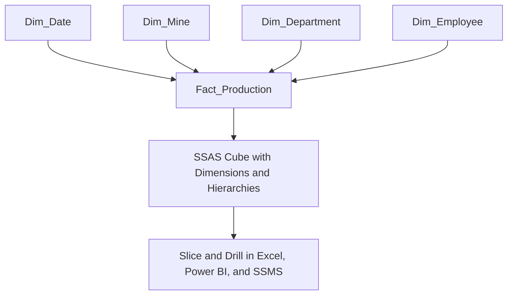
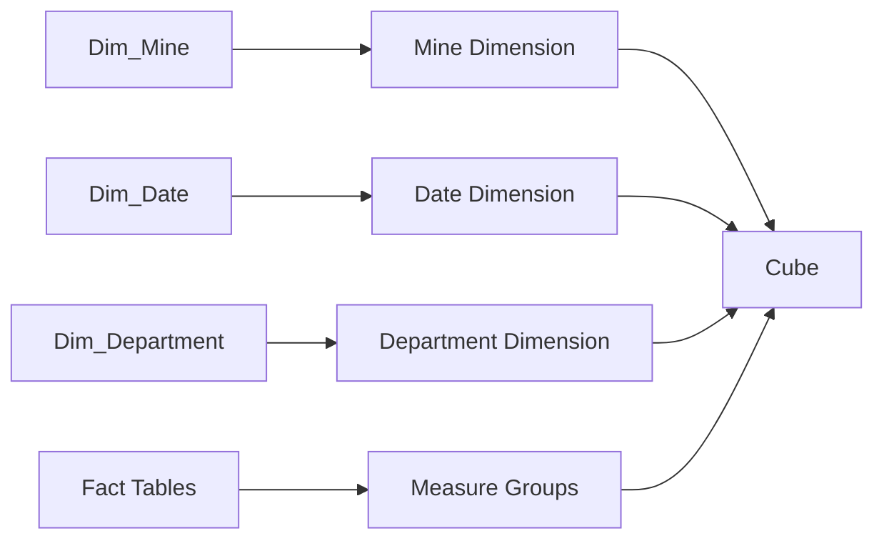
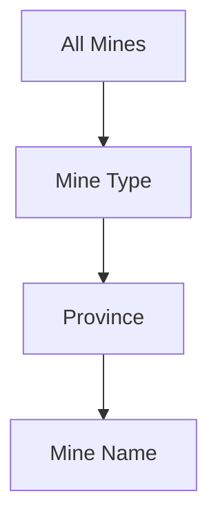
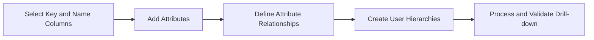
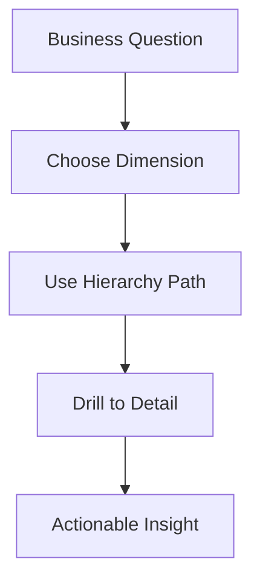

# Multidimensional Models and Dimensions
## Day 01 | Assmang Pty Ltd — SSAS Fundamentals Training

---

## 🎯 Learning Objectives

By the end of this topic, participants will be able to:

1. Understand star-schema thinking and how dimensions support analysis.
2. Design dimensions from the Assmang dimension tables.
3. Build hierarchies that support drill-down navigation.
4. Recognise common dimension design issues such as poor keys or weak hierarchies.

---

## 📋 Topic Overview

**Dataset:** `v1_assmang_mining_base.sql`  
**Difficulty:** Beginner (no prior SSAS experience required)  
**Estimated reading time:** 20-30 minutes

### What is this topic about?

This topic teaches you about **Multidimensional Models and Dimensions**. If you have never worked with SQL Server Analysis Services before, don't worry — we will explain everything from scratch using plain language and real examples from Assmang's mining operations.

### Why does this matter to you?

As someone working at or with Assmang, you deal with data every day — production figures, costs, safety records, employee information. Right now, getting answers from that data probably involves:

- Asking someone in IT to write a report
- Waiting for Excel spreadsheets to be updated
- Running the same SQL queries over and over
- Not being sure if the numbers are up to date

SSAS solves these problems by creating a **pre-built analytical model** (called a "cube") that lets anyone with Excel or Power BI get instant answers without writing code.

### The Assmang training context

All examples in this course use data from Assmang's actual operations:

| Mine | What it produces | Where it is |
|------|-----------------|-------------|
| Beeshoek Mine | Iron Ore | Postmasburg, Northern Cape |
| Khumani Mine | Iron Ore | Kathu, Northern Cape |
| Black Rock Mine | Manganese | Hotazel, Northern Cape |
| Dwarsrivier Chrome Mine | Chrome | Burgersfort, Limpopo |
| Machadodorp Works | Chrome (processing) | Machadodorp, Mpumalanga |

---

## 🧠 Real-World Analogy (Plain English)

**Think of this topic like the labels on filing cabinet drawers.**

Think of dimensions like the labels on a filing cabinet. One drawer is labelled 'By Mine', another 'By Month', another 'By Department'. When you want to find production data for Beeshoek in March, you open the 'Mine' drawer, find 'Beeshoek', then look in the 'Month' section for 'March'. Dimensions are those category labels that help you navigate to exactly the data you need.

> **Key insight:** SSAS takes complex data and makes it simple to explore. You don't need to be a programmer to use the results — you just need to know what question you want to answer.

---

## 1. Dimensional thinking

### 💬 In plain English

Let's break down **dimensional thinking** in the simplest possible terms:

**→** A multidimensional model separates descriptive business context from measurable facts.

**→** Dimension tables answer 'by what' questions: by mine, by month, by department, by employee.

**→** A clean dimension model improves user navigation and aggregation behaviour.

### 📚 Detailed explanation

This concept is important because it directly affects how well the cube works for business users. Here is a deeper look:

**Point 1: A multidimensional model separates descriptive business context from measurable facts.**

What this means in practice: When you apply this at Assmang, it means that a multidimensional model separates descriptive business context from measurable facts. This is not just a technical exercise — it directly helps managers, engineers, and executives get better information faster.

**Point 2: Dimension tables answer 'by what' questions: by mine, by month, by department, by employee.**

What this means in practice: When you apply this at Assmang, it means that dimension tables answer 'by what' questions: by mine, by month, by department, by employee. This is not just a technical exercise — it directly helps managers, engineers, and executives get better information faster.

**Point 3: A clean dimension model improves user navigation and aggregation behaviour.**

What this means in practice: When you apply this at Assmang, it means that a clean dimension model improves user navigation and aggregation behaviour. This is not just a technical exercise — it directly helps managers, engineers, and executives get better information faster.

### 🏭 Assmang scenario

**Situation:** A production manager at Khumani Mine asks: "Can I see this month's iron ore output compared to last month, broken down by shift?"

**How dimensional thinking helps:** Because the cube already has the right structure (dimensions for time and mine, measures for production), this question can be answered in seconds using Excel or Power BI — no SQL coding needed, no waiting for IT.

### ❓ Frequently Asked Questions

**Q: Do I need to be a programmer to understand dimensional thinking?**  
A: No. This concept is about business logic and design thinking. The tools (SSDT) provide visual interfaces for most of the work.

**Q: What happens if we get dimensional thinking wrong?**  
A: The cube will still work technically, but users may get confusing results, slow performance, or missing data. That's why we follow best practices from the start.

**Q: How long does it take to set up dimensional thinking for a real project?**  
A: For a project the size of Assmang's training cube, this typically takes a few hours of design work plus a few hours of implementation and testing.

---

## 2. Assmang dimensions

### 💬 In plain English

Let's break down **assmang dimensions** in the simplest possible terms:

**→** `Dim_Mine` supports analysis by mine, province, and commodity type.

**→** `Dim_Date` supports time intelligence through year, quarter, month, and day levels.

**→** `Dim_Department` supports cost and people analysis by function area.

**→** `Dim_Employee` supports workforce-centric reporting and role-based views.

### 📚 Detailed explanation

This concept is important because it directly affects how well the cube works for business users. Here is a deeper look:

**Point 1: `Dim_Mine` supports analysis by mine, province, and commodity type.**

What this means in practice: When you apply this at Assmang, it means that `dim_mine` supports analysis by mine, province, and commodity type. This is not just a technical exercise — it directly helps managers, engineers, and executives get better information faster.

**Point 2: `Dim_Date` supports time intelligence through year, quarter, month, and day levels.**

What this means in practice: When you apply this at Assmang, it means that `dim_date` supports time intelligence through year, quarter, month, and day levels. This is not just a technical exercise — it directly helps managers, engineers, and executives get better information faster.

**Point 3: `Dim_Department` supports cost and people analysis by function area.**

What this means in practice: When you apply this at Assmang, it means that `dim_department` supports cost and people analysis by function area. This is not just a technical exercise — it directly helps managers, engineers, and executives get better information faster.

**Point 4: `Dim_Employee` supports workforce-centric reporting and role-based views.**

What this means in practice: When you apply this at Assmang, it means that `dim_employee` supports workforce-centric reporting and role-based views. This is not just a technical exercise — it directly helps managers, engineers, and executives get better information faster.

### 🏭 Assmang scenario

**Situation:** A production manager at Khumani Mine asks: "Can I see this month's iron ore output compared to last month, broken down by shift?"

**How assmang dimensions helps:** Because the cube already has the right structure (dimensions for time and mine, measures for production), this question can be answered in seconds using Excel or Power BI — no SQL coding needed, no waiting for IT.

### ❓ Frequently Asked Questions

**Q: Do I need to be a programmer to understand assmang dimensions?**  
A: No. This concept is about business logic and design thinking. The tools (SSDT) provide visual interfaces for most of the work.

**Q: What happens if we get assmang dimensions wrong?**  
A: The cube will still work technically, but users may get confusing results, slow performance, or missing data. That's why we follow best practices from the start.

**Q: How long does it take to set up assmang dimensions for a real project?**  
A: For a project the size of Assmang's training cube, this typically takes a few hours of design work plus a few hours of implementation and testing.

---

## 3. Hierarchies and drill paths

### 💬 In plain English

Let's break down **hierarchies and drill paths** in the simplest possible terms:

**→** A hierarchy gives users a guided navigation path rather than a flat list of attributes.

**→** Examples include Time: Year > Quarter > Month > Day and Mine: Mine Type > Province > Mine Name.

**→** Good hierarchies make Excel pivot navigation and MDX browsing easier.

### 📚 Detailed explanation

This concept is important because it directly affects how well the cube works for business users. Here is a deeper look:

**Point 1: A hierarchy gives users a guided navigation path rather than a flat list of attributes.**

What this means in practice: When you apply this at Assmang, it means that a hierarchy gives users a guided navigation path rather than a flat list of attributes. This is not just a technical exercise — it directly helps managers, engineers, and executives get better information faster.

**Point 2: Examples include Time: Year > Quarter > Month > Day and Mine: Mine Type > Province > Mine Name.**

What this means in practice: When you apply this at Assmang, it means that examples include time: year > quarter > month > day and mine: mine type > province > mine name. This is not just a technical exercise — it directly helps managers, engineers, and executives get better information faster.

**Point 3: Good hierarchies make Excel pivot navigation and MDX browsing easier.**

What this means in practice: When you apply this at Assmang, it means that good hierarchies make excel pivot navigation and mdx browsing easier. This is not just a technical exercise — it directly helps managers, engineers, and executives get better information faster.

### 🏭 Assmang scenario

**Situation:** A production manager at Khumani Mine asks: "Can I see this month's iron ore output compared to last month, broken down by shift?"

**How hierarchies and drill paths helps:** Because the cube already has the right structure (dimensions for time and mine, measures for production), this question can be answered in seconds using Excel or Power BI — no SQL coding needed, no waiting for IT.

### ❓ Frequently Asked Questions

**Q: Do I need to be a programmer to understand hierarchies and drill paths?**  
A: No. This concept is about business logic and design thinking. The tools (SSDT) provide visual interfaces for most of the work.

**Q: What happens if we get hierarchies and drill paths wrong?**  
A: The cube will still work technically, but users may get confusing results, slow performance, or missing data. That's why we follow best practices from the start.

**Q: How long does it take to set up hierarchies and drill paths for a real project?**  
A: For a project the size of Assmang's training cube, this typically takes a few hours of design work plus a few hours of implementation and testing.

---

## 4. Slowly changing dimensions

### 💬 In plain English

Let's break down **slowly changing dimensions** in the simplest possible terms:

**→** Type 1 overwrites old values and is useful when history is not required.

**→** Type 2 preserves historical versions and is useful when reporting must reflect old business states.

**→** Beginners should understand the concept even if the training implementation stays simple.

### 📚 Detailed explanation

This concept is important because it directly affects how well the cube works for business users. Here is a deeper look:

**Point 1: Type 1 overwrites old values and is useful when history is not required.**

What this means in practice: When you apply this at Assmang, it means that type 1 overwrites old values and is useful when history is not required. This is not just a technical exercise — it directly helps managers, engineers, and executives get better information faster.

**Point 2: Type 2 preserves historical versions and is useful when reporting must reflect old business states.**

What this means in practice: When you apply this at Assmang, it means that type 2 preserves historical versions and is useful when reporting must reflect old business states. This is not just a technical exercise — it directly helps managers, engineers, and executives get better information faster.

**Point 3: Beginners should understand the concept even if the training implementation stays simple.**

What this means in practice: When you apply this at Assmang, it means that beginners should understand the concept even if the training implementation stays simple. This is not just a technical exercise — it directly helps managers, engineers, and executives get better information faster.

### 🏭 Assmang scenario

**Situation:** A production manager at Khumani Mine asks: "Can I see this month's iron ore output compared to last month, broken down by shift?"

**How slowly changing dimensions helps:** Because the cube already has the right structure (dimensions for time and mine, measures for production), this question can be answered in seconds using Excel or Power BI — no SQL coding needed, no waiting for IT.

### ❓ Frequently Asked Questions

**Q: Do I need to be a programmer to understand slowly changing dimensions?**  
A: No. This concept is about business logic and design thinking. The tools (SSDT) provide visual interfaces for most of the work.

**Q: What happens if we get slowly changing dimensions wrong?**  
A: The cube will still work technically, but users may get confusing results, slow performance, or missing data. That's why we follow best practices from the start.

**Q: How long does it take to set up slowly changing dimensions for a real project?**  
A: For a project the size of Assmang's training cube, this typically takes a few hours of design work plus a few hours of implementation and testing.

---

## 📊 Architecture / Concept Diagram

The following diagram shows how this topic fits into the bigger picture:

### How to read this diagram

- **Left side:** Where your raw data lives (SQL Server database tables containing production, cost, safety, and employee data).
- **Middle:** Where SSAS transforms that raw data into an analytical structure (the cube with its dimensions, hierarchies, and measures).
- **Right side:** Where business users access the results (Excel pivot tables, Power BI dashboards, or MDX query results in SSMS).

### Why this matters

Without SSAS (the middle layer), every time a manager wants an answer, someone has to write SQL code against the raw database. With SSAS, the analytical structure is pre-built, so users can explore data independently using familiar tools like Excel.

---

## 📖 Key Terminology Reference

Here are the most important terms for this topic. Don't worry about memorising them all — you will learn them naturally through practice:

| Term | Plain English Definition | Example at Assmang |
|------|------------------------|-------------------|
| **Cube** | A pre-built analytical structure that lets users explore data from many angles | The "Assmang Mining Analytics" cube containing all production and cost data |
| **Dimension** | A category you use to slice data (like filters in Excel) | Mine, Date, Department, Employee — these are the "by what" categories |
| **Hierarchy** | A drill-down path from general to specific | Year → Quarter → Month → Day (time hierarchy) |
| **Member** | One specific value within a dimension | "Beeshoek Mine" is a member of the Mine dimension |
| **Measure** | A number you want to analyse | Tonnes Produced, Revenue in ZAR, Cost Per Tonne |
| **Measure Group** | A collection of related measures from one business area | Production Measures (tonnes + grade + revenue) |
| **Fact Table** | The database table that stores the raw numbers | FactProduction, FactOperatingCosts |
| **Processing** | Loading data into the cube and building pre-calculated summaries | Running a nightly job that refreshes yesterday's production data |
| **Aggregation** | A pre-calculated total or average stored for speed | Total tonnes per mine per month (calculated once, queried many times) |
| **MDX** | The query language used to ask questions of a cube | Similar to SQL, but designed for multidimensional analysis |
| **MOLAP** | Storage mode where data is stored inside the cube for maximum speed | Default choice for Assmang — gives sub-second query times |
| **ROLAP** | Storage mode where data stays in SQL Server (slower but always fresh) | Used when real-time data is more important than speed |
| **KPI** | A traffic-light indicator showing whether a target is being met | Production KPI: Green if >= 90% of target, Red if < 70% |
| **SSDT** | SQL Server Data Tools — the IDE where you design and build cubes | Visual Studio with the SSAS project templates |
| **SSMS** | SQL Server Management Studio — for administration and testing | Where you deploy cubes and run MDX queries |
| **Data Source View (DSV)** | A logical view of which database tables the cube uses | Selecting Dim_Mine, Dim_Date, FactProduction for inclusion |
| **Deployment** | Pushing your cube design from your computer to the SSAS server | Like publishing a website — makes it available to users |

---

## 🧭 Additional Diagrams

### Diagram 1: Star Schema to Dimension Model

### Diagram 2: Hierarchy Drill Path

### Diagram 3: Dimension Design Lifecycle

## 📌 Topic-Specific Summary

This topic defines analytical navigation quality. Good dimensions and hierarchies make reports intuitive, reduce query complexity, and support accurate drill-down from executive to operational detail.

If this topic is done well, users can explore data naturally. If done poorly, users get lost in long member lists and inconsistent naming.

## Deep Dive in Layman Terms

Dimensions are the labels people think in. Mines, dates, departments, and employees are not technical extras. They are how business users ask questions.

Hierarchies are the path of thinking, such as Year -> Quarter -> Month or Mine Type -> Province -> Mine Name. A good hierarchy lets users start broad and drill down without confusion.

### Assmang-style example

A production manager asks: "Start with total iron ore, then show me by province, then by mine." If the hierarchy is clean, this is a smooth three-click journey. If not, the user must manually filter hundreds of members.

### Clarity diagram: Navigation quality

