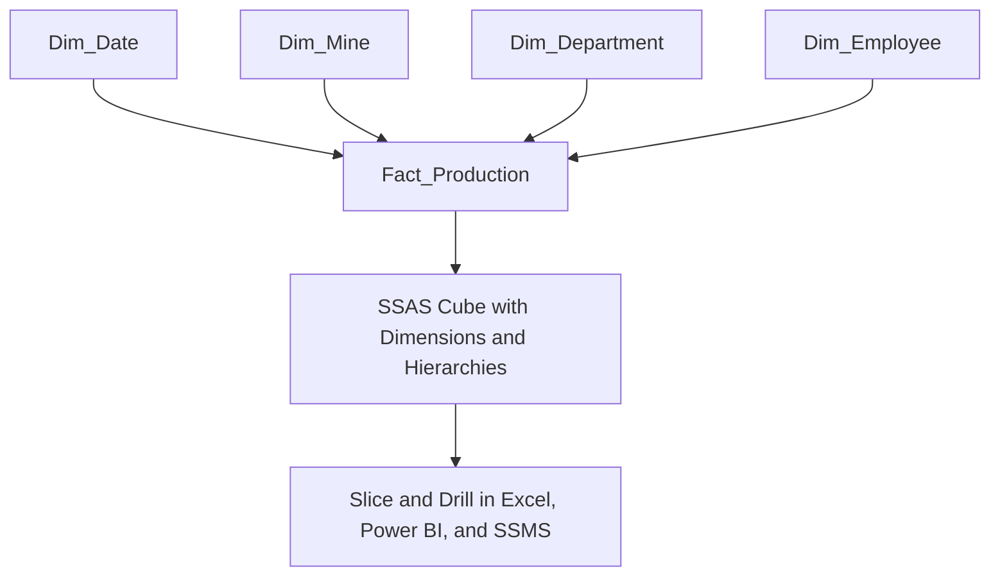
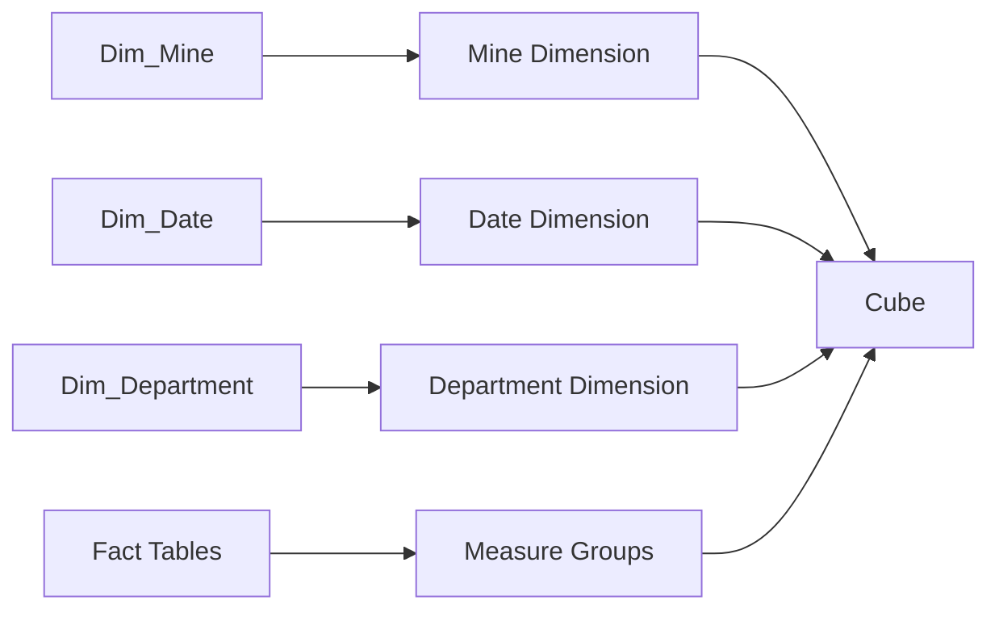
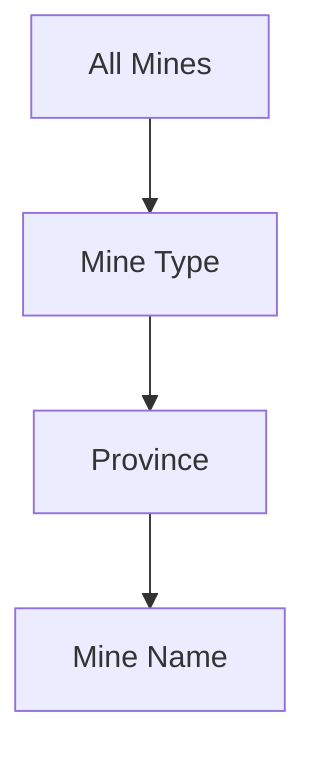
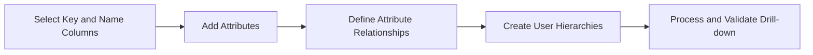
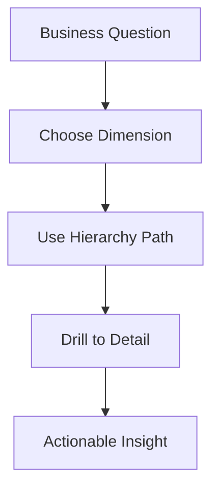

# Multidimensional Models and Dimensions
## Day 01 | Assmang Pty Ltd — SSAS Fundamentals Training

---

## 🎯 Learning Objectives

By the end of this topic, participants will be able to:

1. Understand star-schema thinking and how dimensions support analysis.
2. Design dimensions from the Assmang dimension tables.
3. Build hierarchies that support drill-down navigation.
4. Recognise common dimension design issues such as poor keys or weak hierarchies.

---

## 📋 Topic Overview

**Dataset:** `v1_assmang_mining_base.sql`  
**Difficulty:** Beginner (no prior SSAS experience required)  
**Estimated reading time:** 20-30 minutes

### What this topic covers

Every business question has a "what" and a "by what". The **measures** are the "what" (tonnes produced, revenue, cost). The **dimensions** are the "by what" — by mine, by month, by department, by shift.

This topic focuses entirely on dimensions: how to design them, how to build hierarchies that let users drill down, and how to avoid the mistakes that create broken or misleading reports.

### Why dimension design matters more than you might think

A cube with badly designed dimensions will still build and deploy without errors. The problems only appear later:

- Users see ID numbers instead of names (`Mine ID 3` instead of `Khumani`)
- Drill-down stops halfway through the hierarchy
- Months sort alphabetically instead of chronologically (April, August, February...)
- Reports show duplicate rows because the key attribute is wrong

This topic teaches you to catch and fix these issues during design — before users encounter them.

### What you are working with in this topic

**Dataset:** `v1_assmang_mining_base.sql` — the foundational dataset. Four dimension tables (`Dim_Mine`, `Dim_Date`, `Dim_Department`, `Dim_Employee`) supporting one fact table `FactProduction`. The dimension skills you build here carry forward to v2 and v3 in later topics.

---

## 🧠 Real-World Analogy (Plain English)

**Think of this topic like the labels on filing cabinet drawers.**

Think of dimensions like the labels on a filing cabinet. One drawer is labelled 'By Mine', another 'By Month', another 'By Department'. When you want to find production data for Beeshoek in March, you open the 'Mine' drawer, find 'Beeshoek', then look in the 'Month' section for 'March'. Dimensions are those category labels that help you navigate to exactly the data you need.

> **Key insight for this topic:** The quality of your dimensions determines how useful the cube is for end users. A well-built Mine dimension lets a manager drill from Province → Mine Type → Mine Name in three clicks. A poorly built one shows ID numbers and dead ends.

---

## 1. Dimensional thinking — With real examples

**In one sentence:** Separate "what you measure" (facts) from "how you slice it" (dimensions).

### What this means at Assmang

**Fact: Tonnes Produced = 1,500 on a specific day at a specific mine**

Without dimensions, this is useless — you can't answer: "Was that good? Better than yesterday? Better than our target? How does it compare to other mines?"

**With dimensions, you can answer all of those:**
- By Mine: Was 1,500 tonnes from Khumani or Beeshoek?
- By Date: Was it on a good day (Wednesday) or bad day (Monday)? Summer or winter?
- By Shift: Was it day shift or night shift? First shift or second?
- By Department: Was it from Extraction or Processing?

### The separation principle

| Fact Table (WHAT you measure) | Dimension Tables (HOW you slice it) |
|-------------------------------|-------------------------------------|
| TonnesProduced = 1,500 | Mine = Khumani |
| RevenueProdZAR = R 850,000 | Date = 2024-01-15 (Monday, Q1, January) |
| Grade = 64% | Department = Extraction |
| MaintenanceCostZAR = R 12,000 | Shift = Day (06:00-14:00) |

**Benefit:** You can ask "production by mine" or "production by shift" or "production by month" without changing the database. The dimensions provide the filters.

---

## 2. Assmang dimensions — With detailed examples

### Dimension 1: Mine Dimension (How to drill down by geographic location)

**Table:** `Dim_Mine`

**Columns:**
- `MineKey` (unique ID: 1, 2, 3, 4, 5)
- `MineName` (Beeshoek, Khumani, Black Rock, Dwarsrivier, Machadodorp)
- `MineProvince` (Northern Cape, Limpopo, Mpumalanga)
- `Commodity` (Iron Ore, Manganese, Chrome)
- `StartYear` (1995, 2001, 1987, 1998, 2005)

**Sample data:**

| MineKey | MineName | Province | Commodity | StartYear |
|---------|----------|----------|-----------|-----------|
| 1 | Beeshoek | Northern Cape | Iron Ore | 1995 |
| 2 | Khumani | Northern Cape | Iron Ore | 2001 |
| 3 | Black Rock | Northern Cape | Manganese | 1987 |
| 4 | Dwarsrivier | Limpopo | Chrome | 1998 |
| 5 | Machadodorp | Mpumalanga | Chrome Processing | 2005 |

**How it helps in business questions:**
```
"Production by mine?"            → Uses MineName level
"Iron ore vs. other commodities?" → Uses Commodity level (not in mine—different fact!)
"Which province is most productive?" → Uses Province level
"Oldest vs. newest mines?"        → Uses StartYear level
```

**Hierarchy you'll build:** 
```
All
  ├─ Northern Cape
  │   ├─ Beeshoek Mine
  │   ├─ Khumani Mine
  │   └─ Black Rock Mine
  ├─ Limpopo
  │   └─ Dwarsrivier Mine
  └─ Mpumalanga
      └─ Machadodorp Works
```

---

### Dimension 2: Date Dimension (Time intelligence for trend analysis)

**Table:** `Dim_Date`

**Key columns:**
- `DateKey` (20240101, 20240102, etc.)
- `FullDate` (2024-01-15)
- `Year` (2024)
- `Quarter` (Q1, Q2, Q3, Q4)
- `Month` (January, February, ..., December)
- `Day` (1-31)
- `DayOfWeek` (Monday, Tuesday, ..., Sunday)
- `IsWeekend` (0 or 1)

**Sample data (first few rows):**

| DateKey | FullDate | Year | Quarter | Month | DayOfWeek | IsWeekend |
|---------|----------|------|---------|-------|-----------|-----------|
| 20240101 | 2024-01-01 | 2024 | Q1 | January | Monday | 0 |
| 20240102 | 2024-01-02 | 2024 | Q1 | January | Tuesday | 0 |
| 20240103 | 2024-01-03 | 2024 | Q1 | January | Wednesday | 0 |
| 20240115 | 2024-01-15 | 2024 | Q1 | January | Monday | 0 |
| 20240131 | 2024-01-31 | 2024 | Q1 | January | Wednesday | 0 |
| 20240201 | 2024-02-01 | 2024 | Q1 | February | Thursday | 0 |

**How it helps in business questions:**
```
"Daily production trend?"          → Uses Day level
"Monthly performance?"             → Uses Month level
"Q1 vs. Q2 production?"           → Uses Quarter level
"Year-over-year comparison?"      → Uses Year level
"Why weekends lower?"             → Uses DayOfWeek + IsWeekend levels
```

**Hierarchy you'll build:**
```
All
  ├─ 2024
  │   ├─ Q1
  │   │   ├─ January (1-31)
  │   │   ├─ February (1-29)
  │   │   └─ March (1-31)
  │   ├─ Q2
  │   ├─ Q3
  │   └─ Q4
  └─ 2025
      └─ ...
```

---

### Dimension 3: Department Dimension (Cost center analysis)

**Table:** `Dim_Department`

**Columns:**
- `DepartmentKey` (1, 2, 3, 4, 5)
- `DepartmentName` (Extraction, Processing, Maintenance, Safety, Administration)
- `Manager` (Person responsible)
- `CostCenter` (Unique ID for finance)

**Sample data:**

| DepartmentKey | DepartmentName | Manager | CostCenter |
|---------------|----------------|---------|------------|
| 1 | Extraction | J. Kuma | CC-EXT-001 |
| 2 | Processing | M. Nkosi | CC-PROC-001 |
| 3 | Maintenance | P. Dlamini | CC-MAINT-001 |
| 4 | Safety | K. Mokoena | CC-SAFE-001 |
| 5 | Administration | T. Chen | CC-ADMIN-001 |

**How it helps:**
```
"Cost by department?"             → Which department spends most?
"Extraction vs. rest of mine?"   → Are we mining efficiently?
"Manager accountability?"         → Each manager sees only their costs
```

---

### Dimension 4: Employee Dimension (Workforce analytics)

**Columns:**
- `EmployeeKey`
- `EmployeeName`
- `EmployeeID`
- `Department`
- `JobTitle` (Miner, Foreman, Engineer, Operator)
- `HireDate`

**Enables questions like:**
```
"Revenue per employee?"           → How productive is each worker?
"Headcount by department?"        → Are we overstaffed anywhere?
"Retention analysis?"             → Who's been with us longest?
"Job title distribution?"         → Do we have too many operators?
```

---

## 3. Hierarchies explained with detailed steps

### What is a hierarchy?

A hierarchy is a drill-down path from general (ALL) to specific (individual values).

**Example: Date hierarchy**
```
ALL TIME
  └─ 2024 (year level)
      └─ Q1 (quarter level)
          └─ January (month level)
              └─ 15 (day level)
```

**Why this matters:** A manager can ask:
- "Total for all time" → Uses ALL
- "How much in 2024?" → Uses Year level
- "Q1 performance?" → Uses Quarter level
- "January specific numbers?" → Uses Month level
- "What happened January 15?" → Uses Day level

### Example: Mine hierarchy with proper design

```
ALL MINES
  └─ Northern Cape (province level)
      ├─ Beeshoek Mine (iron ore mine)
      ├─ Khumani Mine (iron ore mine)
      └─ Black Rock Mine (manganese mine)
  └─ Limpopo (province level)
      └─ Dwarsrivier Mine (chrome mine)
  └─ Mpumalanga (province level)
      └─ Machadodorp Works (processing facility)
```

**How to build this in SSDT (step-by-step):**

**PART A: Prepare the dimension table**

**Step 1:** In Visual Studio, open the SSAS project

**Step 2:** In **Solution Explorer**, expand **Data Sources**

**Step 3:** Right-click **Data Sources** and select **New Data Source**

**Step 4:** In the wizard, select your SQL Server database connection

**Step 5:** If using existing Dim_Mine table (recommended), skip to PART B

**Step 6:** If you need to create Dim_Mine, run this SQL in SQL Server first:
```sql
CREATE TABLE Dim_Mine (
    MineKey INT PRIMARY KEY,
    MineName NVARCHAR(100),
    Province NVARCHAR(50),
    Commodity NVARCHAR(50)
);

INSERT INTO Dim_Mine VALUES
(1, 'Beeshoek', 'Northern Cape', 'Iron Ore'),
(2, 'Khumani', 'Northern Cape', 'Iron Ore'),
(3, 'Black Rock', 'Northern Cape', 'Manganese'),
(4, 'Dwarsrivier', 'Limpopo', 'Chrome'),
(5, 'Machadodorp', 'Mpumalanga', 'Chrome Processing');
```

**PART B: Add table to Data Source View**

**Step 7:** In **Solution Explorer**, double-click **Data Source View**

**Step 8:** Right-click in the DSV designer and select **Add/Remove Tables**

**Step 9:** Select `Dim_Mine` (or other dimension table) from the list

**Step 10:** Click **OK** — the table appears in DSV with a blue outline

**PART C: Create the dimension**

**Step 11:** In **Solution Explorer**, right-click **Dimensions**

**Step 12:** Click **New Dimension**

**Step 13:** In the wizard, select **Dim_Mine** as the source table

**Step 14:** Click **Next**

**Step 15:** In "Specify Dimension Type," select **Regular dimension** (not Time)

**Step 16:** Click **Next**

**Step 17:** In "Specify Dimension Tables," confirm `Dim_Mine` appears

**Step 18:** Click **Next**

**Step 19:** In "Select Attributes," checkboxes appear for each column:
- ☑ MineKey (automatically marked)
- ☑ MineName (check this)
- ☑ Province (check this)
- ☑ Commodity (check this)

**Step 20:** Click **Next**

**Step 21:** The wizard creates a new dimension file and opens **Dimension Designer**

**PART D: Build the hierarchy**

**Step 22:** In Dimension Designer, you see three panes:
- **Left:** Attributes (MineKey, MineName, Province, Commodity)
- **Right:** Hierarchies (empty — we'll add one)

**Step 23:** In the **Hierarchies** pane, right-click and select **New Hierarchy**

**Step 24:** A hierarchy appears named "Hierarchy 1"

**Step 25:** Right-click the hierarchy name and select **Rename**

**Step 26:** Type: `Geography`

**Step 27:** Now drag attributes into the hierarchy in order (general → specific):
1. **First:** Drag `Province` from Attributes pane into the `Geography` hierarchy
2. **Second:** Drag `MineName` below `Province` in the same hierarchy
3. **Result:** The hierarchy now reads:
   ```
   Geography
     ├─ Province
     └─ MineName
   ```

**Step 28:** To verify the hierarchy works, click **Browser** tab

**Step 29:** You should see:
```
All
  ├─ Limpopo
  │   └─ Dwarsrivier Mine
  ├─ Mpumalanga
  │   └─ Machadodorp Works
  └─ Northern Cape
      ├─ Beeshoek Mine
      ├─ Black Rock Mine
      └─ Khumani Mine
```

**Step 30:** Right-click the dimension and select **Deploy**

**Step 31:** Wait for "Deployment successful" message

---

## 4. Common dimension mistakes and how to fix them

| Mistake | What Goes Wrong | Solution |
|---------|-----------------|----------|
| **Fact attribute in dimension** | You add SalesAmount as an attribute (it's a measure, not a dimension) | Measures go in FACT table only. Dimensions hold descriptive data (Mine, Month, Department). |
| **Wrong hierarchy order** | You make MineName → Province instead of Province → MineName | Hierarchy = large to small (Geography → Company → Department). Test by asking "Does it make sense to drill down this way?" |
| **Many-to-many relationships** | One mine ships to multiple customers (dimension relationship breaks) | Add a bridge table or change the join type in DSV to "many-to-many" (advanced) |
| **Missing attributes** | Users can't filter by commodity or province (you only added MineName) | Add ALL descriptive columns as attributes, even if not all are used in hierarchies |
| **Duplicate keys** | Two Khumani entries with different keys (confuses cube) | Ensure each MineName has ONE MineName value with ONE key |

---

## When hierarchies are used at Assmang

| Hierarchy | Drill Path | Used For | Tools |
|-----------|-----------|----------|-------|
| **Date → Quarter → Month → Day** | 2024 → Q1 → January → 15 | Trend analysis, daily KPI tracking | Power BI, Excel, dashboards |
| **Mine → Commodity** | All → Northern Cape → Khumani → Iron Ore | Commodity cost allocation, market analysis | SSRS reports, Executive dashboards |
| **Department → Team → Employee** | Org hierarchy → Department accountability → Team bonus tracking | Workforce reports, cost center drill-down | HR dashboards, expense reports |

---

## Real-world example: Assmang's month-end close

**Scenario:** Finance manager asks: "Which department exceeded their budget in January?"

**Without proper hierarchies:** Would need to run 5+ separate SQL queries and manually compare results in Excel.

**With proper hierarchies:**
1. Opens Power BI dashboard
2. Clicks: Dimensions → Department → Extraction
3. Selects: Date → 2024 → Q1 → January
4. Sees: Extraction spent R 2.4M (budget was R 2.1M)
5. Drills into: Department → Team → Shift to find the overspend
6. **Result:** Found that night shift ran extra equipment maintenance → legitimate overspend

**Time saved:** 2 hours → 2 minutes

---

## 3. Hierarchies and drill paths

A hierarchy is an ordered path from broad to specific within a dimension. Without a hierarchy, users see a flat list of hundreds of members. With a hierarchy, they follow a logical path.

### How hierarchies work in practice

**Mine hierarchy:**
```
All Mines → Mine Type → Province → Mine Name
```
Starting at the top, a user can click to expand: All Mines → Iron Ore → Northern Cape → Khumani Mine.

**Date hierarchy:**
```
All Dates → Year → Quarter → Month → Day
```
A user drilling from Q1 2024 → January 2024 → specific day follows this path naturally.

### Hierarchy design: what SSDT needs from you

When you create a user hierarchy in SSDT, you must:
1. Define the **attribute relationship** between each level (Year → Quarter → Month → Day)
2. Set the **KeyColumn** for each level to a unique value in the dimension table
3. Mark the **Key Attribute** (lowest granularity, usually Date Key or Mine Key)

> ⚠️ **The most common beginner mistake:** Hiding the Key Attribute after building a hierarchy. SSAS uses the Key Attribute internally even when it is not visible. If you hide it before attribute relationships are correct, drill-down breaks silently — no error, just wrong or missing members.

### Hierarchy examples at Assmang

| Hierarchy | Level 1 | Level 2 | Level 3 | Level 4 |
|-----------|---------|---------|---------|---------|
| **Mine** | Mine Type (Iron / Manganese) | Province | Mine Name | — |
| **Date** | Year | Quarter | Month | Day |
| **Department** | Division | Business Unit | Department | — |
| **Employee Grade** | Employment Type | Grade Band | Grade | — |

---

## 4. Slowly changing dimensions

A Slowly Changing Dimension (SCD) describes what to do when a dimension member's attributes change over time. For example: a mine shifts its status from "Active" to "Care and Maintenance" — what happens to historical production data?

### The two types relevant to Assmang

**SCD Type 1 — Overwrite (no history):**
- New value replaces the old value in the dimension table
- Historical records now all show the new value
- Use when: the change was a correction, and history does not matter (e.g., fixing a mine name spelling error)

**SCD Type 2 — Add new row (keep history):**
- Old row is end-dated, new row is inserted with the new value
- Historical records link to the old row, new records link to the new row
- Use when: the change is real and history matters (e.g., a department restructure mid-year means Q1 and Q2 should show different reporting lines)

### At Assmang: which type for which dimension?

| Dimension | Typical approach | Reason |
|-----------|-----------------|--------|
| **Mine** | Type 1 | Mine names and types rarely change; corrections can overwrite |
| **Date** | Not applicable | Dates are fixed — they never change |
| **Department** | Type 2 | Organisational restructures happen; historical comparisons must reflect the old structure |
| **Employee** | Type 2 | Grade changes and promotions must be traceable for HR reporting |

> ℹ️ **For this training course:** The v1–v3 datasets use Type 1 for simplicity. You will implement a static dimension table. Understanding Type 2 prepares you for the real-world Assmang implementation discussed on Day 2.

---

## 📊 Architecture / Concept Diagram

The following diagram shows how this topic fits into the bigger picture:



### How to read this diagram

- **Left side:** Where your raw data lives (SQL Server database tables containing production, cost, safety, and employee data).
- **Middle:** Where SSAS transforms that raw data into an analytical structure (the cube with its dimensions, hierarchies, and measures).
- **Right side:** Where business users access the results (Excel pivot tables, Power BI dashboards, or MDX query results in SSMS).

### Why this matters

Without clear dimension hierarchies, business users face a flat list of hundreds of members and no guided path to explore. Good dimension design means a mine manager can answer their own question — starting at a province level and drilling to a specific mine — without calling IT for a custom SQL query.

---

## 🧭 Additional Diagrams

### Diagram 1: Star Schema to Dimension Model



### Diagram 2: Hierarchy Drill Path



### Diagram 3: Dimension Design Lifecycle



## 📌 Topic-Specific Summary

This topic defines analytical navigation quality. Good dimensions and hierarchies make reports intuitive, reduce query complexity, and support accurate drill-down from executive to operational detail.

If this topic is done well, users can explore data naturally. If done poorly, users get lost in long member lists and inconsistent naming.

## Deep Dive in Layman Terms

Dimensions are the labels people think in. Mines, dates, departments, and employees are not technical extras. They are how business users ask questions.

Hierarchies are the path of thinking, such as Year -> Quarter -> Month or Mine Type -> Province -> Mine Name. A good hierarchy lets users start broad and drill down without confusion.

### Assmang-style example

A production manager asks: "Start with total iron ore, then show me by province, then by mine." If the hierarchy is clean, this is a smooth three-click journey. If not, the user must manually filter hundreds of members.

### Clarity diagram: Navigation quality


