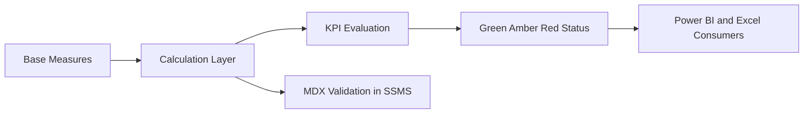
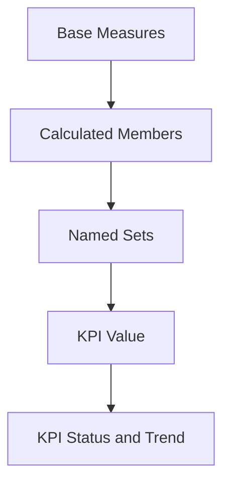
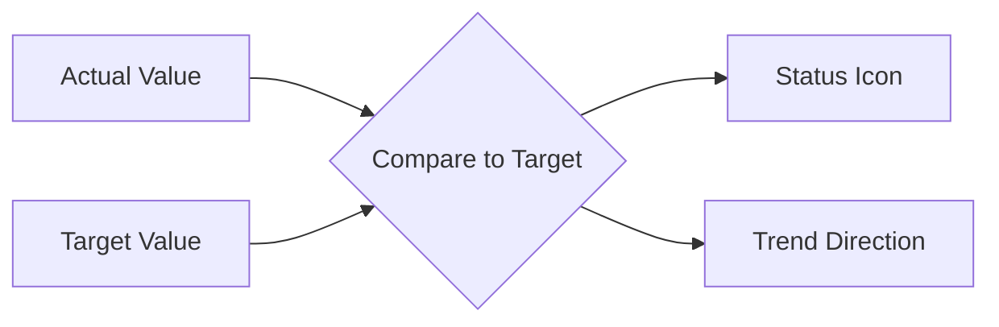
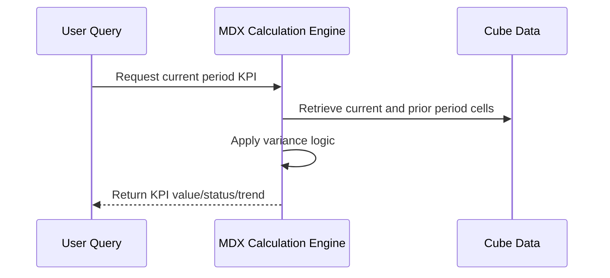
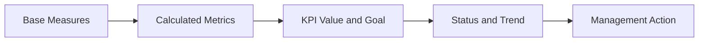

# Advanced Queries, Calculations, and KPIs
## Day 02 | Assmang Pty Ltd — SSAS Fundamentals Training

---

## 🎯 Learning Objectives

By the end of this topic, participants will be able to:

1. Create calculated measures and members for business-friendly analytics.
2. Understand named sets and reusable MDX logic.
3. Design practical KPIs for production, cost, and safety monitoring.
4. Use time-based calculations to support trend analysis.

---

## 📋 Topic Overview

**Dataset:** `v3_assmang_mining_complete.sql`  
**Difficulty:** Beginner (no prior SSAS experience required)  
**Estimated reading time:** 20-30 minutes

### What is this topic about?

This topic teaches you about **Advanced Queries, Calculations, and KPIs**. If you have never worked with SQL Server Analysis Services before, don't worry — we will explain everything from scratch using plain language and real examples from Assmang's mining operations.

### Why does this matter to you?

As someone working at or with Assmang, you deal with data every day — production figures, costs, safety records, employee information. Right now, getting answers from that data probably involves:

- Asking someone in IT to write a report
- Waiting for Excel spreadsheets to be updated
- Running the same SQL queries over and over
- Not being sure if the numbers are up to date

SSAS solves these problems by creating a **pre-built analytical model** (called a "cube") that lets anyone with Excel or Power BI get instant answers without writing code.

### The Assmang training context

All examples in this course use data from Assmang's actual operations:

| Mine | What it produces | Where it is |
|------|-----------------|-------------|
| Beeshoek Mine | Iron Ore | Postmasburg, Northern Cape |
| Khumani Mine | Iron Ore | Kathu, Northern Cape |
| Black Rock Mine | Manganese | Hotazel, Northern Cape |
| Dwarsrivier Chrome Mine | Chrome | Burgersfort, Limpopo |
| Machadodorp Works | Chrome (processing) | Machadodorp, Mpumalanga |

---

## 🧠 Real-World Analogy (Plain English)

**Think of this topic like adding a dashboard with warning lights to your car.**

Basic measures tell you speed and fuel level. But KPIs are like adding warning lights — green means everything is fine, amber means pay attention, red means there is a problem. A KPI takes a measure (like production tonnes), compares it to a target, and shows a colour-coded status so executives can instantly see which mines are on track and which need attention.

> **Key insight:** SSAS takes complex data and makes it simple to explore. You don't need to be a programmer to use the results — you just need to know what question you want to answer.

---

## 1. Calculated measures

### 💬 In plain English

Let's break down **calculated measures** in the simplest possible terms:

**→** Calculated measures derive new business insight without changing the source fact table.

**→** Examples include cost per tonne, revenue variance, and tonnes per employee.

**→** These measures should be clearly named and documented for users.

### 📚 Detailed explanation

This concept is important because it directly affects how well the cube works for business users. Here is a deeper look:

**Point 1: Calculated measures derive new business insight without changing the source fact table.**

What this means in practice: When you apply this at Assmang, it means that calculated measures derive new business insight without changing the source fact table. This is not just a technical exercise — it directly helps managers, engineers, and executives get better information faster.

**Point 2: Examples include cost per tonne, revenue variance, and tonnes per employee.**

What this means in practice: When you apply this at Assmang, it means that examples include cost per tonne, revenue variance, and tonnes per employee. This is not just a technical exercise — it directly helps managers, engineers, and executives get better information faster.

**Point 3: These measures should be clearly named and documented for users.**

What this means in practice: When you apply this at Assmang, it means that these measures should be clearly named and documented for users. This is not just a technical exercise — it directly helps managers, engineers, and executives get better information faster.

### 🏭 Assmang scenario

**Situation:** A production manager at Khumani Mine asks: "Can I see this month's iron ore output compared to last month, broken down by shift?"

**How calculated measures helps:** Because the cube already has the right structure (dimensions for time and mine, measures for production), this question can be answered in seconds using Excel or Power BI — no SQL coding needed, no waiting for IT.

### ❓ Frequently Asked Questions

**Q: Do I need to be a programmer to understand calculated measures?**  
A: No. This concept is about business logic and design thinking. The tools (SSDT) provide visual interfaces for most of the work.

**Q: What happens if we get calculated measures wrong?**  
A: The cube will still work technically, but users may get confusing results, slow performance, or missing data. That's why we follow best practices from the start.

**Q: How long does it take to set up calculated measures for a real project?**  
A: For a project the size of Assmang's training cube, this typically takes a few hours of design work plus a few hours of implementation and testing.

---

## 2. Named sets and reusable logic

### 💬 In plain English

Let's break down **named sets and reusable logic** in the simplest possible terms:

**→** Named sets define reusable groups of members, such as top-performing mines or active operations.

**→** They simplify repeated report logic and improve consistency.

### 📚 Detailed explanation

This concept is important because it directly affects how well the cube works for business users. Here is a deeper look:

**Point 1: Named sets define reusable groups of members, such as top-performing mines or active operations.**

What this means in practice: When you apply this at Assmang, it means that named sets define reusable groups of members, such as top-performing mines or active operations. This is not just a technical exercise — it directly helps managers, engineers, and executives get better information faster.

**Point 2: They simplify repeated report logic and improve consistency.**

What this means in practice: When you apply this at Assmang, it means that they simplify repeated report logic and improve consistency. This is not just a technical exercise — it directly helps managers, engineers, and executives get better information faster.

### 🏭 Assmang scenario

**Situation:** A production manager at Khumani Mine asks: "Can I see this month's iron ore output compared to last month, broken down by shift?"

**How named sets and reusable logic helps:** Because the cube already has the right structure (dimensions for time and mine, measures for production), this question can be answered in seconds using Excel or Power BI — no SQL coding needed, no waiting for IT.

### ❓ Frequently Asked Questions

**Q: Do I need to be a programmer to understand named sets and reusable logic?**  
A: No. This concept is about business logic and design thinking. The tools (SSDT) provide visual interfaces for most of the work.

**Q: What happens if we get named sets and reusable logic wrong?**  
A: The cube will still work technically, but users may get confusing results, slow performance, or missing data. That's why we follow best practices from the start.

**Q: How long does it take to set up named sets and reusable logic for a real project?**  
A: For a project the size of Assmang's training cube, this typically takes a few hours of design work plus a few hours of implementation and testing.

---

## 3. KPIs in SSAS

### 💬 In plain English

Let's break down **kpis in ssas** in the simplest possible terms:

**→** A KPI combines value, goal, status, and often trend.

**→** At Assmang, KPIs can be created for safety score, production target attainment, or cost control.

**→** KPIs help executives consume analytics visually and consistently.

### 📚 Detailed explanation

This concept is important because it directly affects how well the cube works for business users. Here is a deeper look:

**Point 1: A KPI combines value, goal, status, and often trend.**

What this means in practice: When you apply this at Assmang, it means that a kpi combines value, goal, status, and often trend. This is not just a technical exercise — it directly helps managers, engineers, and executives get better information faster.

**Point 2: At Assmang, KPIs can be created for safety score, production target attainment, or cost control.**

What this means in practice: When you apply this at Assmang, it means that at assmang, kpis can be created for safety score, production target attainment, or cost control. This is not just a technical exercise — it directly helps managers, engineers, and executives get better information faster.

**Point 3: KPIs help executives consume analytics visually and consistently.**

What this means in practice: When you apply this at Assmang, it means that kpis help executives consume analytics visually and consistently. This is not just a technical exercise — it directly helps managers, engineers, and executives get better information faster.

### 🏭 Assmang scenario

**Situation:** A production manager at Khumani Mine asks: "Can I see this month's iron ore output compared to last month, broken down by shift?"

**How kpis in ssas helps:** Because the cube already has the right structure (dimensions for time and mine, measures for production), this question can be answered in seconds using Excel or Power BI — no SQL coding needed, no waiting for IT.

### ❓ Frequently Asked Questions

**Q: Do I need to be a programmer to understand kpis in ssas?**  
A: No. This concept is about business logic and design thinking. The tools (SSDT) provide visual interfaces for most of the work.

**Q: What happens if we get kpis in ssas wrong?**  
A: The cube will still work technically, but users may get confusing results, slow performance, or missing data. That's why we follow best practices from the start.

**Q: How long does it take to set up kpis in ssas for a real project?**  
A: For a project the size of Assmang's training cube, this typically takes a few hours of design work plus a few hours of implementation and testing.

---

## 4. Time-based logic

### 💬 In plain English

Let's break down **time-based logic** in the simplest possible terms:

**→** MDX calculations often compare current month to previous month, current year to previous year, or actual to target.

**→** This is where clean date hierarchies become especially valuable.

### 📚 Detailed explanation

This concept is important because it directly affects how well the cube works for business users. Here is a deeper look:

**Point 1: MDX calculations often compare current month to previous month, current year to previous year, or actual to target.**

What this means in practice: When you apply this at Assmang, it means that mdx calculations often compare current month to previous month, current year to previous year, or actual to target. This is not just a technical exercise — it directly helps managers, engineers, and executives get better information faster.

**Point 2: This is where clean date hierarchies become especially valuable.**

What this means in practice: When you apply this at Assmang, it means that this is where clean date hierarchies become especially valuable. This is not just a technical exercise — it directly helps managers, engineers, and executives get better information faster.

### 🏭 Assmang scenario

**Situation:** A production manager at Khumani Mine asks: "Can I see this month's iron ore output compared to last month, broken down by shift?"

**How time-based logic helps:** Because the cube already has the right structure (dimensions for time and mine, measures for production), this question can be answered in seconds using Excel or Power BI — no SQL coding needed, no waiting for IT.

### ❓ Frequently Asked Questions

**Q: Do I need to be a programmer to understand time-based logic?**  
A: No. This concept is about business logic and design thinking. The tools (SSDT) provide visual interfaces for most of the work.

**Q: What happens if we get time-based logic wrong?**  
A: The cube will still work technically, but users may get confusing results, slow performance, or missing data. That's why we follow best practices from the start.

**Q: How long does it take to set up time-based logic for a real project?**  
A: For a project the size of Assmang's training cube, this typically takes a few hours of design work plus a few hours of implementation and testing.

---

## 📊 Architecture / Concept Diagram

The following diagram shows how this topic fits into the bigger picture:

### How to read this diagram

- **Left side:** Where your raw data lives (SQL Server database tables containing production, cost, safety, and employee data).
- **Middle:** Where SSAS transforms that raw data into an analytical structure (the cube with its dimensions, hierarchies, and measures).
- **Right side:** Where business users access the results (Excel pivot tables, Power BI dashboards, or MDX query results in SSMS).

### Why this matters

Without SSAS (the middle layer), every time a manager wants an answer, someone has to write SQL code against the raw database. With SSAS, the analytical structure is pre-built, so users can explore data independently using familiar tools like Excel.

---

## 📖 Key Terminology Reference

Here are the most important terms for this topic. Don't worry about memorising them all — you will learn them naturally through practice:

| Term | Plain English Definition | Example at Assmang |
|------|------------------------|-------------------|
| **Cube** | A pre-built analytical structure that lets users explore data from many angles | The "Assmang Mining Analytics" cube containing all production and cost data |
| **Dimension** | A category you use to slice data (like filters in Excel) | Mine, Date, Department, Employee — these are the "by what" categories |
| **Hierarchy** | A drill-down path from general to specific | Year → Quarter → Month → Day (time hierarchy) |
| **Member** | One specific value within a dimension | "Beeshoek Mine" is a member of the Mine dimension |
| **Measure** | A number you want to analyse | Tonnes Produced, Revenue in ZAR, Cost Per Tonne |
| **Measure Group** | A collection of related measures from one business area | Production Measures (tonnes + grade + revenue) |
| **Fact Table** | The database table that stores the raw numbers | FactProduction, FactOperatingCosts |
| **Processing** | Loading data into the cube and building pre-calculated summaries | Running a nightly job that refreshes yesterday's production data |
| **Aggregation** | A pre-calculated total or average stored for speed | Total tonnes per mine per month (calculated once, queried many times) |
| **MDX** | The query language used to ask questions of a cube | Similar to SQL, but designed for multidimensional analysis |
| **MOLAP** | Storage mode where data is stored inside the cube for maximum speed | Default choice for Assmang — gives sub-second query times |
| **ROLAP** | Storage mode where data stays in SQL Server (slower but always fresh) | Used when real-time data is more important than speed |
| **KPI** | A traffic-light indicator showing whether a target is being met | Production KPI: Green if >= 90% of target, Red if < 70% |
| **SSDT** | SQL Server Data Tools — the IDE where you design and build cubes | Visual Studio with the SSAS project templates |
| **SSMS** | SQL Server Management Studio — for administration and testing | Where you deploy cubes and run MDX queries |
| **Data Source View (DSV)** | A logical view of which database tables the cube uses | Selecting Dim_Mine, Dim_Date, FactProduction for inclusion |
| **Deployment** | Pushing your cube design from your computer to the SSAS server | Like publishing a website — makes it available to users |

---

## 🧭 Additional Diagrams

### Diagram 1: Calculation Layering

### Diagram 2: KPI Evaluation Flow

### Diagram 3: Time Intelligence Pattern

## 📌 Topic-Specific Summary

This topic adds business semantics on top of raw numbers. Calculations, named sets, and KPIs convert aggregate data into decision-ready performance indicators for operations and leadership.

This is where analytics becomes management language: not only "what happened", but "are we on target" and "are we improving or declining".

## Deep Dive in Layman Terms

A calculated measure answers "derived" questions such as cost per tonne. A KPI wraps business meaning around numbers using thresholds and trend logic.

Named sets help you reuse common business views like "top 5 mines by revenue" without rewriting logic each time.

### Assmang-style example

A KPI status can immediately show if a mine is under target for monthly production, while a trend arrow shows whether it is recovering or worsening. Leaders act faster when this context is visible.

### Clarity diagram: From data to decision signal

