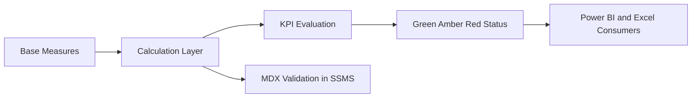
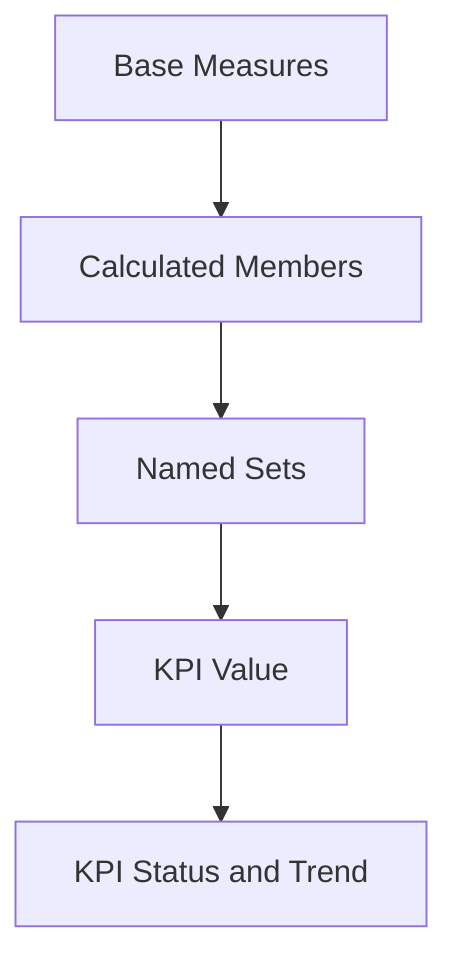
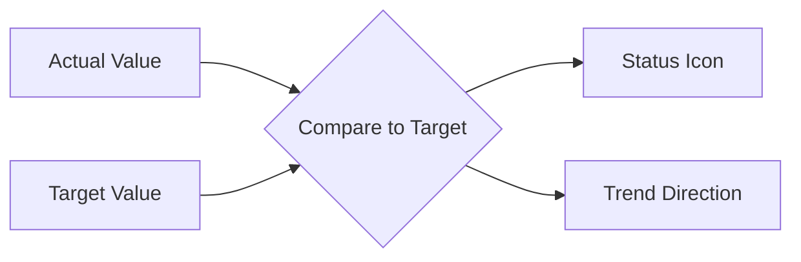
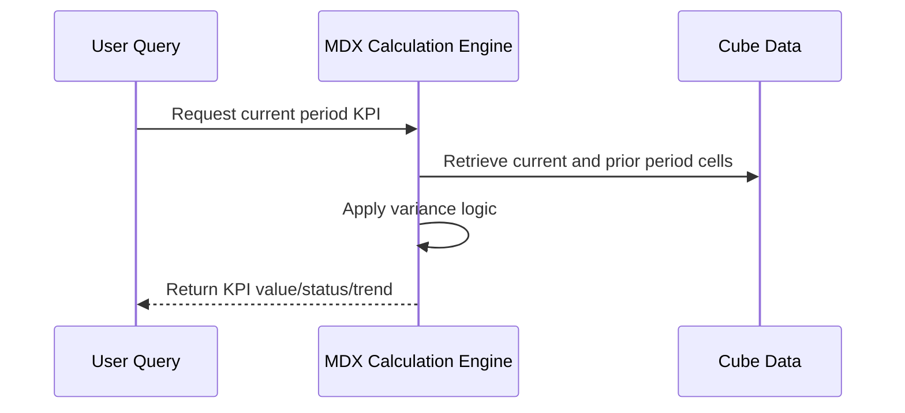
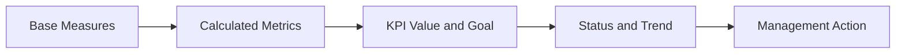

# Advanced Queries, Calculations, and KPIs
## Day 02 | Assmang Pty Ltd — SSAS Fundamentals Training

---

## 🎯 Learning Objectives

By the end of this topic, participants will be able to:

1. Create calculated measures and members for business-friendly analytics.
2. Understand named sets and reusable MDX logic.
3. Design practical KPIs for production, cost, and safety monitoring.
4. Use time-based calculations to support trend analysis.

---

## 📋 Topic Overview

**Dataset:** `v3_assmang_mining_complete.sql`  
**Difficulty:** Beginner (no prior SSAS experience required)  
**Estimated reading time:** 20-30 minutes

### What is this topic about?

This topic teaches you about **Advanced Queries, Calculations, and KPIs**. If you have never worked with SQL Server Analysis Services before, don't worry — we will explain everything from scratch using plain language and real examples from Assmang's mining operations.

### Why does this matter to you?

As someone working at or with Assmang, you deal with data every day — production figures, costs, safety records, employee information. Right now, getting answers from that data probably involves:

- Asking someone in IT to write a report
- Waiting for Excel spreadsheets to be updated
- Running the same SQL queries over and over
- Not being sure if the numbers are up to date

SSAS solves these problems by creating a **pre-built analytical model** (called a "cube") that lets anyone with Excel or Power BI get instant answers without writing code.

### The Assmang training context

All examples in this course use data from Assmang's actual operations:

| Mine | What it produces | Where it is |
|------|-----------------|-------------|
| Beeshoek Mine | Iron Ore | Postmasburg, Northern Cape |
| Khumani Mine | Iron Ore | Kathu, Northern Cape |
| Black Rock Mine | Manganese | Hotazel, Northern Cape |
| Dwarsrivier Chrome Mine | Chrome | Burgersfort, Limpopo |
| Machadodorp Works | Chrome (processing) | Machadodorp, Mpumalanga |

---

## 🧠 Real-World Analogy (Plain English)

**Think of this topic like adding a dashboard with warning lights to your car.**

Basic measures tell you speed and fuel level. But KPIs are like adding warning lights — green means everything is fine, amber means pay attention, red means there is a problem. A KPI takes a measure (like production tonnes), compares it to a target, and shows a colour-coded status so executives can instantly see which mines are on track and which need attention.

> **Key insight:** SSAS takes complex data and makes it simple to explore. You don't need to be a programmer to use the results — you just need to know what question you want to answer.

---

## 1. Calculated measures — Real formulas with step-by-step guide

A calculated measure derives a new business insight by combining existing measures or applying logic.

### Formula 1: Cost Per Tonne (Most useful at Assmang)

**What it does:** Divides total operating cost by tonnes produced to show efficiency

**Formula:**
```mdx
([Measures].[Total Operating Cost] / [Measures].[Tonnes Produced])
```

**Where it's used at Assmang:**
- Daily: "Was today's production cost-effective?"
- Monthly: "Which mine ran most cheaply this month?"
- Trend: "Is our cost per tonne going up or down?"

**Worked example with real numbers:**

| Scenario | Tonnes Produced | Total Operating Cost | Cost Per Tonne |
|----------|-----------------|----------------------|-----------------|
| Khumani week 1 | 5,500 tonnes | R 2,200,000 | R 400/tonne |
| Khumani week 2 | 6,200 tonnes | R 2,325,000 | R 375/tonne |
| Khumani week 3 | 5,800 tonnes | R 2,088,000 | R 360/tonne |
| **Combined** | **17,500 tonnes** | **R 6,613,000** | **R 378/tonne** |

**Why this matters:** If a manager sees "Week 3 cost R 360/tonne but Week 1 cost R 400," they can investigate what made Week 3 more efficient (better maintenance? fewer breakdowns?).

**How to implement in SSDT:**

**Step 1:** Open the Assmang project in Visual Studio

**Step 2:** Double-click the **Assmang Mining Analytics** cube to open Cube Designer

**Step 3:** Click the **Calculations** tab

**Step 4:** Click **New Calculated Member** button

**Step 5:** In the **Name** field, type: `Cost Per Tonne (ZAR)`

**Step 6:** In the **Parent hierarchy** dropdown, select: `[Measures]`

**Step 7:** In the **Expression** field, paste:
```mdx
([Measures].[Total Operating Cost] / [Measures].[Tonnes Produced])
```

**Step 8:** Click **OK**

**Step 9:** Click **Build Solution** (Ctrl+Shift+B)

**Step 10:** Right-click the project and click **Deploy**

**Step 11:** Wait for deployment message "Deployment Successful"

**Step 12:** In Cube Designer, click the **Browser** tab

**Step 13:** Drag `[Measures].[Cost Per Tonne (ZAR)]` to the grid area

**Step 14:** Verify you see reasonable numbers (between 200-500 ZAR/tonne for Assmang)

---

### Formula 2: Revenue per Employee

**What it does:** Shows how much revenue each employee generates (workforce productivity)

**Formula:**
```mdx
([Measures].[Revenue (ZAR)] / [Measures].[Employee Count])
```

**Where it's used at Assmang:**
- HR planning: "Are we staffing efficiently?"
- Quarterly review: "Did revenue-per-employee improve?"
- Department comparison: "Which department is most productive?"

**Real example:**
```
Khumani:   R 28,500,000 revenue / 450 employees = R 63,333 per employee
Beeshoek: R 18,200,000 revenue / 280 employees = R 65,000 per employee
```

Beeshoek generates slightly more revenue per worker, suggesting better efficiency or higher-grade ore.

**How to implement:** (Same 14 steps as above, but with this formula)

---

### Formula 3: Equipment Uptime Percentage

**What it does:** Shows what percentage of available time equipment was running

**Formula:**
```mdx
([Measures].[Equipment Hours Available] - [Measures].[Maintenance Hours]) 
/ [Measures].[Equipment Hours Available] * 100
```

**Where it's used at Assmang:**
- Daily: "Was equipment reliable?"
- Maintenance planning: "Which machines break down most?"
- SLA tracking: "Are we meeting 95% uptime target?"

---

### Formula 4: Grade Consistency (Weighted average across shifts)

**Formula:**
```mdx
[Measures].[Total Ore Grade] / [Measures].[Tonnes Produced]
```

**Where it's used:**
- Ore quality monitoring
- Buyer confidence (consistent grade = premium price)
- Shift performance comparison

---

## 2. Named sets and reusable logic — Practical examples

A named set is a pre-built list of members you can reuse in any query, saving time and ensuring consistency.

### Named Set 1: High-performing mines

**What it does:** Automatically groups mines by production (e.g., top 2 mines)

**Formula:**
```mdx
TopCount([Mine].[Mine Name].Members, 2, [Measures].[Tonnes Produced])
```

**What this means:** Rank all mines by Tonnes Produced, return the top 2

**Where it's used:**
- Executive dashboards: "Show me the leading operations"
- Bonus allocation: "Which mines qualify for performance bonus?"
- Capacity planning: "Which operations should get equipment upgrades?"

**Expected result:**
```
Rank 1: Khumani (45,200 tonnes)
Rank 2: Beeshoek (32,500 tonnes)
```

**How to create in SSDT:**

**Step 1:** Open Cube Designer

**Step 2:** Click the **Calculations** tab

**Step 3:** In the **Script Organizer** panel on the right, right-click **Named Sets**

**Step 4:** Click **New Named Set**

**Step 5:** In the **Name** field, type: `Top Producing Mines`

**Step 6:** In the **Expression** field, paste:
```mdx
TopCount([Mine].[Mine Name].Members, 2, [Measures].[Tonnes Produced])
```

**Step 7:** Click **OK**

**Step 8:** Rebuild and deploy

**Step 9:** In a query, you can now use:
```mdx
SELECT { [Measures].[Tonnes Produced] } ON COLUMNS,
       [Top Producing Mines] ON ROWS
FROM [Assmang Mining Analytics]
```

---

### Named Set 2: Iron Ore operations only

**What it does:** Shows only mines that produce iron ore (excludes chromium/manganese)

**Formula:**
```mdx
{ [Mine].[Khumani], [Mine].[Beeshoek] }
```

**Where it's used:**
- Separate P&L by commodity
- Commodity-specific safety meetings
- Market analysis (iron ore prices move independently)

---

### Named Set 3: Current calendar year (dynamic)

**What it does:** Always points to the current year, no manual updates needed

**Formula:**
```mdx
[Date].[Calendar].[Year].&[2024]
```

**Where it's used:**
- Year-end reporting ("Compare 2024 to 2023")
- Rolling 12-month analysis
- Consistency across reports (all queries use same year reference)

---

## 3. KPI design — Practical formulas and status logic

A KPI is a metric that automatically shows a traffic light (Green/Amber/Red) based on whether a target is being met.

### KPI 1: Production Target KPI

**Business question:** "Is Khumani meeting its daily production target of 1,000 tonnes?"

**Key Measure (what we're tracking):**
```mdx
[Measures].[Tonnes Produced]
```

**Target Formula (what we want):**
```mdx
1000  ← Fixed daily target
```

**Status Formula (green/amber/red logic):**
```mdx
IF [Measures].[Tonnes Produced] >= 1000 THEN 1 ELSE IF [Measures].[Tonnes Produced] >= 800 THEN 0 ELSE -1
```

**Status values:**
- `1` = Green (success — 100% or more of target)
- `0` = Amber (warning — 80-99% of target, something to watch)
- `-1` = Red (critical — below 80% of target, needs action)

**Real example:**
```
2024-01-15:  Khumani produced 1,050 tonnes  → 1,050 >= 1,000  → GREEN (exceeding target)
2024-01-16:  Khumani produced 850 tonnes    → 850 >= 800     → AMBER (slightly below target)
2024-01-17:  Khumani produced 650 tonnes    → 650 < 800      → RED (significantly below target—needs investigation)
```

**How to create in SSDT:**

**Step 1:** Open Cube Designer → **Calculations** tab

**Step 2:** Right-click **KPIs** in the Script Organizer

**Step 3:** Click **New KPI**

**Step 4:** In the **KPI Name** field, type: `Production Target KPI`

**Step 5:** For **Associated measure group**, select: `Production`

**Step 6:** In the **Key Performance Indicator** section:
   - **Measure name:** `[Measures].[Tonnes Produced]`

**Step 7:** In the **Target expression** box, enter:
```mdx
1000
```

**Step 8:** In the **Status expression** box, enter:
```mdx
CASE
  WHEN [Measures].[Tonnes Produced] >= 1000 THEN 1
  WHEN [Measures].[Tonnes Produced] >= 800 THEN 0
  ELSE -1
END
```

**Step 9:** Optionally set **Trend expression** to show if trending up or down:
```mdx
CASE
  WHEN [Measures].[Tonnes Produced] > 1000 THEN 1
  WHEN [Measures].[Tonnes Produced] = 1000 THEN 0
  ELSE -1
END
```

**Step 10:** Click **OK**

**Step 11:** Rebuild and deploy

**Step 12:** Test in Browser tab — select a date and mine, observe KPI status

---

### KPI 2: Cost Efficiency KPI

**Business question:** "Is our cost per tonne within acceptable range?"

**Key Measure:**
```mdx
[Measures].[Cost Per Tonne (ZAR)]
```

**Target (industry standard for Assmang):**
```mdx
400  ← Target is R 400 per tonne
```

**Status Formula:**
```mdx
CASE
  WHEN [Measures].[Cost Per Tonne (ZAR)] <= 400 THEN 1   ← GREEN if <= target (cheaper is better)
  WHEN [Measures].[Cost Per Tonne (ZAR)] <= 450 THEN 0   ← AMBER if within 50 above
  ELSE -1                                                  ← RED if > 450 (too expensive)
END
```

**Real example:**
```
Day 1: Cost R 380/tonne  → 380 <= 400  → GREEN (efficient)
Day 2: Cost R 425/tonne  → 425 <= 450  → AMBER (acceptable but getting expensive)
Day 3: Cost R 475/tonne  → 475 > 450   → RED (over budget, investigate waste)
```

---

### KPI 3: Safety Compliance KPI

**Business question:** "Is our safety compliance score meeting minimum requirements?"

**Key Measure:**
```mdx
[Measures].[Safety Compliance Score]
```

**Target:**
```mdx
95  ← Target 95% compliance (industry standard)
```

**Status Formula:**
```mdx
CASE
  WHEN [Measures].[Safety Compliance Score] >= 95 THEN 1    ← GREEN (excellent safety)
  WHEN [Measures].[Safety Compliance Score] >= 80 THEN 0    ← AMBER (acceptable but needs monitoring)
  ELSE -1                                                     ← RED (critical safety concerns)
END
```

**How it plays out at Assmang:**
- **GREEN (95%+):** No lost-time accidents, all protocols followed → bonus eligible
- **AMBER (80-94%):** Minor incidents, training needed → watchlist
- **RED (<80%):** Major incidents, operations review → immediate action

---

## Common errors and how to fix them

| Error | Cause | Solution |
|-------|-------|----------|
| "Calculated measure shows no data" | Missing [Measures]. prefix | Always write `[Measures].[Name]`, not just `[Name]` |
| "Named set returns empty" | Hierarchy spelled wrong | Check exact hierarchy name in Cube Designer (e.g., `[Mine].[Mine Name]`, not `[Mine].[MineName]`) |
| "KPI shows no status color" | Status expression returns wrong values (must be -1, 0, or 1) | Verify formula returns exactly -1 (red), 0 (amber), or 1 (green) |
| "Formula works in Calculations tab but not in queries" | Didn't rebuild and deploy | Always Ctrl+Shift+B then right-click project→Deploy |
| "Can't see calculated measure in Browser" | Measure not in default measure set | Right-click measure in Cube Designer → Add to Default Measure Set |

---

## Where to use these formulas in practice

| Formula Type | Used by | Frequency | Tools |
|--------------|---------|-----------|-------|
| **Calculated measures** (Cost Per Tonne, Revenue Per Employee) | Analysts, Managers | Daily reports | Excel, Power BI, SSMS |
| **Named sets** (Top Mines, Iron Ore Only) | Dashboard developers, Executives | Standing dashboards | SSRS, Power BI |
| **KPIs** (Production Target, Cost Efficiency, Safety) | Plant managers, Executives | Daily dashboards, alerts | Power BI, Excel, SSAS Browser |

---

## 3. KPIs in SSAS

### 💬 In plain English

Let's break down **kpis in ssas** in the simplest possible terms:

**→** A KPI combines value, goal, status, and often trend.

**→** At Assmang, KPIs can be created for safety score, production target attainment, or cost control.

**→** KPIs help executives consume analytics visually and consistently.

### 📚 Detailed explanation

This concept is important because it directly affects how well the cube works for business users. Here is a deeper look:


**Point 1: A KPI combines value, goal, status, and often trend.**

What this means in practice: When you apply this at Assmang, it means that a kpi combines value, goal, status, and often trend. This is not just a technical exercise — it directly helps managers, engineers, and executives get better information faster.

**Point 2: At Assmang, KPIs can be created for safety score, production target attainment, or cost control.**

What this means in practice: When you apply this at Assmang, it means that at assmang, kpis can be created for safety score, production target attainment, or cost control. This is not just a technical exercise — it directly helps managers, engineers, and executives get better information faster.

**Point 3: KPIs help executives consume analytics visually and consistently.**

What this means in practice: When you apply this at Assmang, it means that kpis help executives consume analytics visually and consistently. This is not just a technical exercise — it directly helps managers, engineers, and executives get better information faster.


### 🏭 Assmang scenario

**Situation:** A production manager at Khumani Mine asks: "Can I see this month's iron ore output compared to last month, broken down by shift?"

**How kpis in ssas helps:** Because the cube already has the right structure (dimensions for time and mine, measures for production), this question can be answered in seconds using Excel or Power BI — no SQL coding needed, no waiting for IT.


### ❓ Frequently Asked Questions

**Q: Do I need to be a programmer to understand kpis in ssas?**  
A: No. This concept is about business logic and design thinking. The tools (SSDT) provide visual interfaces for most of the work.

**Q: What happens if we get kpis in ssas wrong?**  
A: The cube will still work technically, but users may get confusing results, slow performance, or missing data. That's why we follow best practices from the start.

**Q: How long does it take to set up kpis in ssas for a real project?**  
A: For a project the size of Assmang's training cube, this typically takes a few hours of design work plus a few hours of implementation and testing.

---

## 4. Time-based logic

### 💬 In plain English

Let's break down **time-based logic** in the simplest possible terms:

**→** MDX calculations often compare current month to previous month, current year to previous year, or actual to target.

**→** This is where clean date hierarchies become especially valuable.

### 📚 Detailed explanation

This concept is important because it directly affects how well the cube works for business users. Here is a deeper look:


**Point 1: MDX calculations often compare current month to previous month, current year to previous year, or actual to target.**

What this means in practice: When you apply this at Assmang, it means that mdx calculations often compare current month to previous month, current year to previous year, or actual to target. This is not just a technical exercise — it directly helps managers, engineers, and executives get better information faster.

**Point 2: This is where clean date hierarchies become especially valuable.**

What this means in practice: When you apply this at Assmang, it means that this is where clean date hierarchies become especially valuable. This is not just a technical exercise — it directly helps managers, engineers, and executives get better information faster.


### 🏭 Assmang scenario

**Situation:** A production manager at Khumani Mine asks: "Can I see this month's iron ore output compared to last month, broken down by shift?"

**How time-based logic helps:** Because the cube already has the right structure (dimensions for time and mine, measures for production), this question can be answered in seconds using Excel or Power BI — no SQL coding needed, no waiting for IT.


### ❓ Frequently Asked Questions

**Q: Do I need to be a programmer to understand time-based logic?**  
A: No. This concept is about business logic and design thinking. The tools (SSDT) provide visual interfaces for most of the work.

**Q: What happens if we get time-based logic wrong?**  
A: The cube will still work technically, but users may get confusing results, slow performance, or missing data. That's why we follow best practices from the start.

**Q: How long does it take to set up time-based logic for a real project?**  
A: For a project the size of Assmang's training cube, this typically takes a few hours of design work plus a few hours of implementation and testing.

---

## 📊 Architecture / Concept Diagram

The following diagram shows how this topic fits into the bigger picture:



### How to read this diagram

- **Left side:** Where your raw data lives (SQL Server database tables containing production, cost, safety, and employee data).
- **Middle:** Where SSAS transforms that raw data into an analytical structure (the cube with its dimensions, hierarchies, and measures).
- **Right side:** Where business users access the results (Excel pivot tables, Power BI dashboards, or MDX query results in SSMS).

### Why this matters

Without SSAS (the middle layer), every time a manager wants an answer, someone has to write SQL code against the raw database. With SSAS, the analytical structure is pre-built, so users can explore data independently using familiar tools like Excel.

---

## 📖 Key Terminology Reference

Here are the most important terms for this topic. Don't worry about memorising them all — you will learn them naturally through practice:


| Term | Plain English Definition | Example at Assmang |
|------|------------------------|-------------------|
| **Cube** | A pre-built analytical structure that lets users explore data from many angles | The "Assmang Mining Analytics" cube containing all production and cost data |
| **Dimension** | A category you use to slice data (like filters in Excel) | Mine, Date, Department, Employee — these are the "by what" categories |
| **Hierarchy** | A drill-down path from general to specific | Year → Quarter → Month → Day (time hierarchy) |
| **Member** | One specific value within a dimension | "Beeshoek Mine" is a member of the Mine dimension |
| **Measure** | A number you want to analyse | Tonnes Produced, Revenue in ZAR, Cost Per Tonne |
| **Measure Group** | A collection of related measures from one business area | Production Measures (tonnes + grade + revenue) |
| **Fact Table** | The database table that stores the raw numbers | FactProduction, FactOperatingCosts |
| **Processing** | Loading data into the cube and building pre-calculated summaries | Running a nightly job that refreshes yesterday's production data |
| **Aggregation** | A pre-calculated total or average stored for speed | Total tonnes per mine per month (calculated once, queried many times) |
| **MDX** | The query language used to ask questions of a cube | Similar to SQL, but designed for multidimensional analysis |
| **MOLAP** | Storage mode where data is stored inside the cube for maximum speed | Default choice for Assmang — gives sub-second query times |
| **ROLAP** | Storage mode where data stays in SQL Server (slower but always fresh) | Used when real-time data is more important than speed |
| **KPI** | A traffic-light indicator showing whether a target is being met | Production KPI: Green if >= 90% of target, Red if < 70% |
| **SSDT** | SQL Server Data Tools — the IDE where you design and build cubes | Visual Studio with the SSAS project templates |
| **SSMS** | SQL Server Management Studio — for administration and testing | Where you deploy cubes and run MDX queries |
| **Data Source View (DSV)** | A logical view of which database tables the cube uses | Selecting Dim_Mine, Dim_Date, FactProduction for inclusion |
| **Deployment** | Pushing your cube design from your computer to the SSAS server | Like publishing a website — makes it available to users |

---


## 🧭 Additional Diagrams

### Diagram 1: Calculation Layering



### Diagram 2: KPI Evaluation Flow



### Diagram 3: Time Intelligence Pattern



## 📌 Topic-Specific Summary

This topic adds business semantics on top of raw numbers. Calculations, named sets, and KPIs convert aggregate data into decision-ready performance indicators for operations and leadership.

This is where analytics becomes management language: not only "what happened", but "are we on target" and "are we improving or declining".

## Deep Dive in Layman Terms

A calculated measure answers "derived" questions such as cost per tonne. A KPI wraps business meaning around numbers using thresholds and trend logic.

Named sets help you reuse common business views like "top 5 mines by revenue" without rewriting logic each time.

### Assmang-style example

A KPI status can immediately show if a mine is under target for monthly production, while a trend arrow shows whether it is recovering or worsening. Leaders act faster when this context is visible.

### Clarity diagram: From data to decision signal


