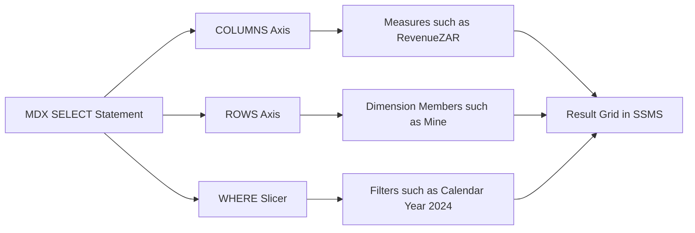
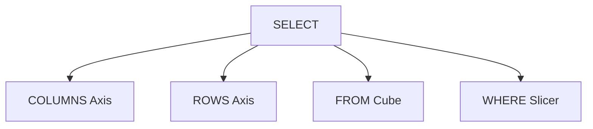
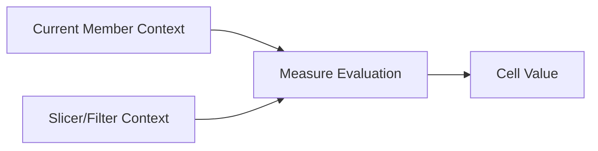
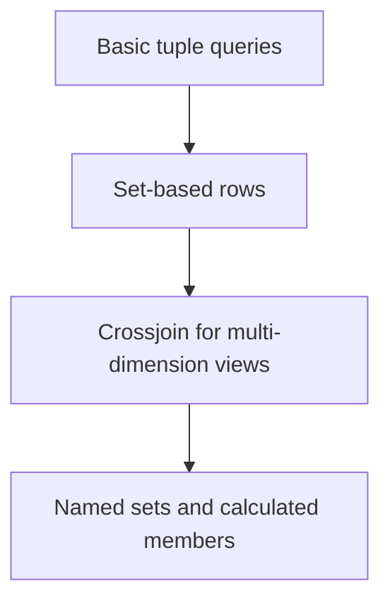
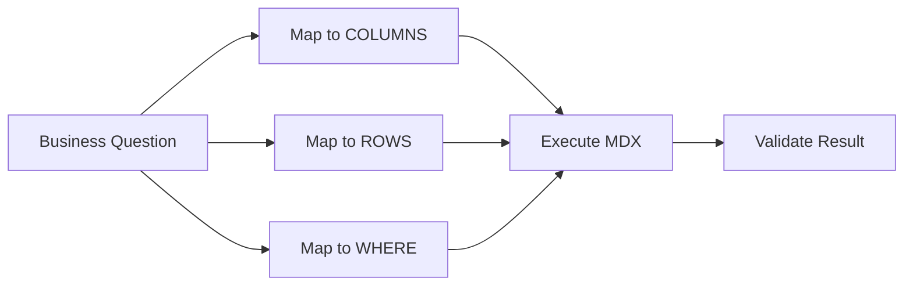

# MDX Query Fundamentals
## Day 02 | Assmang Pty Ltd — SSAS Fundamentals Training

---

## 🎯 Learning Objectives

By the end of this topic, participants will be able to:

1. Understand the structure of a basic MDX SELECT statement.
2. Work with measures, members, sets, tuples, and slicers.
3. Query the Assmang cube for common analytical views.
4. Recognise how MDX differs from SQL thinking.

---

## 📋 Topic Overview

**Dataset:** `v3_assmang_mining_complete.sql`  
**Difficulty:** Beginner (no prior SSAS experience required)  
**Estimated reading time:** 20-30 minutes

### What is this topic about?

This topic teaches you about **MDX Query Fundamentals**. If you have never worked with SQL Server Analysis Services before, don't worry — we will explain everything from scratch using plain language and real examples from Assmang's mining operations.

### Why does this matter to you?

As someone working at or with Assmang, you deal with data every day — production figures, costs, safety records, employee information. Right now, getting answers from that data probably involves:

- Asking someone in IT to write a report
- Waiting for Excel spreadsheets to be updated
- Running the same SQL queries over and over
- Not being sure if the numbers are up to date

SSAS solves these problems by creating a **pre-built analytical model** (called a "cube") that lets anyone with Excel or Power BI get instant answers without writing code.

### The Assmang training context

All examples in this course use data from Assmang's actual operations:

| Mine | What it produces | Where it is |
|------|-----------------|-------------|
| Beeshoek Mine | Iron Ore | Postmasburg, Northern Cape |
| Khumani Mine | Iron Ore | Kathu, Northern Cape |
| Black Rock Mine | Manganese | Hotazel, Northern Cape |
| Dwarsrivier Chrome Mine | Chrome | Burgersfort, Limpopo |
| Machadodorp Works | Chrome (processing) | Machadodorp, Mpumalanga |

---

## 🧠 Real-World Analogy (Plain English)

**Think of this topic like asking a specific question to a smart assistant.**

Imagine MDX is like talking to a very organised assistant. Instead of saying 'find me some data', you say exactly: 'Show me REVENUE (what I want to see) for EACH MINE (rows) for the YEAR 2024 (filter).' The assistant already knows where everything is because the cube was pre-built, so the answer comes back instantly.

> **Key insight:** SSAS takes complex data and makes it simple to explore. You don't need to be a programmer to use the results — you just need to know what question you want to answer.

---

## 1. How MDX differs from SQL

### 💬 In plain English

Let's break down **how mdx differs from sql** in the simplest possible terms:

**→** SQL retrieves rows from tables; MDX navigates coordinates in a cube.

**→** MDX focuses on axes, members, sets, and dimensional context.

**→** The question is not only 'which rows?' but 'which slice of the cube?'.

### 📚 Detailed explanation

This concept is important because it directly affects how well the cube works for business users. Here is a deeper look:

**Point 1: SQL retrieves rows from tables; MDX navigates coordinates in a cube.**

What this means in practice: When you apply this at Assmang, it means that sql retrieves rows from tables; mdx navigates coordinates in a cube. This is not just a technical exercise — it directly helps managers, engineers, and executives get better information faster.

**Point 2: MDX focuses on axes, members, sets, and dimensional context.**

What this means in practice: When you apply this at Assmang, it means that mdx focuses on axes, members, sets, and dimensional context. This is not just a technical exercise — it directly helps managers, engineers, and executives get better information faster.

**Point 3: The question is not only 'which rows?' but 'which slice of the cube?'.**

What this means in practice: When you apply this at Assmang, it means that the question is not only 'which rows?' but 'which slice of the cube?'. This is not just a technical exercise — it directly helps managers, engineers, and executives get better information faster.

### 🏭 Assmang scenario

**Situation:** A production manager at Khumani Mine asks: "Can I see this month's iron ore output compared to last month, broken down by shift?"

**How how mdx differs from sql helps:** Because the cube already has the right structure (dimensions for time and mine, measures for production), this question can be answered in seconds using Excel or Power BI — no SQL coding needed, no waiting for IT.

### ❓ Frequently Asked Questions

**Q: Do I need to be a programmer to understand how mdx differs from sql?**  
A: No. This concept is about business logic and design thinking. The tools (SSDT) provide visual interfaces for most of the work.

**Q: What happens if we get how mdx differs from sql wrong?**  
A: The cube will still work technically, but users may get confusing results, slow performance, or missing data. That's why we follow best practices from the start.

**Q: How long does it take to set up how mdx differs from sql for a real project?**  
A: For a project the size of Assmang's training cube, this typically takes a few hours of design work plus a few hours of implementation and testing.

---

## 2. Basic SELECT structure

### 💬 In plain English

Let's break down **basic select structure** in the simplest possible terms:

**→** Measures often appear on columns and dimension members appear on rows.

**→** The FROM clause names the cube, not a table.

**→** The WHERE clause acts as a slicer over dimensional context.

### 📚 Detailed explanation

This concept is important because it directly affects how well the cube works for business users. Here is a deeper look:

**Point 1: Measures often appear on columns and dimension members appear on rows.**

What this means in practice: When you apply this at Assmang, it means that measures often appear on columns and dimension members appear on rows. This is not just a technical exercise — it directly helps managers, engineers, and executives get better information faster.

**Point 2: The FROM clause names the cube, not a table.**

What this means in practice: When you apply this at Assmang, it means that the from clause names the cube, not a table. This is not just a technical exercise — it directly helps managers, engineers, and executives get better information faster.

**Point 3: The WHERE clause acts as a slicer over dimensional context.**

What this means in practice: When you apply this at Assmang, it means that the where clause acts as a slicer over dimensional context. This is not just a technical exercise — it directly helps managers, engineers, and executives get better information faster.

### 🏭 Assmang scenario

**Situation:** A production manager at Khumani Mine asks: "Can I see this month's iron ore output compared to last month, broken down by shift?"

**How basic select structure helps:** Because the cube already has the right structure (dimensions for time and mine, measures for production), this question can be answered in seconds using Excel or Power BI — no SQL coding needed, no waiting for IT.

### ❓ Frequently Asked Questions

**Q: Do I need to be a programmer to understand basic select structure?**  
A: No. This concept is about business logic and design thinking. The tools (SSDT) provide visual interfaces for most of the work.

**Q: What happens if we get basic select structure wrong?**  
A: The cube will still work technically, but users may get confusing results, slow performance, or missing data. That's why we follow best practices from the start.

**Q: How long does it take to set up basic select structure for a real project?**  
A: For a project the size of Assmang's training cube, this typically takes a few hours of design work plus a few hours of implementation and testing.

---

## 3. Core MDX building blocks

### 💬 In plain English

Let's break down **core mdx building blocks** in the simplest possible terms:

**→** Member = one addressable point such as `[Mine].[Mine Name].&[Beeshoek Mine]`.

**→** Set = a collection of members.

**→** Tuple = one combination across dimensions, such as Mine + Month.

### 📚 Detailed explanation

This concept is important because it directly affects how well the cube works for business users. Here is a deeper look:

**Point 1: Member = one addressable point such as `[Mine].[Mine Name].&[Beeshoek Mine]`.**

What this means in practice: When you apply this at Assmang, it means that member = one addressable point such as `[mine].[mine name].&[beeshoek mine]`. This is not just a technical exercise — it directly helps managers, engineers, and executives get better information faster.

**Point 2: Set = a collection of members.**

What this means in practice: When you apply this at Assmang, it means that set = a collection of members. This is not just a technical exercise — it directly helps managers, engineers, and executives get better information faster.

**Point 3: Tuple = one combination across dimensions, such as Mine + Month.**

What this means in practice: When you apply this at Assmang, it means that tuple = one combination across dimensions, such as mine + month. This is not just a technical exercise — it directly helps managers, engineers, and executives get better information faster.

### 🏭 Assmang scenario

**Situation:** A production manager at Khumani Mine asks: "Can I see this month's iron ore output compared to last month, broken down by shift?"

**How core mdx building blocks helps:** Because the cube already has the right structure (dimensions for time and mine, measures for production), this question can be answered in seconds using Excel or Power BI — no SQL coding needed, no waiting for IT.

### ❓ Frequently Asked Questions

**Q: Do I need to be a programmer to understand core mdx building blocks?**  
A: No. This concept is about business logic and design thinking. The tools (SSDT) provide visual interfaces for most of the work.

**Q: What happens if we get core mdx building blocks wrong?**  
A: The cube will still work technically, but users may get confusing results, slow performance, or missing data. That's why we follow best practices from the start.

**Q: How long does it take to set up core mdx building blocks for a real project?**  
A: For a project the size of Assmang's training cube, this typically takes a few hours of design work plus a few hours of implementation and testing.

---

## 4. Beginner query patterns

### 💬 In plain English

Let's break down **beginner query patterns** in the simplest possible terms:

**→** One measure by one dimension.

**→** One measure by a hierarchy level.

**→** Filtered results using a slicer.

### 📚 Detailed explanation

This concept is important because it directly affects how well the cube works for business users. Here is a deeper look:

**Point 1: One measure by one dimension.**

What this means in practice: When you apply this at Assmang, it means that one measure by one dimension. This is not just a technical exercise — it directly helps managers, engineers, and executives get better information faster.

**Point 2: One measure by a hierarchy level.**

What this means in practice: When you apply this at Assmang, it means that one measure by a hierarchy level. This is not just a technical exercise — it directly helps managers, engineers, and executives get better information faster.

**Point 3: Filtered results using a slicer.**

What this means in practice: When you apply this at Assmang, it means that filtered results using a slicer. This is not just a technical exercise — it directly helps managers, engineers, and executives get better information faster.

### 🏭 Assmang scenario

**Situation:** A production manager at Khumani Mine asks: "Can I see this month's iron ore output compared to last month, broken down by shift?"

**How beginner query patterns helps:** Because the cube already has the right structure (dimensions for time and mine, measures for production), this question can be answered in seconds using Excel or Power BI — no SQL coding needed, no waiting for IT.

### ❓ Frequently Asked Questions

**Q: Do I need to be a programmer to understand beginner query patterns?**  
A: No. This concept is about business logic and design thinking. The tools (SSDT) provide visual interfaces for most of the work.

**Q: What happens if we get beginner query patterns wrong?**  
A: The cube will still work technically, but users may get confusing results, slow performance, or missing data. That's why we follow best practices from the start.

**Q: How long does it take to set up beginner query patterns for a real project?**  
A: For a project the size of Assmang's training cube, this typically takes a few hours of design work plus a few hours of implementation and testing.

---

## 📊 Architecture / Concept Diagram

The following diagram shows how this topic fits into the bigger picture:

### How to read this diagram

- **Left side:** Where your raw data lives (SQL Server database tables containing production, cost, safety, and employee data).
- **Middle:** Where SSAS transforms that raw data into an analytical structure (the cube with its dimensions, hierarchies, and measures).
- **Right side:** Where business users access the results (Excel pivot tables, Power BI dashboards, or MDX query results in SSMS).

### Why this matters

Without SSAS (the middle layer), every time a manager wants an answer, someone has to write SQL code against the raw database. With SSAS, the analytical structure is pre-built, so users can explore data independently using familiar tools like Excel.

---

## 📖 Key Terminology Reference

Here are the most important terms for this topic. Don't worry about memorising them all — you will learn them naturally through practice:

| Term | Plain English Definition | Example at Assmang |
|------|------------------------|-------------------|
| **Cube** | A pre-built analytical structure that lets users explore data from many angles | The "Assmang Mining Analytics" cube containing all production and cost data |
| **Dimension** | A category you use to slice data (like filters in Excel) | Mine, Date, Department, Employee — these are the "by what" categories |
| **Hierarchy** | A drill-down path from general to specific | Year → Quarter → Month → Day (time hierarchy) |
| **Member** | One specific value within a dimension | "Beeshoek Mine" is a member of the Mine dimension |
| **Measure** | A number you want to analyse | Tonnes Produced, Revenue in ZAR, Cost Per Tonne |
| **Measure Group** | A collection of related measures from one business area | Production Measures (tonnes + grade + revenue) |
| **Fact Table** | The database table that stores the raw numbers | FactProduction, FactOperatingCosts |
| **Processing** | Loading data into the cube and building pre-calculated summaries | Running a nightly job that refreshes yesterday's production data |
| **Aggregation** | A pre-calculated total or average stored for speed | Total tonnes per mine per month (calculated once, queried many times) |
| **MDX** | The query language used to ask questions of a cube | Similar to SQL, but designed for multidimensional analysis |
| **MOLAP** | Storage mode where data is stored inside the cube for maximum speed | Default choice for Assmang — gives sub-second query times |
| **ROLAP** | Storage mode where data stays in SQL Server (slower but always fresh) | Used when real-time data is more important than speed |
| **KPI** | A traffic-light indicator showing whether a target is being met | Production KPI: Green if >= 90% of target, Red if < 70% |
| **SSDT** | SQL Server Data Tools — the IDE where you design and build cubes | Visual Studio with the SSAS project templates |
| **SSMS** | SQL Server Management Studio — for administration and testing | Where you deploy cubes and run MDX queries |
| **Data Source View (DSV)** | A logical view of which database tables the cube uses | Selecting Dim_Mine, Dim_Date, FactProduction for inclusion |
| **Deployment** | Pushing your cube design from your computer to the SSAS server | Like publishing a website — makes it available to users |

---

## 🧭 Additional Diagrams

### Diagram 1: MDX Query Anatomy

### Diagram 2: Context Evaluation

### Diagram 3: Reusable Query Patterns

## 📌 Topic-Specific Summary

This topic teaches cube interrogation. MDX fluency enables analysts to validate business logic, investigate anomalies, and build reusable analytical patterns beyond drag-and-drop reporting tools.

MDX is often feared because of syntax, but at beginner level it is just a structured way to say: what number, by what rows, under what filter.

## Deep Dive in Layman Terms

Think of MDX as asking the cube a precise question:

- COLUMNS = what numbers you want.
- ROWS = how you want to list them.
- WHERE = the filter context.

Once this pattern is clear, most beginner MDX queries are small variations of the same idea.

### Assmang-style example

"Show Tonnes Produced by mine for 2024" becomes one MDX query. If the answer looks wrong, MDX helps you isolate whether the issue is the measure, the dimension member, or the year filter.

### Clarity diagram: MDX thinking model

