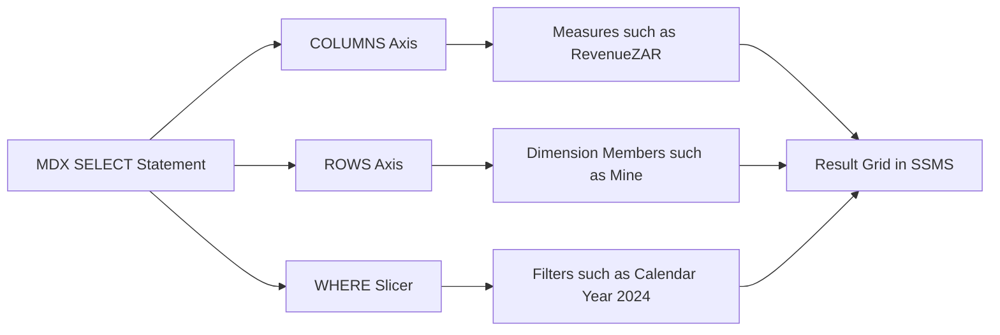
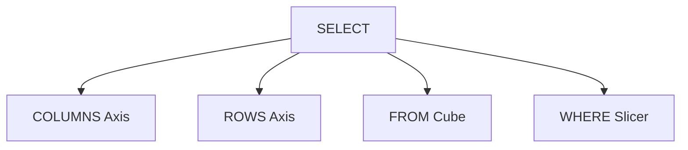
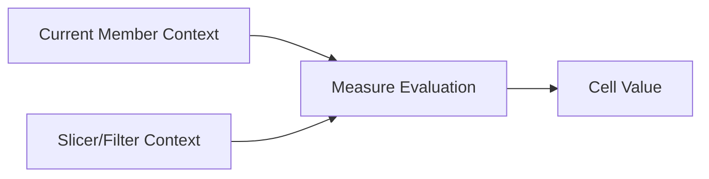
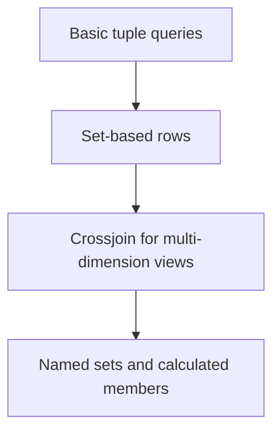
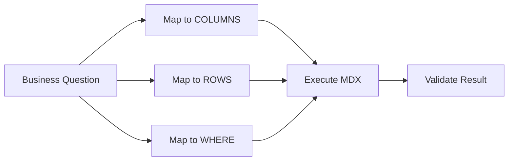

# MDX Query Fundamentals
## Day 02 | Assmang Pty Ltd — SSAS Fundamentals Training

---

## 🎯 Learning Objectives

By the end of this topic, participants will be able to:

1. Understand the structure of a basic MDX SELECT statement.
2. Work with measures, members, sets, tuples, and slicers.
3. Query the Assmang cube for common analytical views.
4. Recognise how MDX differs from SQL thinking.

---

## 📋 Topic Overview

**Dataset:** `v3_assmang_mining_complete.sql`  
**Difficulty:** Beginner (no prior SSAS experience required)  
**Estimated reading time:** 20-30 minutes

### What this topic covers

The cube is built and deployed. Now you need to **query it**. MDX (Multidimensional Expressions) is the query language of SSAS — it tells the cube exactly what to show and how to arrange the results.

If you know SQL, MDX will feel familiar but think differently. Both use `SELECT`, `FROM`, and `WHERE` — but in MDX, `WHERE` does not filter rows. It narrows the entire query to a **slice of the cube**.

### MDX vs SQL — The mental shift you need to make

| SQL thinking | MDX thinking |
|-------------|-------------|
| "Give me the rows where Mine = Khumani" | "Navigate to the Khumani coordinate of the cube" |
| WHERE filters rows | WHERE slices the whole result |
| Columns = table fields | Axes = what goes on rows and columns of the result |
| One result set, flat | Multi-dimensional grid with row/column/slicer axes |

### What MDX can do that SQL cannot easily do

| Business question | Why SQL struggles | What MDX gives you |
|------------------|------------------|--------------------|
| Tonnes by mine AND by month in one grid | Requires JOIN + GROUP BY + PIVOT | Two axes: mines on ROWS, months on COLUMNS |
| This year vs last year side by side | Self-join or subquery | PARALLELPERIOD() on one axis |
| Only mines above average production | Subquery or CTE | FILTER() function on a set |
| Percentage of total | Window function or subquery | MEMBER with division by All member |

---

## 🧠 Real-World Analogy (Plain English)

**Think of this topic like asking a specific question to a smart assistant.**

Imagine MDX is like talking to a very organised assistant. Instead of saying 'find me some data', you say exactly: 'Show me REVENUE (what I want to see) for EACH MINE (rows) for the YEAR 2024 (filter).' The assistant already knows where everything is because the cube was pre-built, so the answer comes back instantly.

> **Key insight for this topic:** In MDX, the `WHERE` clause is a **slicer** — it does not filter rows the way SQL does. It narrows the entire result to a slice of the cube. Think of it as zooming in on a region of the data, not removing rows from a table.

---

## 1. How MDX differs from SQL

**SQL** asks: "Which rows from which tables meet this condition?"
**MDX** asks: "Which value at which coordinate of this cube?"

| Aspect | SQL | MDX |
|--------|-----|-----|
| **Unit of work** | Rows from tables | Cells from a cube (coordinates) |
| **Main clauses** | SELECT (columns), FROM (tables), WHERE (rows) | SELECT (axes), FROM (cube), WHERE (slicer) |
| **Thinking model** | "Get me data that meets criteria" | "Navigate to a specific intersection of dimensions" |
| **Example** | Get all production rows where Mine='Khumani' | Show TonnesProduced at the intersection of [Mine].[Khumani] and [Date].[2024] |

**Real Assmang example:**

SQL way (slow - must scan millions of rows):
```sql
SELECT SUM(TonnesProduced) 
FROM FactProduction 
WHERE MineID = 2 AND YEAR(DateID) = 2024;
```

MDX way (fast - reads pre-calculated aggregate):
```mdx
SELECT [Measures].[Tonnes Produced] ON COLUMNS,
       [Mine].[Khumani] ON ROWS
FROM [Assmang Mining Analytics]
WHERE ([Date].[Calendar].[Year].&[2024])
```

The MDX version runs in milliseconds because SSAS pre-calculated the intersection point during processing. No scanning needed.

---

## 2. Basic SELECT structure — With Real Examples

The basic MDX SELECT has four parts. Here they are with real Assmang queries:

### Part 1: SELECT clause with COLUMNS axis

**What it does:** Specifies which measure(s) you want to see

**Syntax:**
```mdx
SELECT { [Measures].[Measure Name] } ON COLUMNS
```

**Real Assmang examples:**

```mdx
-- Single measure: tonnes produced
SELECT { [Measures].[Tonnes Produced] } ON COLUMNS
```

```mdx
-- Multiple measures: tonnes AND revenue side-by-side
SELECT { [Measures].[Tonnes Produced], [Measures].[Revenue (ZAR)] } ON COLUMNS
```

**When to use:**
- Always start here — decide what number you want to see
- Common Assmang measures: TonnesProduced, Revenue(ZAR), LaborCost(ZAR), MaintenanceCost(ZAR), Grade

---

### Part 2: ROWS axis with dimension members

**What it does:** Specifies which categories appear as rows

**Syntax:**
```mdx
SELECT {...} ON COLUMNS,
       [Dimension].[Hierarchy].Members ON ROWS
```

**Real Assmang examples:**

```mdx
-- Show tonnes for each mine
SELECT { [Measures].[Tonnes Produced] } ON COLUMNS,
       [Mine].[Mine Name].Members ON ROWS
FROM [Assmang Mining Analytics]
```

Result:
```
                  Tonnes Produced
Beeshoek Mine     32,500
Khumani Mine      45,200
Black Rock Mine   28,100
Dwarsrivier       15,600
```

```mdx
-- Show tonnes for each month in 2024
SELECT { [Measures].[Tonnes Produced] } ON COLUMNS,
       [Date].[Calendar Year].&[2024].[Calendar Month].Members ON ROWS
FROM [Assmang Mining Analytics]
```

Result:
```
January 2024      8,450
February 2024     8,100
March 2024        8,650
... (continuing through December)
```

**When to use:**
- ROWS shows your "by what" category — by mine, by month, by department
- Always use `.Members` to get all values in that level

---

### Part 3: FROM clause naming the cube

**What it does:** Specifies which cube contains your data

**Syntax:**
```mdx
FROM [Cube Name]
```

**Real Assmang example:**

```mdx
SELECT {...} ON COLUMNS,
       {...} ON ROWS
FROM [Assmang Mining Analytics]  ← This is the cube name, not a table
```

**When to use:**
- Same cube for almost all Assmang queries: `[Assmang Mining Analytics]`
- Only changes if you deploy multiple cubes (rare)

---

### Part 4: WHERE clause as a slicer (filter)

**What it does:** Restricts the query to a specific context (like Excel autofilter)

**Syntax:**
```mdx
WHERE ([Dimension].[Member])
```

**Real Assmang examples:**

```mdx
-- Tonnes for each mine, but only 2024
SELECT { [Measures].[Tonnes Produced] } ON COLUMNS,
       [Mine].[Mine Name].Members ON ROWS
FROM [Assmang Mining Analytics]
WHERE ([Date].[Calendar].[Year].&[2024])
```

```mdx
-- Revenue by mine, but only Extraction department
SELECT { [Measures].[Revenue (ZAR)] } ON COLUMNS,
       [Mine].[Mine Name].Members ON ROWS
FROM [Assmang Mining Analytics]
WHERE ([Department].[Extraction])
```

```mdx
-- Combine multiple filters
SELECT { [Measures].[Tonnes Produced] } ON COLUMNS,
       [Date].[Calendar].[Month].Members ON ROWS
FROM [Assmang Mining Analytics]
WHERE ([Mine].[Khumani], [Date].[Calendar].[Year].&[2024])
```

**When to use:**
- WHERE is optional — if omitted, shows ALL context
- Use it to zoom into a specific subset
- Multiple slicers separated by commas apply all at once

---

## 3. Core MDX building blocks — With Examples

### Member — One specific value

**What it is:** A single point you can address

**Assmang examples:**
- `[Mine].[Mine Name].&[Khumani]` — the specific mine called Khumani
- `[Date].[2024-01-15]` — a specific date
- `[Department].[Extraction]` — the extraction department

**How to use in a query:**
```mdx
SELECT { [Measures].[Tonnes Produced] } ON COLUMNS
FROM [Assmang Mining Analytics]
WHERE ([Mine].[Khumani])  ← This is a member: specifically Khumani, not all mines
```

---

### Set — A collection of members

**What it is:** Multiple members grouped together

**Assmang examples:**
- All mines: `[Mine].[Mine Name].Members`
- Iron ore mines only: `{[Mine].[Khumani], [Mine].[Beeshoek]}`
- All 2024 months: `[Date].[2024].Children`

**How to use in a query:**
```mdx
SELECT { [Measures].[Tonnes Produced] } ON COLUMNS,
       [Mine].[Mine Name].Members ON ROWS  ← This is a set: all mines
FROM [Assmang Mining Analytics]
```

```mdx
-- Define an iron ore set explicitly
SELECT { [Measures].[Tonnes Produced] } ON COLUMNS,
       { [Mine].[Khumani], [Mine].[Beeshoek] } ON ROWS  ← This is a set: just 2 mines
FROM [Assmang Mining Analytics]
```

---

### Tuple — A combination across dimensions

**What it is:** One specific intersection (like a cell reference)

**Assmang examples:**
- Khumani mine + January 2024 = one tuple
- Black Rock mine + Labor Cost + Q2 2024 = one tuple

**How to use in a query:**
```mdx
SELECT { [Measures].[Tonnes Produced] } ON COLUMNS
FROM [Assmang Mining Analytics]
WHERE ([Mine].[Khumani], [Date].[2024-01])  ← This tuple specifies exactly one mine + one month
```

---

## 4. Beginner query patterns — Step-by-step recipes

### Pattern 1: One measure by one dimension (Most common)

**Business question:** "How many tonnes did each mine produce in 2024?"

**Step 1:** Identify the measure
- Answer: Tonnes Produced

**Step 2:** Identify the dimension to show as rows
- Answer: Mine

**Step 3:** Identify any filters
- Answer: 2024 only

**Step 4:** Write the query**

```mdx
SELECT { [Measures].[Tonnes Produced] } ON COLUMNS,
       [Mine].[Mine Name].Members ON ROWS
FROM [Assmang Mining Analytics]
WHERE ([Date].[Calendar].[Year].&[2024])
```

**Step 5:** Execute in SSMS and check the result

---

### Pattern 2: One measure across time hierarchy (Useful for trends)

**Business question:** "What was our monthly production trend in 2024?"

**Step 1:** Identify the measure
- Answer: Tonnes Produced

**Step 2:** Identify the time level
- Answer: Month (not day, not year)

**Step 3:** Identify the year filter
- Answer: 2024

**Step 4:** Write the query

```mdx
SELECT { [Measures].[Tonnes Produced] } ON COLUMNS,
       [Date].[Calendar].[Year].&[2024].[Calendar Month].Children ON ROWS
FROM [Assmang Mining Analytics]
```

**Step 5:** Execute and verify you see 12 months

---

### Pattern 3: Multiple measures with one dimension (Side-by-side comparison)

**Business question:** "For each mine, show both tonnes produced AND revenue?"

**Step 1:** Identify multiple measures
- Answer: Tonnes Produced AND Revenue (ZAR)

**Step 2:** Identify the row dimension
- Answer: Mine

**Step 3:** Write the query

```mdx
SELECT { [Measures].[Tonnes Produced], [Measures].[Revenue (ZAR)] } ON COLUMNS,
       [Mine].[Mine Name].Members ON ROWS
FROM [Assmang Mining Analytics]
WHERE ([Date].[Calendar].[Year].&[2024])
```

**Result:**
```
                Tonnes Produced    Revenue (ZAR)
Beeshoek        32,500             R 18,200,000
Khumani         45,200             R 28,500,000
Black Rock      28,100             R 12,600,000
Dwarsrivier     15,600             R 9,500,000
```

---

### Pattern 4: Filtered by both dimension and time

**Business question:** "Show Khumani's monthly cost breakdown for Q1 2024?"

**Step 1:** Identify the measure
- Answer: Total Operating Cost

**Step 2:** Identify the row dimension
- Answer: Cost Type (or department)

**Step 3:** Identify filters
- Answer: Khumani + Q1 2024

**Step 4:** Write the query

```mdx
SELECT { [Measures].[Total Operating Cost] } ON COLUMNS,
       [Cost Type].Members ON ROWS  ← Assuming a cost type dimension exists
FROM [Assmang Mining Analytics]
WHERE ([Mine].[Khumani], [Date].[Calendar].[Year].&[2024].[Calendar Quarter].&[Q1])
```

---

## How to execute these queries in SSMS

**Step 1:** Open SSMS and connect to **Analysis Services** (not Database Engine)

**Step 2:** Click **New Query > MDX**

**Step 3:** In the query toolbar, select **Assmang Mining Analytics** from the database dropdown (CRITICAL—without this the parser fails)

**Step 4:** Type or paste your MDX query

**Step 5:** Press **F5** or click **Execute**

**Step 6:** Read results in the grid at the bottom — columns = measures, rows = dimension members

## 📊 Architecture / Concept Diagram

The following diagram shows how this topic fits into the bigger picture:



### How to read this diagram

- **Left side:** Where your raw data lives (SQL Server database tables containing production, cost, safety, and employee data).
- **Middle:** Where SSAS transforms that raw data into an analytical structure (the cube with its dimensions, hierarchies, and measures).
- **Right side:** Where business users access the results (Excel pivot tables, Power BI dashboards, or MDX query results in SSMS).

### Why this matters

Without MDX fluency, debugging a cube that returns wrong results is nearly impossible. When a Power BI report shows an incorrect number, MDX is how you isolate whether the problem is in the source data, the dimension structure, or the measure calculation. Even basic MDX skill makes you a far more effective SSAS developer.

---

## 🧭 Additional Diagrams

### Diagram 1: MDX Query Anatomy



### Diagram 2: Context Evaluation



### Diagram 3: Reusable Query Patterns



## 📌 Topic-Specific Summary

This topic teaches cube interrogation. MDX fluency enables analysts to validate business logic, investigate anomalies, and build reusable analytical patterns beyond drag-and-drop reporting tools.

MDX is often feared because of syntax, but at beginner level it is just a structured way to say: what number, by what rows, under what filter.

## Deep Dive in Layman Terms

Think of MDX as asking the cube a precise question:

- COLUMNS = what numbers you want.
- ROWS = how you want to list them.
- WHERE = the filter context.

Once this pattern is clear, most beginner MDX queries are small variations of the same idea.

### Assmang-style example

"Show Tonnes Produced by mine for 2024" becomes one MDX query. If the answer looks wrong, MDX helps you isolate whether the issue is the measure, the dimension member, or the year filter.

### Clarity diagram: MDX thinking model


