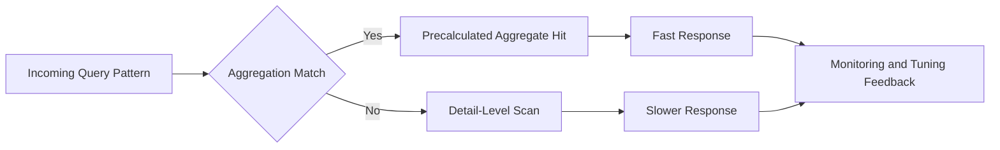
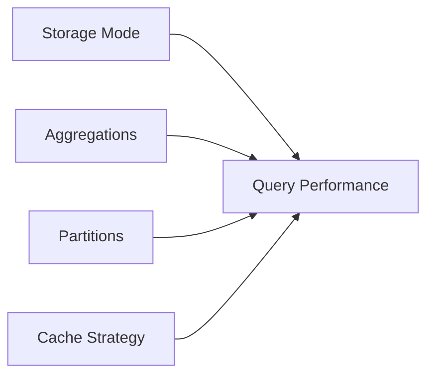
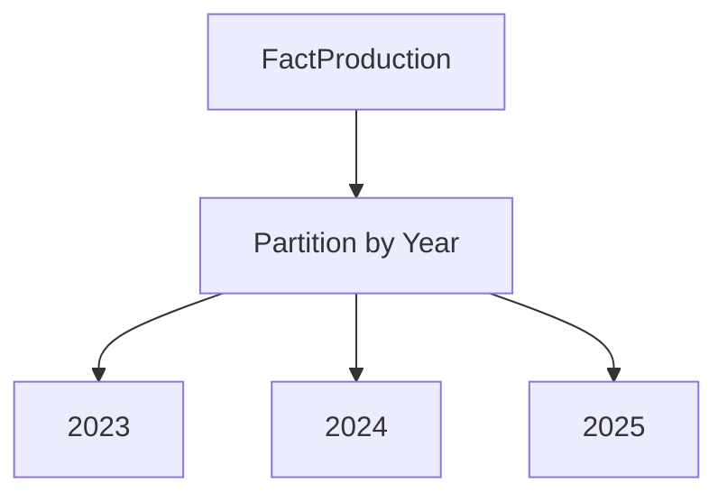
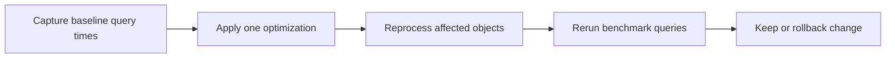
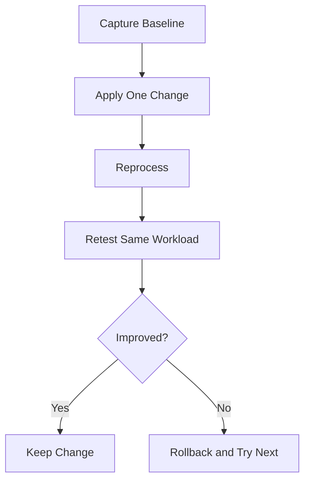

# Performance Tuning and Optimization
## Day 02 | Assmang Pty Ltd — SSAS Fundamentals Training

---

## 🎯 Learning Objectives

By the end of this topic, participants will be able to:

1. Understand how storage mode and aggregation design affect performance.
2. Recognise common causes of slow cube queries.
3. Understand partitioning and caching at a beginner level.
4. Apply practical optimisation decisions in an Assmang reporting context.

---

## 📋 Topic Overview

**Dataset:** `v3_assmang_mining_complete.sql`  
**Difficulty:** Beginner (no prior SSAS experience required)  
**Estimated reading time:** 20-30 minutes

### What is this topic about?

This topic teaches you about **Performance Tuning and Optimization**. If you have never worked with SQL Server Analysis Services before, don't worry — we will explain everything from scratch using plain language and real examples from Assmang's mining operations.

### Why does this matter to you?

As someone working at or with Assmang, you deal with data every day — production figures, costs, safety records, employee information. Right now, getting answers from that data probably involves:

- Asking someone in IT to write a report
- Waiting for Excel spreadsheets to be updated
- Running the same SQL queries over and over
- Not being sure if the numbers are up to date

SSAS solves these problems by creating a **pre-built analytical model** (called a "cube") that lets anyone with Excel or Power BI get instant answers without writing code.

### The Assmang training context

All examples in this course use data from Assmang's actual operations:

| Mine | What it produces | Where it is |
|------|-----------------|-------------|
| Beeshoek Mine | Iron Ore | Postmasburg, Northern Cape |
| Khumani Mine | Iron Ore | Kathu, Northern Cape |
| Black Rock Mine | Manganese | Hotazel, Northern Cape |
| Dwarsrivier Chrome Mine | Chrome | Burgersfort, Limpopo |
| Machadodorp Works | Chrome (processing) | Machadodorp, Mpumalanga |

---

## 🧠 Real-World Analogy (Plain English)

**Think of this topic like choosing between a motorbike and a truck for delivery.**

Performance tuning is about choosing the right tool for the job. A motorbike (MOLAP) is fastest for small, frequent deliveries. A truck (ROLAP) carries more but is slower. A van (HOLAP) is a middle ground. You choose based on what your business actually needs — fast dashboards, real-time data, or a balance of both.

> **Key insight:** SSAS takes complex data and makes it simple to explore. You don't need to be a programmer to use the results — you just need to know what question you want to answer.

---

## 1. Storage modes

### 💬 In plain English

Let's break down **storage modes** in the simplest possible terms:

**→** MOLAP stores processed cube data and aggregations inside SSAS for best query speed.

**→** ROLAP queries relational storage more directly and can be useful when freshness matters more than speed.

**→** HOLAP combines both approaches.

### 📚 Detailed explanation

This concept is important because it directly affects how well the cube works for business users. Here is a deeper look:

**Point 1: MOLAP stores processed cube data and aggregations inside SSAS for best query speed.**

What this means in practice: When you apply this at Assmang, it means that molap stores processed cube data and aggregations inside ssas for best query speed. This is not just a technical exercise — it directly helps managers, engineers, and executives get better information faster.

**Point 2: ROLAP queries relational storage more directly and can be useful when freshness matters more than speed.**

What this means in practice: When you apply this at Assmang, it means that rolap queries relational storage more directly and can be useful when freshness matters more than speed. This is not just a technical exercise — it directly helps managers, engineers, and executives get better information faster.

**Point 3: HOLAP combines both approaches.**

What this means in practice: When you apply this at Assmang, it means that holap combines both approaches. This is not just a technical exercise — it directly helps managers, engineers, and executives get better information faster.

### 🏭 Assmang scenario

**Situation:** A production manager at Khumani Mine asks: "Can I see this month's iron ore output compared to last month, broken down by shift?"

**How storage modes helps:** Because the cube already has the right structure (dimensions for time and mine, measures for production), this question can be answered in seconds using Excel or Power BI — no SQL coding needed, no waiting for IT.

### ❓ Frequently Asked Questions

**Q: Do I need to be a programmer to understand storage modes?**  
A: No. This concept is about business logic and design thinking. The tools (SSDT) provide visual interfaces for most of the work.

**Q: What happens if we get storage modes wrong?**  
A: The cube will still work technically, but users may get confusing results, slow performance, or missing data. That's why we follow best practices from the start.

**Q: How long does it take to set up storage modes for a real project?**  
A: For a project the size of Assmang's training cube, this typically takes a few hours of design work plus a few hours of implementation and testing.

---

## 2. Aggregation design

### 💬 In plain English

Let's break down **aggregation design** in the simplest possible terms:

**→** Aggregations reduce the amount of work required at query time.

**→** The best aggregation design reflects common reporting patterns such as by mine, by month, and by department.

**→** Too many aggregations can increase processing time and storage usage.

### 📚 Detailed explanation

This concept is important because it directly affects how well the cube works for business users. Here is a deeper look:

**Point 1: Aggregations reduce the amount of work required at query time.**

What this means in practice: When you apply this at Assmang, it means that aggregations reduce the amount of work required at query time. This is not just a technical exercise — it directly helps managers, engineers, and executives get better information faster.

**Point 2: The best aggregation design reflects common reporting patterns such as by mine, by month, and by department.**

What this means in practice: When you apply this at Assmang, it means that the best aggregation design reflects common reporting patterns such as by mine, by month, and by department. This is not just a technical exercise — it directly helps managers, engineers, and executives get better information faster.

**Point 3: Too many aggregations can increase processing time and storage usage.**

What this means in practice: When you apply this at Assmang, it means that too many aggregations can increase processing time and storage usage. This is not just a technical exercise — it directly helps managers, engineers, and executives get better information faster.

### 🏭 Assmang scenario

**Situation:** A production manager at Khumani Mine asks: "Can I see this month's iron ore output compared to last month, broken down by shift?"

**How aggregation design helps:** Because the cube already has the right structure (dimensions for time and mine, measures for production), this question can be answered in seconds using Excel or Power BI — no SQL coding needed, no waiting for IT.

### ❓ Frequently Asked Questions

**Q: Do I need to be a programmer to understand aggregation design?**  
A: No. This concept is about business logic and design thinking. The tools (SSDT) provide visual interfaces for most of the work.

**Q: What happens if we get aggregation design wrong?**  
A: The cube will still work technically, but users may get confusing results, slow performance, or missing data. That's why we follow best practices from the start.

**Q: How long does it take to set up aggregation design for a real project?**  
A: For a project the size of Assmang's training cube, this typically takes a few hours of design work plus a few hours of implementation and testing.

---

## 3. Partitioning and scalability

### 💬 In plain English

Let's break down **partitioning and scalability** in the simplest possible terms:

**→** Large fact data can be partitioned by time or business area.

**→** Partitioning supports manageability, faster processing windows, and targeted optimisation.

### 📚 Detailed explanation

This concept is important because it directly affects how well the cube works for business users. Here is a deeper look:

**Point 1: Large fact data can be partitioned by time or business area.**

What this means in practice: When you apply this at Assmang, it means that large fact data can be partitioned by time or business area. This is not just a technical exercise — it directly helps managers, engineers, and executives get better information faster.

**Point 2: Partitioning supports manageability, faster processing windows, and targeted optimisation.**

What this means in practice: When you apply this at Assmang, it means that partitioning supports manageability, faster processing windows, and targeted optimisation. This is not just a technical exercise — it directly helps managers, engineers, and executives get better information faster.

### 🏭 Assmang scenario

**Situation:** A production manager at Khumani Mine asks: "Can I see this month's iron ore output compared to last month, broken down by shift?"

**How partitioning and scalability helps:** Because the cube already has the right structure (dimensions for time and mine, measures for production), this question can be answered in seconds using Excel or Power BI — no SQL coding needed, no waiting for IT.

### ❓ Frequently Asked Questions

**Q: Do I need to be a programmer to understand partitioning and scalability?**  
A: No. This concept is about business logic and design thinking. The tools (SSDT) provide visual interfaces for most of the work.

**Q: What happens if we get partitioning and scalability wrong?**  
A: The cube will still work technically, but users may get confusing results, slow performance, or missing data. That's why we follow best practices from the start.

**Q: How long does it take to set up partitioning and scalability for a real project?**  
A: For a project the size of Assmang's training cube, this typically takes a few hours of design work plus a few hours of implementation and testing.

---

## 4. Caching and practical tuning

### 💬 In plain English

Let's break down **caching and practical tuning** in the simplest possible terms:

**→** Repeated queries can benefit from cache reuse.

**→** Good dimension design, clean hierarchies, and sensible calculations all contribute to better performance.

### 📚 Detailed explanation

This concept is important because it directly affects how well the cube works for business users. Here is a deeper look:

**Point 1: Repeated queries can benefit from cache reuse.**

What this means in practice: When you apply this at Assmang, it means that repeated queries can benefit from cache reuse. This is not just a technical exercise — it directly helps managers, engineers, and executives get better information faster.

**Point 2: Good dimension design, clean hierarchies, and sensible calculations all contribute to better performance.**

What this means in practice: When you apply this at Assmang, it means that good dimension design, clean hierarchies, and sensible calculations all contribute to better performance. This is not just a technical exercise — it directly helps managers, engineers, and executives get better information faster.

### 🏭 Assmang scenario

**Situation:** A production manager at Khumani Mine asks: "Can I see this month's iron ore output compared to last month, broken down by shift?"

**How caching and practical tuning helps:** Because the cube already has the right structure (dimensions for time and mine, measures for production), this question can be answered in seconds using Excel or Power BI — no SQL coding needed, no waiting for IT.

### ❓ Frequently Asked Questions

**Q: Do I need to be a programmer to understand caching and practical tuning?**  
A: No. This concept is about business logic and design thinking. The tools (SSDT) provide visual interfaces for most of the work.

**Q: What happens if we get caching and practical tuning wrong?**  
A: The cube will still work technically, but users may get confusing results, slow performance, or missing data. That's why we follow best practices from the start.

**Q: How long does it take to set up caching and practical tuning for a real project?**  
A: For a project the size of Assmang's training cube, this typically takes a few hours of design work plus a few hours of implementation and testing.

---

## 📊 Architecture / Concept Diagram

The following diagram shows how this topic fits into the bigger picture:

### How to read this diagram

- **Left side:** Where your raw data lives (SQL Server database tables containing production, cost, safety, and employee data).
- **Middle:** Where SSAS transforms that raw data into an analytical structure (the cube with its dimensions, hierarchies, and measures).
- **Right side:** Where business users access the results (Excel pivot tables, Power BI dashboards, or MDX query results in SSMS).

### Why this matters

Without SSAS (the middle layer), every time a manager wants an answer, someone has to write SQL code against the raw database. With SSAS, the analytical structure is pre-built, so users can explore data independently using familiar tools like Excel.

---

## 📖 Key Terminology Reference

Here are the most important terms for this topic. Don't worry about memorising them all — you will learn them naturally through practice:

| Term | Plain English Definition | Example at Assmang |
|------|------------------------|-------------------|
| **Cube** | A pre-built analytical structure that lets users explore data from many angles | The "Assmang Mining Analytics" cube containing all production and cost data |
| **Dimension** | A category you use to slice data (like filters in Excel) | Mine, Date, Department, Employee — these are the "by what" categories |
| **Hierarchy** | A drill-down path from general to specific | Year → Quarter → Month → Day (time hierarchy) |
| **Member** | One specific value within a dimension | "Beeshoek Mine" is a member of the Mine dimension |
| **Measure** | A number you want to analyse | Tonnes Produced, Revenue in ZAR, Cost Per Tonne |
| **Measure Group** | A collection of related measures from one business area | Production Measures (tonnes + grade + revenue) |
| **Fact Table** | The database table that stores the raw numbers | FactProduction, FactOperatingCosts |
| **Processing** | Loading data into the cube and building pre-calculated summaries | Running a nightly job that refreshes yesterday's production data |
| **Aggregation** | A pre-calculated total or average stored for speed | Total tonnes per mine per month (calculated once, queried many times) |
| **MDX** | The query language used to ask questions of a cube | Similar to SQL, but designed for multidimensional analysis |
| **MOLAP** | Storage mode where data is stored inside the cube for maximum speed | Default choice for Assmang — gives sub-second query times |
| **ROLAP** | Storage mode where data stays in SQL Server (slower but always fresh) | Used when real-time data is more important than speed |
| **KPI** | A traffic-light indicator showing whether a target is being met | Production KPI: Green if >= 90% of target, Red if < 70% |
| **SSDT** | SQL Server Data Tools — the IDE where you design and build cubes | Visual Studio with the SSAS project templates |
| **SSMS** | SQL Server Management Studio — for administration and testing | Where you deploy cubes and run MDX queries |
| **Data Source View (DSV)** | A logical view of which database tables the cube uses | Selecting Dim_Mine, Dim_Date, FactProduction for inclusion |
| **Deployment** | Pushing your cube design from your computer to the SSAS server | Like publishing a website — makes it available to users |

---

## 🧭 Additional Diagrams

### Diagram 1: Performance Levers

### Diagram 2: Partitioning Strategy

### Diagram 3: Tuning Workflow

## 📌 Topic-Specific Summary

This topic focuses on measurable optimisation. Effective tuning requires baseline evidence, isolated changes, and before/after benchmarking to avoid introducing performance regressions.

The practical mindset here is scientific: measure first, change one thing, measure again. Never tune by guessing.

## Deep Dive in Layman Terms

Performance is not one switch. It is the combined result of storage choices, aggregations, partitions, and cache behavior.

For beginners, the safe order is:

1. Identify slow queries.
2. Confirm whether slowness is from detail scans or model design.
3. Apply one optimization at a time.
4. Re-test with the same query set.

### Assmang-style example

If monthly executive dashboards are slow every Monday morning, warm-up strategy and aggregation design can reduce queue time significantly without changing report layout.

### Clarity diagram: Safe tuning loop

