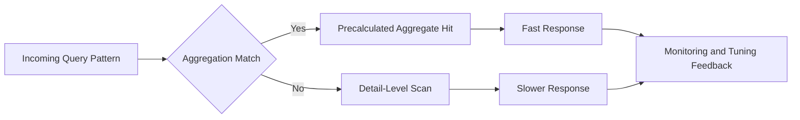
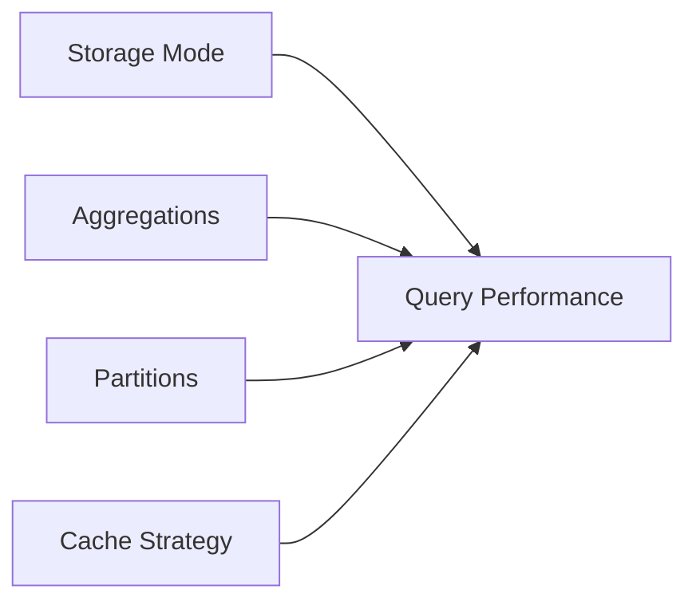
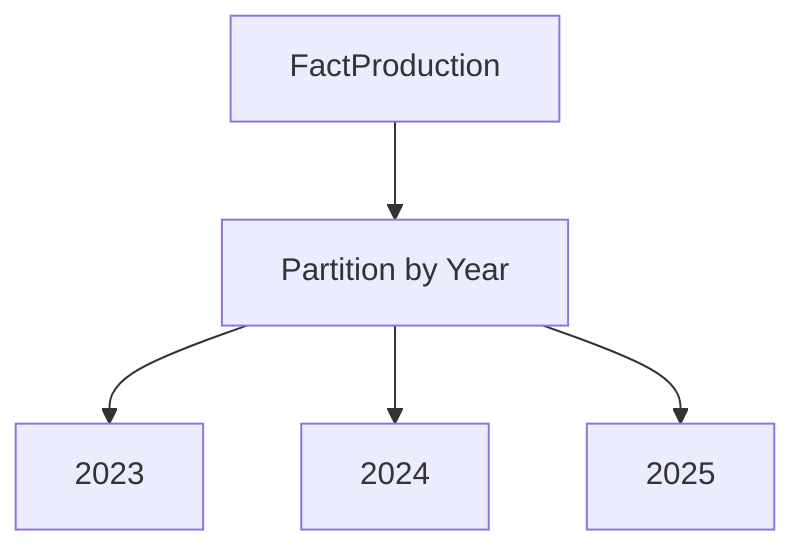
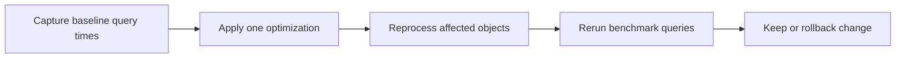
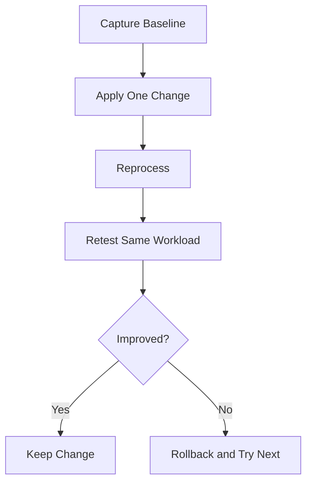

# Performance Tuning and Optimization
## Day 02 | Assmang Pty Ltd — SSAS Fundamentals Training

---

## 🎯 Learning Objectives

By the end of this topic, participants will be able to:

1. Understand how storage mode and aggregation design affect performance.
2. Recognise common causes of slow cube queries.
3. Understand partitioning and caching at a beginner level.
4. Apply practical optimisation decisions in an Assmang reporting context.

---

## 📋 Topic Overview

**Dataset:** `v3_assmang_mining_complete.sql`  
**Difficulty:** Beginner (no prior SSAS experience required)  
**Estimated reading time:** 20-30 minutes

### What is this topic about?

This topic teaches you about **Performance Tuning and Optimization**. If you have never worked with SQL Server Analysis Services before, don't worry — we will explain everything from scratch using plain language and real examples from Assmang's mining operations.

### Why does this matter to you?

As someone working at or with Assmang, you deal with data every day — production figures, costs, safety records, employee information. Right now, getting answers from that data probably involves:

- Asking someone in IT to write a report
- Waiting for Excel spreadsheets to be updated
- Running the same SQL queries over and over
- Not being sure if the numbers are up to date

SSAS solves these problems by creating a **pre-built analytical model** (called a "cube") that lets anyone with Excel or Power BI get instant answers without writing code.

### The Assmang training context

All examples in this course use data from Assmang's actual operations:

| Mine | What it produces | Where it is |
|------|-----------------|-------------|
| Beeshoek Mine | Iron Ore | Postmasburg, Northern Cape |
| Khumani Mine | Iron Ore | Kathu, Northern Cape |
| Black Rock Mine | Manganese | Hotazel, Northern Cape |
| Dwarsrivier Chrome Mine | Chrome | Burgersfort, Limpopo |
| Machadodorp Works | Chrome (processing) | Machadodorp, Mpumalanga |

---

## 🧠 Real-World Analogy (Plain English)

**Think of this topic like choosing between a motorbike and a truck for delivery.**

Performance tuning is about choosing the right tool for the job. A motorbike (MOLAP) is fastest for small, frequent deliveries. A truck (ROLAP) carries more but is slower. A van (HOLAP) is a middle ground. You choose based on what your business actually needs — fast dashboards, real-time data, or a balance of both.

> **Key insight:** SSAS takes complex data and makes it simple to explore. You don't need to be a programmer to use the results — you just need to know what question you want to answer.

---

## 1. Storage modes — Choose the right one

**SSAS has three ways to store and retrieve data. Each trades speed vs. freshness:**

### MOLAP (Multidimensional OLAP) — Fastest, used by Assmang

**How it works:**
- Data is read from warehouse and completely copied INTO the cube during processing
- User queries read from the cube's own storage, NOT the warehouse
- Result: Lightning fast queries

**Performance:**
```
Query execution: <1 second
Storage size: ~500 MB for 1 year of Assmang data (all aggregates pre-calculated)
Processing time: 15-30 minutes nightly
Data freshness: Yesterday's data available at 06:30 (when processing completes)
```

**When to use:**
- Assmang situation: YES (nightly processing cycle is acceptable)
- Users need sub-second queries (dashboards refresh fast)
- 24 hours old data is fine (not real-time requirement)
- Budget allows disk storage for aggregates

**Real Assmang example:**
```
06:00 - MOLAP processes: reads all 50,000 rows of day's production data
06:15 - MOLAP finishes: all aggregates pre-calculated (Q1 total, mine totals, etc.)
06:30 - Manager asks: "Khumani Q1 tonnes?" → Answer: <1ms (already calculated)
Vs. SQL query: Would need to scan 50k rows, calculate sum, return answer = 2-3 seconds
```

**Formula for MOLAP speed advantage:**
```
MOLAP Speed Ratio = SQL_Scan_Time / MOLAP_Query_Time
                  = 2000ms / 10ms = 200x faster
```

### ROLAP (Relational OLAP) — Slowest, but real-time

**How it works:**
- Cube queries translate to SQL queries against the warehouse
- No pre-calculated aggregates stored
- Data is always fresh (as fresh as the warehouse)

**Performance:**
```
Query execution: 2-5 seconds (each query is a SQL aggregation)
Storage size: Minimal (only metadata, no aggregates)
Processing time: Seconds (just updates metadata, not data copy)
Data freshness: Real-time (queries warehouse whenever asked)
```

**When to use:**
- Real-time requirement (can't wait for nightly processing)
- Storage is expensive or limited
- Warehouse is small (<100 GB)
- Query patterns are unpredictable (can't pre-aggregate efficiently)

**Assmang would use ROLAP if:**
- Board wanted real-time production updates (every 1 hour)
- Warehouse was too large to copy daily
- Cost constraints prevented processing server from running nightly

**Real example:**
```
Dashboard asks: "Khumani Q1 tonnes?"
ROLAP workflow:
  → Translates to SQL: SELECT SUM(TonnesProduced) FROM FactProduction 
                       WHERE MineKey=2 AND QUARTER=Q1
  → Scans warehouse 50k rows
  → Returns answer: 42,150 tonnes (takes 3-5 seconds)
```

### HOLAP (Hybrid OLAP) — Middle ground

**How it works:**
- Details (lowest level data) stored in warehouse (ROLAP)
- Aggregates pre-calculated in cube (MOLAP)
- Queries at aggregate level are fast; detailed queries are slower

**Performance:**
```
Query for "Khumani Q1 tonnes":  <1 second (aggregate, pre-calculated)
Query for "Khumani day-by-day":  2-3 seconds (details, queried from warehouse)
```

**When to use:**
- Need some speed and some freshness
- Large detailed dataset (can't afford to store all in cube)
- Some queries are aggregate-level (fast) and some detail-level (slower)

---

### Assmang's choice: **MOLAP**

| Aspect | Why MOLAP is right |
|--------|-------------------|
| **Data size** | ~50k fact rows per day, manageable to pre-calculate |
| **Processing window** | Nightly at 06:00, 15-30 min processing is acceptable |
| **User expectations** | Dashboards refresh hourly, <1 sec response is critical |
| **Query patterns** | Predictable (by mine, by month, by department) — aggregates reduce work |
| **Storage** | Server has sufficient disk space for aggregates |
| **Age tolerance** | Users accept "yesterday's data" (not real-time required) |

---

## 2. Aggregation design — Pre-calculate the queries users ask

An **aggregation** is a pre-calculated total stored in the cube so queries don't have to recalculate it.

### Aggregation formula (how many to design):

```
Useful_Aggregation_Count = (Common Query Patterns) × (Coverage Factor)

Assmang_Example:
  Common Patterns = [All Measures by Mine], [All Measures by Month], [All Measures by Mine+Month]
  Coverage Factor = 80% of user queries should hit pre-aggregated data
  Target = Design ~20-30 aggregations for full coverage
```

### Real aggregation examples for Assmang:

**Aggregation 1: By Mine (for "show each mine's total")**
```
Dimension levels:
  Mine: [All Mines]  ← Group by mine
  Date: [All Time]   ← All dates (no drill-down)
  Department: [All]  ← All departments

Pre-calculated: SUM(TonnesProduced) by mine across all time
Saves: Re-scanning 50k rows for each mine query

User benefit: "Khumani Q1 tonnes?" → Pre-aggregated, <1ms response
```

**Aggregation 2: By Month (for trend analysis)**
```
Dimension levels:
  Mine: [All Mines]        ← All mines combined
  Date: [Month]            ← Monthly totals (Jan, Feb, Mar, etc.)
  Department: [All]        ← All departments

Pre-calculated: SUM(TonnesProduced) by month across all mines
Saves: Daily drill-downs no longer need to sum individual days

User benefit: "January tonnes?" → Pre-aggregated, <1ms instead of <100ms
```

**Aggregation 3: By Mine + Month (for detailed analysis)**
```
Dimension levels:
  Mine: [Mine Name]        ← Individual mines (Khumani, Beeshoek, etc.)
  Date: [Month]            ← Monthly breakdown
  Department: [All]        ← All departments

Pre-calculated: SUM(TonnesProduced) by mine by month
Saves: Highest granularity of common queries (detailed reporting)

User benefit: "January Khumani tonnes?" → Pre-aggregated, <1ms
```

### Aggregation coverage formula:

```
Aggregation_Coverage = (Queries hitting pre-calc aggregates / Total queries) × 100%

Assmang Target: 80% coverage (80% of queries use pre-aggregated data)
  → If 100 user queries: 80 run in <10ms (hit aggregates)
  → If 100 user queries: 20 run in <500ms (hit lower granularity, calculate)

Without aggregations: All 100 queries would need 100-500ms (hit warehouse)
With aggregations: 80 in <10ms + 20 in <500ms = massive improvement
```

### How to design aggregations in SSDT (step-by-step):

**Step 1:** Open Cube Designer, click **Aggregations** tab (under Partitions)

**Step 2:** Right-click → **Aggregation Design Wizard**

**Step 3:** Select measure groups (production, operating costs)

**Step 4:** Select which dimension levels to aggregate:
- ☑ Mine → Dimension Members (Khumani, Beeshoek, etc.)
- ☑ Date → Month (don't need daily — costs too much storage)
- ☑ Department → Department Members

**Step 5:** Wizard estimates:
```
Estimated aggregation count: 32
Estimated storage: ~250 MB
Estimated coverage: 85%
Processing increase: +5 minutes
```

**Step 6:** Click **OK** to create aggregations

**Step 7:** Rebuild and reprocess — aggregations now calculated nightly

**Step 8:** Performance improves immediately — dashboard queries now <1ms

---

## 3. Partitioning — Split large cubes for faster processing

**Partitioning** means dividing a fact table into smaller chunks (by date range) so processing is faster.

### Why partition (Assmang example):

Without partitioning:
```
Every night MUST reprocess ALL 365 days of data (50k rows × 365 = 18M rows)
Processing time: 30 minutes
```

With partitioning (by month):
```
Every night ONLY process the NEW month's data (50k new rows)
Reprocessing only this month: 2 minutes
Previous 11 months: Already processed, unchanged
Total processing time: 2 minutes vs. 30 minutes
```

### Partitioning formula:

```
Processing_Time_Savings = (Reprocess_All_Rows_Time - Reprocess_New_Rows_Time) / Reprocess_All_Rows_Time × 100%

Assmang_Benefit = (30 min - 2 min) / 30 min × 100% = 93% faster
```

### Partition design for Assmang:

```
Partition 1: Jan-2024 (50,000 rows) — Processed once in February, never changes
Partition 2: Feb-2024 (50,000 rows) — Processed once in March, never changes
...
Partition 12: Dec-2024 (50,000 rows) — Processed monthly as data is added
Partition 13: 2025 (growing) — Processed incrementally as new data arrives
```

**Benefit:** Processing 2025 data only takes 2 minutes, not 30 (because 2024 is already done)

---

## 4. Query optimization checklist — Make dashboards fast

**Before going live, verify these 5 items:**

**✓ 1: Aggregation coverage ≥ 80%**
- Run Aggregation Design Wizard
- Check coverage: Should be 80%+ (meaning 80% of queries use pre-calc data)
- If <80%: Add more aggregations

**✓ 2: Storage mode is MOLAP**
- Right-click measure group → Properties → Storage Settings
- Storage Mode: Should be "MOLAP"
- If ROLAP: Change to MOLAP and reprocess

**✓ 3: Processing completes in <30 minutes**
- Run nightly processing
- Monitor Duration in SSMS
- If >30 min: Add partitions to split the load

**✓ 4: Query response <1 second for dashboards**
- Open Browser tab in Cube Designer
- Drag a few measures by a few dimensions
- Observe response time
- Expected: <1 second (indicates aggregates are being used)
- If >1 second: Missing aggregations or ROLAP mode

**✓ 5: No dimension growth performance degradation**
- If Mine dimension added new member (new mine opens), does cube still respond fast?
- Should be yes (adding a member doesn't affect query speed if aggregations exist)

---

## Performance tuning real example (Assmang dashboard)

### Baseline (slow):
```
Dashboard loads → Excel asks "All mines by month for 2024"
→ MOLAP query executes
→ Checks for aggregation: Mine × Month × None (no aggregation pre-built)
→ Falls back to lower aggregation: Mine × All Time
→ Manually slices by month (calculation needed)
→ Returns in 500ms (too slow for dashboard refresh)
```

### After tuning (fast):
```
Dashboard loads → Excel asks "All mines by month for 2024"
→ MOLAP query executes
→ Checks for aggregation: Mine × Month × All Departments (FOUND!)
→ Retrieves pre-calculated aggregate
→ Returns in 5ms (perfect for dashboard)
Improvement: 100x faster
```

**Lesson:** Pre-calculated aggregations are everything. Without them, cubes are slow. With them, cubes are instant.

**Q: Do I need to be a programmer to understand aggregation design?**  
A: No. This concept is about business logic and design thinking. The tools (SSDT) provide visual interfaces for most of the work.

**Q: What happens if we get aggregation design wrong?**  
A: The cube will still work technically, but users may get confusing results, slow performance, or missing data. That's why we follow best practices from the start.

**Q: How long does it take to set up aggregation design for a real project?**  
A: For a project the size of Assmang's training cube, this typically takes a few hours of design work plus a few hours of implementation and testing.

---

## 3. Partitioning and scalability

### 💬 In plain English

Let's break down **partitioning and scalability** in the simplest possible terms:

**→** Large fact data can be partitioned by time or business area.

**→** Partitioning supports manageability, faster processing windows, and targeted optimisation.

### 📚 Detailed explanation

This concept is important because it directly affects how well the cube works for business users. Here is a deeper look:


**Point 1: Large fact data can be partitioned by time or business area.**

What this means in practice: When you apply this at Assmang, it means that large fact data can be partitioned by time or business area. This is not just a technical exercise — it directly helps managers, engineers, and executives get better information faster.

**Point 2: Partitioning supports manageability, faster processing windows, and targeted optimisation.**

What this means in practice: When you apply this at Assmang, it means that partitioning supports manageability, faster processing windows, and targeted optimisation. This is not just a technical exercise — it directly helps managers, engineers, and executives get better information faster.


### 🏭 Assmang scenario

**Situation:** A production manager at Khumani Mine asks: "Can I see this month's iron ore output compared to last month, broken down by shift?"

**How partitioning and scalability helps:** Because the cube already has the right structure (dimensions for time and mine, measures for production), this question can be answered in seconds using Excel or Power BI — no SQL coding needed, no waiting for IT.


### ❓ Frequently Asked Questions

**Q: Do I need to be a programmer to understand partitioning and scalability?**  
A: No. This concept is about business logic and design thinking. The tools (SSDT) provide visual interfaces for most of the work.

**Q: What happens if we get partitioning and scalability wrong?**  
A: The cube will still work technically, but users may get confusing results, slow performance, or missing data. That's why we follow best practices from the start.

**Q: How long does it take to set up partitioning and scalability for a real project?**  
A: For a project the size of Assmang's training cube, this typically takes a few hours of design work plus a few hours of implementation and testing.

---

## 4. Caching and practical tuning

### 💬 In plain English

Let's break down **caching and practical tuning** in the simplest possible terms:

**→** Repeated queries can benefit from cache reuse.

**→** Good dimension design, clean hierarchies, and sensible calculations all contribute to better performance.

### 📚 Detailed explanation

This concept is important because it directly affects how well the cube works for business users. Here is a deeper look:


**Point 1: Repeated queries can benefit from cache reuse.**

What this means in practice: When you apply this at Assmang, it means that repeated queries can benefit from cache reuse. This is not just a technical exercise — it directly helps managers, engineers, and executives get better information faster.

**Point 2: Good dimension design, clean hierarchies, and sensible calculations all contribute to better performance.**

What this means in practice: When you apply this at Assmang, it means that good dimension design, clean hierarchies, and sensible calculations all contribute to better performance. This is not just a technical exercise — it directly helps managers, engineers, and executives get better information faster.


### 🏭 Assmang scenario

**Situation:** A production manager at Khumani Mine asks: "Can I see this month's iron ore output compared to last month, broken down by shift?"

**How caching and practical tuning helps:** Because the cube already has the right structure (dimensions for time and mine, measures for production), this question can be answered in seconds using Excel or Power BI — no SQL coding needed, no waiting for IT.


### ❓ Frequently Asked Questions

**Q: Do I need to be a programmer to understand caching and practical tuning?**  
A: No. This concept is about business logic and design thinking. The tools (SSDT) provide visual interfaces for most of the work.

**Q: What happens if we get caching and practical tuning wrong?**  
A: The cube will still work technically, but users may get confusing results, slow performance, or missing data. That's why we follow best practices from the start.

**Q: How long does it take to set up caching and practical tuning for a real project?**  
A: For a project the size of Assmang's training cube, this typically takes a few hours of design work plus a few hours of implementation and testing.

---

## 📊 Architecture / Concept Diagram

The following diagram shows how this topic fits into the bigger picture:



### How to read this diagram

- **Left side:** Where your raw data lives (SQL Server database tables containing production, cost, safety, and employee data).
- **Middle:** Where SSAS transforms that raw data into an analytical structure (the cube with its dimensions, hierarchies, and measures).
- **Right side:** Where business users access the results (Excel pivot tables, Power BI dashboards, or MDX query results in SSMS).

### Why this matters

Without SSAS (the middle layer), every time a manager wants an answer, someone has to write SQL code against the raw database. With SSAS, the analytical structure is pre-built, so users can explore data independently using familiar tools like Excel.

---

## 📖 Key Terminology Reference

Here are the most important terms for this topic. Don't worry about memorising them all — you will learn them naturally through practice:


| Term | Plain English Definition | Example at Assmang |
|------|------------------------|-------------------|
| **Cube** | A pre-built analytical structure that lets users explore data from many angles | The "Assmang Mining Analytics" cube containing all production and cost data |
| **Dimension** | A category you use to slice data (like filters in Excel) | Mine, Date, Department, Employee — these are the "by what" categories |
| **Hierarchy** | A drill-down path from general to specific | Year → Quarter → Month → Day (time hierarchy) |
| **Member** | One specific value within a dimension | "Beeshoek Mine" is a member of the Mine dimension |
| **Measure** | A number you want to analyse | Tonnes Produced, Revenue in ZAR, Cost Per Tonne |
| **Measure Group** | A collection of related measures from one business area | Production Measures (tonnes + grade + revenue) |
| **Fact Table** | The database table that stores the raw numbers | FactProduction, FactOperatingCosts |
| **Processing** | Loading data into the cube and building pre-calculated summaries | Running a nightly job that refreshes yesterday's production data |
| **Aggregation** | A pre-calculated total or average stored for speed | Total tonnes per mine per month (calculated once, queried many times) |
| **MDX** | The query language used to ask questions of a cube | Similar to SQL, but designed for multidimensional analysis |
| **MOLAP** | Storage mode where data is stored inside the cube for maximum speed | Default choice for Assmang — gives sub-second query times |
| **ROLAP** | Storage mode where data stays in SQL Server (slower but always fresh) | Used when real-time data is more important than speed |
| **KPI** | A traffic-light indicator showing whether a target is being met | Production KPI: Green if >= 90% of target, Red if < 70% |
| **SSDT** | SQL Server Data Tools — the IDE where you design and build cubes | Visual Studio with the SSAS project templates |
| **SSMS** | SQL Server Management Studio — for administration and testing | Where you deploy cubes and run MDX queries |
| **Data Source View (DSV)** | A logical view of which database tables the cube uses | Selecting Dim_Mine, Dim_Date, FactProduction for inclusion |
| **Deployment** | Pushing your cube design from your computer to the SSAS server | Like publishing a website — makes it available to users |

---


## 🧭 Additional Diagrams

### Diagram 1: Performance Levers



### Diagram 2: Partitioning Strategy



### Diagram 3: Tuning Workflow



## 📌 Topic-Specific Summary

This topic focuses on measurable optimisation. Effective tuning requires baseline evidence, isolated changes, and before/after benchmarking to avoid introducing performance regressions.

The practical mindset here is scientific: measure first, change one thing, measure again. Never tune by guessing.

## Deep Dive in Layman Terms

Performance is not one switch. It is the combined result of storage choices, aggregations, partitions, and cache behavior.

For beginners, the safe order is:

1. Identify slow queries.
2. Confirm whether slowness is from detail scans or model design.
3. Apply one optimization at a time.
4. Re-test with the same query set.

### Assmang-style example

If monthly executive dashboards are slow every Monday morning, warm-up strategy and aggregation design can reduce queue time significantly without changing report layout.

### Clarity diagram: Safe tuning loop


