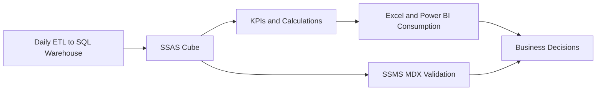
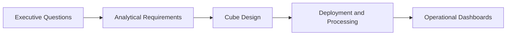
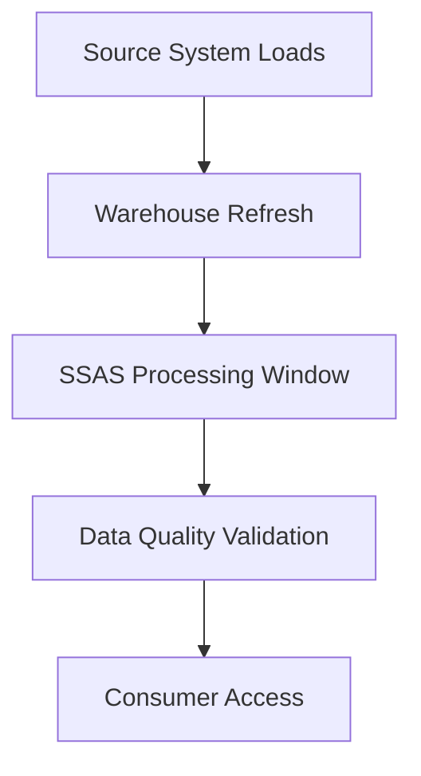
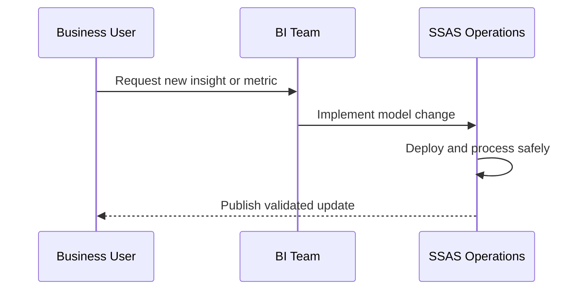
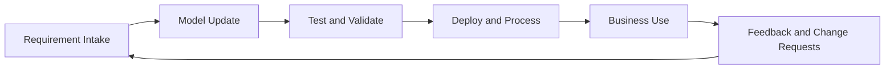

# Real-World SSAS Implementation at Assmang
## Day 02 | Assmang Pty Ltd — SSAS Fundamentals Training

---

## 🎯 Learning Objectives

By the end of this topic, participants will be able to:

1. Apply the full SSAS workflow to an Assmang-style business solution.
2. Design a business-ready analytical cube for production, cost, safety, and workforce reporting.
3. Understand deployment, maintenance, and reporting integration considerations.
4. Consolidate the course into a real implementation playbook.

---

## 📋 Topic Overview

**Dataset:** `v3_assmang_mining_complete.sql`  
**Difficulty:** Beginner (no prior SSAS experience required)  
**Estimated reading time:** 20-30 minutes

### What this topic covers

This is the final topic. Everything from the previous seven sessions — SSAS concepts, dimensions, measures, MDX queries, calculations, KPIs, and performance — comes together into a **complete, working analytical solution** for Assmang.

You will see what a production-grade SSAS implementation looks like end to end: four fact tables, all four dimensions, calculated measures, KPIs with colour-coded status, nightly processing, and role-based security.

### The full v3 Assmang solution at a glance

| Layer | Contents | Business purpose |
|-------|----------|------------------|
| **Fact tables** | FactProduction, FactOperatingCosts, FactSafetyKPI, FactEmployeeMetrics | Production, finance, safety, and HR in one cube |
| **Dimensions** | Mine, Date, Department, Employee | Slice every metric by location, time, team, and person |
| **Calculated measures** | Cost Per Tonne, Revenue Per Employee, Equipment Utilisation | Derived KPIs no single table can provide |
| **KPIs** | Production vs Target, Safety Compliance, Cost Variance | Green/amber/red for executive dashboards |
| **Processing** | Nightly MOLAP refresh at 06:00 | Data is fresh before the 07:00 shift briefing |
| **Security** | Role-based — mine managers see their mine; CFO sees all | Data governance enforced at the cube level |

### How this topic differs from the others

All previous topics taught individual skills in isolation. This topic shows you how those skills interact in a real project — where a dimension design decision in Week 1 affects KPI accuracy in Week 6, and where a processing schedule choice determines whether executives trust the numbers at 07:00 or not.

---

## 🧠 Real-World Analogy (Plain English)

**Think of this topic like building a complete control room for a mine.**

This topic is like designing the entire control room for a mine. You decide what screens to display (dimensions and measures), what alarms to set (KPIs), how often to refresh the data (processing schedule), who can see what (security), and how to handle maintenance. It brings together everything you have learned into one complete, working solution.

> **Key insight for this topic:** A real-world SSAS solution is not just the cube file — it is the deployment process, the nightly processing schedule, the role-based security model, and the communication plan that keeps 50 users trusting the same numbers every morning. The technology is only half the job.

---

## 1. Business requirements → cube design (Complete example)

### Step 1: Collect business requirements (What does Assmang need?)

| Business Area | Question Users Ask | Data Needed | Cube Impact |
|---------------|-------------------|-----------|------------|
| **Production** | "How many tonnes per mine per month?" | FactProduction + Dim_Mine + Dim_Date | Measure Group: Production (TonnesProduced, Grade) |
| **Finance** | "What's our cost per tonne by mine?" | FactOperatingCosts + Dim_Department | Measure Group: Costs (LaborCost, MaintenanceCost); Calculated: CostPerTonne |
| **Safety** | "Which mine had most incidents?" | FactSafetyKPI + Dim_Mine | Measure Group: Safety (IncidentCount); KPI: ComplianceScore with status |
| **HR** | "Headcount by department?" | FactEmployeeMetrics + Dim_Department | Measure Group: Employee (HeadCount, TenureMonths) |

### Step 2: Design dimensions for each requirement

| Business Area | Dimension | Hierarchy |
|---------------|-----------|-----------|
| **Production & Safety** | Mine | All > Province > MineName |
| **All areas** | Date | All > Year > Quarter > Month > Day |
| **Finance & HR** | Department | All > DepartmentName |
| **HR** | Employee | All > Employee |

### Step 3: Design measure groups for each fact table

| Fact Table | Measure Group | Measures | Aggregation |
|-----------|--------------|----------|------------|
| **FactProduction** | Production | TonnesProduced (Sum), Grade (Avg), Revenue (Sum) | Sum for volume; Avg for grade |
| **FactOperatingCosts** | OperatingCosts | LaborCost (Sum), MaintenanceCost (Sum), EquipmentCost (Sum), SafetyCost (Sum) | All Sum (additive costs) |
| **FactSafetyKPI** | Safety | IncidentCount (Sum), ComplianceScore (Avg), NearMisses (Sum) | Sum for counts; Avg for percentage |
| **FactEmployeeMetrics** | Employee | HeadCount (LastNonEmpty), AverageTenure (Avg) | LastNonEmpty (point-in-time), Avg for tenure |

### Step 4: Add calculated measures for derived insights

| Calculated Measure | Formula | Business Use |
|-------------------|---------|--------------|
| **Cost Per Tonne** | [LaborCost] / [TonnesProduced] | Cost efficiency tracking |
| **Revenue Per Employee** | [Revenue] / [HeadCount] | Workforce productivity |
| **Equipment Utilization** | [UptimeHours] / [AvailableHours] × 100 | Equipment reliability |
| **Safety Ratio** | [SafeIncidents] / [TotalIncidents] | Safety performance |

---

## 2. Target cube design — The complete Assmang solution

### Cube architecture (what gets built):

```
Cube: Assmang Mining Analytics
├── Dimensions (how to slice data)
│   ├── Mine (5 members: Beeshoek, Khumani, Black Rock, Dwarsrivier, Machadodorp)
│   │   └── Hierarchy: Geography (Province → MineName)
│   ├── Date (365 members for 2024)
│   │   └── Hierarchy: Calendar (Year → Quarter → Month → Day)
│   ├── Department (5 members: Extraction, Processing, Maintenance, Safety, Admin)
│   └── Employee (~350 members)
│       └── Hierarchy: Organization (Department → EmployeeName)
│
├── Measure Groups (what to measure)
│   ├── Production
│   │   ├── TonnesProduced (Sum)
│   │   ├── Grade (Average — not additive)
│   │   └── RevenueZAR (Sum)
│   ├── Operating Costs
│   │   ├── LaborCostZAR (Sum)
│   │   ├── MaintenanceCostZAR (Sum)
│   │   ├── EquipmentCostZAR (Sum)
│   │   ├── SafetyCostZAR (Sum)
│   │   └── UtilitiesCostZAR (Sum)
│   ├── Safety
│   │   ├── IncidentCount (Sum)
│   │   ├── ComplianceScore (Average)
│   │   └── NearMisses (Sum)
│   └── Employee
│       ├── Headcount (LastNonEmpty — snapshot, not additive)
│       └── AverageTenureMonths (Average)
│
├── Calculated Members (derived insights)
│   ├── Cost Per Tonne ZAR = [Operating Costs] / [Tonnes Produced]
│   ├── Revenue Per Employee = [Revenue ZAR] / [Headcount]
│   ├── Equipment Uptime % = [Maintenance Hours] / [Available Hours] × 100
│   └── Safety Ratio = [Safe Days] / [Total Days] × 100
│
├── KPIs (traffic lights for targets)
│   ├── Production Target KPI (Green if ≥ 1,000 tonnes/day)
│   ├── Cost Efficiency KPI (Green if ≤ R 400/tonne)
│   ├── Safety Compliance KPI (Green if ≥ 95%)
│   └── Equipment Uptime KPI (Green if ≥ 90%)
│
└── Named Sets (reusable member lists)
    ├── Top Producing Mines (TopCount by tonnes)
    ├── Iron Ore Operations (Khumani, Beeshoek)
    └── Current Year (2024 — updates automatically)
```

---

## 3. Operational procedures — How to keep it running

### Daily processing schedule (nightly automation):

```
05:00 — SQL warehouse ETL completes (yesterday's data loaded)
06:00 — SSAS processing starts (automated via SQL Agent job)
        Step 1: Process all dimensions (5 sec)
        Step 2: Process Production measure group (8 sec)
        Step 3: Process Operating Costs measure group (6 sec)
        Step 4: Process Safety measure group (3 sec)
        Step 5: Process Employee measure group (2 sec)
        Step 6: Build aggregations (8 sec)
06:15 — Cube fully processed, ready for queries
06:30 — Users connect to dashboards (Power BI, Excel)
20:00 — Backup runs (cube backup to D:\Backups\AssmangCube_YYYYMMDD.bak)
22:00 — Database maintenance (statistics update)
```

### SQL Agent job to automate processing:

```sql
-- Create a SQL Agent job to process nightly
CREATE JOB [AssmangCubeProcessing]
DESCRIPTION 'Process Assmang Mining Analytics cube nightly'
SCHEDULE [Daily 06:00 AM]

-- Step 1: Process cube
EXEC AsSystemExecution 'Process', '[Assmang Mining Analytics].[Assmang Mining Analytics]', 'Full'

-- If successful, send notification
EXEC sp_send_email @recipients='it-admin@assmang.com', 
                   @subject='Cube processing completed',
                   @body='Cube processed successfully at ' + CAST(GETDATE() AS VARCHAR(20))

-- If failed, alert IT
ON_FAILURE: EXEC sp_send_email @recipients='it-admin@assmang.com',
                                @subject='ALERT: Cube processing failed',
                                @body='Investigation required. Check SSAS logs.'
```

---

## 4. Security and role-based access — Who sees what

**Real Assmang scenario:**
```
Khumani manager should see:  All metrics for Khumani only
Beeshoek manager should see: All metrics for Beeshoek only
Finance director should see: All metrics for all mines
```

### Security implementation via SSAS roles:

**Step 1: Create a role for each mine**

In SSDT, create 5 roles:
- Role: `KhumaniManager`
- Role: `BeeshoekManager`
- Role: `FinanceDirector`

**Step 2: Set dimension security (restrict which mines are visible)**

For `KhumaniManager` role:
```
Dimension: Mine
Dimension Member: [Mine].[Khumani]
Action: Allow (read)

All other mines: Deny
```

Result: When KhumaniManager opens any report, the Mine dimension only shows Khumani. They cannot see Beeshoek data even if they try.

**Step 3: Set cell-level security (restrict measures by role)**

For `BeeshoekManager` role:
```
Measure Group: Operating Costs
Measure: Labor Cost
Cell: [Mine].[Beeshoek] × [Cost Type].[Labor]
Action: Allow (read)

All other mines: Deny
```

Result: Beeshoek manager can see their own labor costs only.

**Step 4: Deploy and test**

- Deploy cube with roles
- Create Windows logins for each role (IT does this)
- Map users to roles in SSDT
- Users connect with their AD credentials
- Cube automatically filters based on assigned role

---

## 5. Maintenance runbook (How to handle problems)

### Scenario 1: Cube doesn't process on time (05:00 still processing at 06:15)

**Diagnosis steps:**
1. Open SSMS → Analysis Services
2. Right-click cube → Properties → Performance
3. Check: "Last Process Date/Time"
4. If stuck: Check SSAS log (`C:\Program Files\Microsoft SQL Server\...\Analysis Services\Log.ldf`)
5. If blocked: Kill long-running query: `EXEC kill_quaryx_query [query_id]`

**Recovery:**
```
Option 1 (Quick): Cancel processing, reprocess just new data (incremental)
Option 2 (Full): Kill all connections, full reprocess
Option 3 (Defer): Post-process notification to users "latest data is 24h old"
```

### Scenario 2: User complains "cost per tonne is wrong"

**Validation steps:**
1. Run SQL baseline: `SELECT SUM(Cost)/SUM(Tonnes) FROM FactProduction WHERE Mine='Khumani' AND Month='2024-01'`
2. Compare to Power BI result
3. If different: Calculated measure has wrong formula

**Fix:**
1. Open SSDT → Cube Designer → Calculations
2. Click calculated measure `Cost Per Tonne`
3. Verify formula: `([Measures].[Total Cost] / [Measures].[Tonnes Produced])`
4. If wrong: Correct formula
5. Rebuild and redeploy
6. Reprocess cube
7. Users see corrected numbers

### Scenario 3: Dashboard is slow (takes 5 seconds instead of <1 second)

**Diagnosis:**
1. Check aggregation coverage: Did the Aggregation Design Wizard show 80%+?
2. Run MDX query: Measure performance in SSMS
3. If >1 second: Missing aggregations OR wrong storage mode

**Fix:**
1. Re-run Aggregation Design Wizard
2. Add missing aggregations (Mine × Month, Department × Quarter)
3. Reprocess
4. Test query again: Should be <100ms now

---

## 6. Implementation roadmap (3-month plan)

| Phase | Timeline | Activity | Owner | Deliverable |
|-------|----------|----------|-------|------------|
| **Phase 1: Design** | Week 1-2 | Gather requirements, create data model diagram | BI Analyst | Cube design document |
| **Phase 1: Design** | Week 2-3 | Build DSV, create dimensions, build measure groups | SSDT Developer | Working cube in dev server |
| **Phase 2: Build** | Week 3-4 | Add calculated measures, KPIs, hierarchies | SSDT Developer | Enhanced cube with formulas |
| **Phase 2: Build** | Week 4-5 | Design aggregations, set up nightly processing schedule | DBA | Processed cube, automation script |
| **Phase 3: Test** | Week 5-6 | User acceptance testing (5 departments test cube) | Business Analysts | Sign-off from stakeholders |
| **Phase 3: Test** | Week 6-7 | Load testing (simulate 50 concurrent users), performance tuning | DBA | Performance report (<1 sec queries) |
| **Phase 4: Deploy** | Week 7-8 | Set up security roles, production deployment | DBA + SSDT | Prod cube ready, users trained |
| **Phase 4: Deploy** | Week 8+ | User training, go-live, 24/7 monitoring for 1 month | IT Support | Successful go-live, SLA met (99.5% uptime) |

---

## 7. Post-go-live SLA (Service Level Agreement) for Assmang cube

**Commitments to users:**

| Metric | Target | How We Achieve It |
|--------|--------|-------------------|
| **Uptime** | 99.5% (max 3.6 hours down per month) | Redundant servers, hourly health checks |
| **Query response time** | <1 second for 95% of queries | Aggregation design, MOLAP storage, performance monitoring |
| **Data freshness** | Data ≤24 hours old | Nightly processing at 06:00 |
| **Processing completion** | 15 minutes or less | Incremental processing, aggregation strategy |
| **Issue resolution** | Critical issues <1 hour, normal <24 hours | On-call DBA, documented runbook |
| **User support** | Response within 2 hours | Help desk ticket system, escalation path |

**Monitoring dashboard (IT watches this daily):**
```
Processing Success Rate: 100% (green if all nightly processes succeed)
Average Query Time: 250ms (green if <1000ms)
Concurrent Users: 35 (green if <50 max capacity)
Disk Space: 2.5GB free (green if >1GB free)
Server CPU: 45% avg (green if <75%)
```

If ANY metric goes red, IT investigates and notifies users of potential impact.

---

## 8. End-to-end workflow summary (Your entire journey as an Assmang analyst)

```
STEP 1: User Requests Dashboard
        "I need to see production by mine by month"
        ↓
STEP 2: Data Analyst Designs Cube
        Data Source → Data Source View → Dimensions (Mine, Date) → Measure (Tonnes)
        ↓
STEP 3: Developer Builds Cube in SSDT
        Create project → Add tables → Add dimensions → Add measure groups
        ↓
STEP 4: Developer Tests in Browser
        Open cube Browser tab → Drag Tonnes to grid → Verify numbers match SQL
        ↓
STEP 5: DBA Deploys to Production
        Right-click project → Deploy → Deployment successful
        ↓
STEP 6: DBA Processes Data
        Run processing job → Cube loaded with data → Aggregates built
        ↓
STEP 7: User Connects from Excel
        Data → Get External Data → From SQL Server → Select Assmang cube
        ↓
STEP 8: User Creates Pivot Table
        Drag Mines to rows, Months to columns, Tonnes to values
        ↓
STEP 9: User Gets Instant Answer
        Excel shows production grid in <1 second (pre-aggregated data)
        ↓
STEP 10: User Explores Further
        Clicks on "Khumani" → Drills into weekly → Sees daily granularity
        → All within <100ms (aggregations pre-calculated)
        ↓
STEP 11: Nightly Cube Auto-Updates
        06:00 processing reads yesterday's production data
        Next morning user sees latest numbers automatically
```

**Result:** Data democratization achieved. No SQL queries, no IT requests, instant answers to business questions.

---

## 3. Connecting client tools to your Assmang cube

Once the cube is deployed and processed, three client tools can connect to it. Each serves a different audience.

### Connecting Excel (for analysts and self-service users)

1. Open Excel → **Data** tab → **Get Data** → **From Database** → **From Analysis Services**
2. Server name: your SSAS server (e.g., `LOCALHOST` or `SERVERNAME\SSAS`)
3. Database: `Assmang Mining Analytics`
4. Click **Next** → select the cube → **Finish**
5. Choose **PivotTable** — you now have a live pivot table backed by the cube

**What Excel users can do:** Drag measures into Values, dimension attributes into Rows/Columns/Filters, and drill into hierarchies using the (+) expand button.

### Connecting Power BI (for dashboards and sharing)

1. Open Power BI Desktop → **Get Data** → **Analysis Services**
2. Server: your SSAS server address
3. Choose **Connect live** — do NOT use Import mode (Import breaks the real-time connection)
4. Select the cube → drag the measures and dimensions you need onto the report canvas

> ⚠️ **Live connection means cube security applies:** Power BI users only see what their cube role permits. If you have set up a "Mine Managers" role that restricts to one mine, Power BI users in that role will only see that mine's data — even in Power BI.

### Using SSMS for administration and validation

SSMS is the correct tool for developers and administrators, not for end users:
- Browse dimension members to confirm what data is in the cube
- Run MDX queries to spot-check measure values against SQL baseline
- View processing status and the timestamp of the last successful process
- Manage roles and review security assignments

> ℹ️ **When to use which tool:** Excel for business user self-service analysis. Power BI for shared dashboards with managed refresh. SSMS for cube developers testing and administering the model.

---

## 4. Operations and maintenance

A deployed cube is not a one-time task. It is an operational service that needs ongoing attention.

### The nightly processing workflow at Assmang

```
06:00  ETL job loads yesterday's production data into SQL Server warehouse
06:45  ETL completes — warehouse tables are fully updated
07:00  SSAS SQL Server Agent job triggers: Process Update on all partitions
07:25  Processing completes — cube is now current
07:30  Business users arrive and query up-to-date data
```

> ⚠️ **Stale data risk:** If processing fails at 07:00, users at 07:30 will query the previous night's data. They will not know this unless monitoring alerts fire. Silent failures are the most dangerous operational failure mode.

### Five operational tasks to set up

| Task | How to implement | Why it matters |
|------|-----------------|----------------|
| **Schedule nightly processing** | SQL Server Agent job → SSAS XMLA ProcessUpdate command | Keeps cube data fresh without manual action |
| **Email alerts on failure** | SQL Server Agent job → Notifications tab → email on failure | You know immediately when processing breaks |
| **Daily backup** | SQL Server Agent → back up the SSAS `.abf` file | Restore capability if the cube database is corrupted |
| **Validation query after processing** | Run baseline MDX query in Agent job after process step | Confirms cube is responsive before users arrive |
| **Change documentation** | Maintain a measure definition register | Prevents "what does this number mean?" disagreements |

### Common operational mistakes beginners make

- **Deploying without re-processing:** A deployment pushes model structure changes to the server, but does NOT reload data. Always run Process Full or Process Update after deployment.
- **Ignoring failed processing jobs:** Stale data looks identical to fresh data. Users have no way to detect it unless you monitor and alert.
- **Renaming measures without notifying users:** Renaming `Revenue (ZAR)` to `Revenue Gross (ZAR)` silently breaks every existing Excel and Power BI report that references the old name.
- **No role-based security in production:** Without security roles, all users connected to SSAS can see all data including cost and salary information.

---

## 📊 Architecture / Concept Diagram

The following diagram shows how this topic fits into the bigger picture:



### How to read this diagram

- **Left side:** Where your raw data lives (SQL Server database tables containing production, cost, safety, and employee data).
- **Middle:** Where SSAS transforms that raw data into an analytical structure (the cube with its dimensions, hierarchies, and measures).
- **Right side:** Where business users access the results (Excel pivot tables, Power BI dashboards, or MDX query results in SSMS).

### Why this matters

Without operational discipline around processing, monitoring, and change management, the cube will eventually serve stale or incorrect data to decision-makers. The technical build is only half the work. Processing schedules, failure alerts, backup procedures, and change documentation are what make a cube trustworthy in production long-term.

---

## 🧭 Additional Diagrams

### Diagram 1: Business-to-Technical Traceability



### Diagram 2: Production Operating Model



### Diagram 3: Governance Feedback Loop



## 📌 Topic-Specific Summary

This topic integrates all prior modules into production reality: requirement capture, model governance, deployment operations, and stakeholder trust built through repeatable validation.

At this stage, success is not only technical. It includes adoption, reliability, and confidence that decision-makers can depend on the numbers.

## Deep Dive in Layman Terms

A real implementation is a living service, not a one-time project. Requirements change, data quality changes, and business priorities shift. The SSAS model must be maintained as an operational asset.

Governance is what keeps it healthy: change control, processing schedules, validation checkpoints, and clear ownership.

### Assmang-style example

Finance may ask for a new cost ratio, operations may ask for a weekly shift view, and safety may request a new incident severity slice. A mature SSAS operating model handles all three without destabilizing existing dashboards.

### Clarity diagram: Production lifecycle


