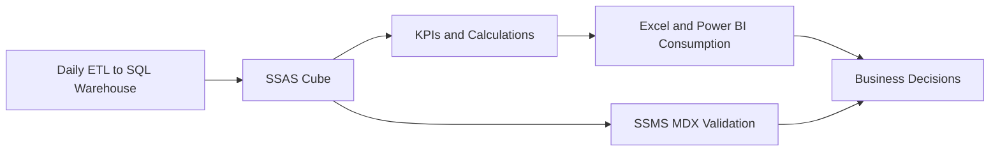
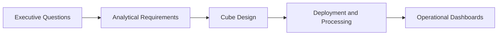
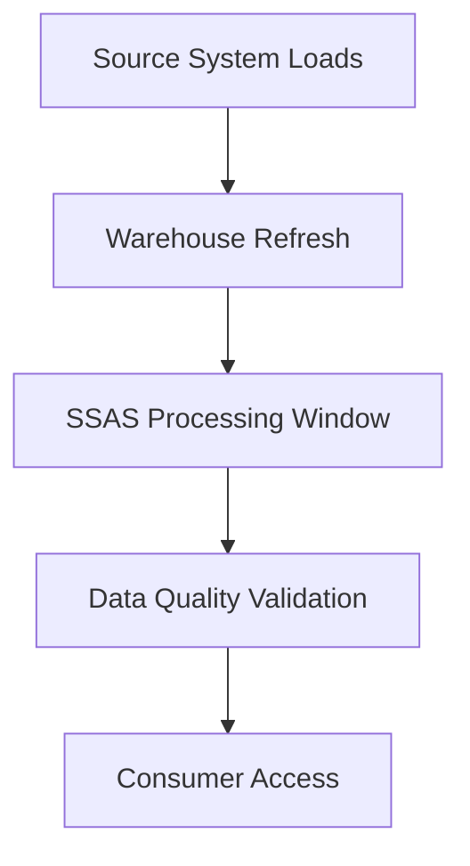
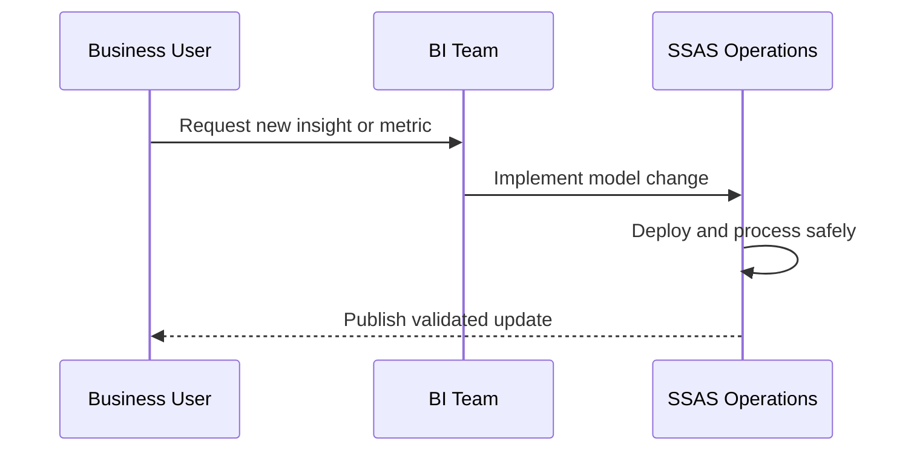
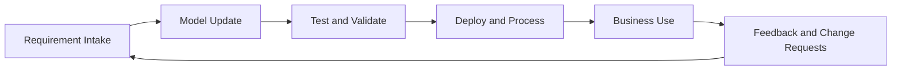

# Real-World SSAS Implementation at Assmang
## Day 02 | Assmang Pty Ltd — SSAS Fundamentals Training

---

## 🎯 Learning Objectives

By the end of this topic, participants will be able to:

1. Apply the full SSAS workflow to an Assmang-style business solution.
2. Design a business-ready analytical cube for production, cost, safety, and workforce reporting.
3. Understand deployment, maintenance, and reporting integration considerations.
4. Consolidate the course into a real implementation playbook.

---

## 📋 Topic Overview

**Dataset:** `v3_assmang_mining_complete.sql`  
**Difficulty:** Beginner (no prior SSAS experience required)  
**Estimated reading time:** 20-30 minutes

### What is this topic about?

This topic teaches you about **Real-World SSAS Implementation at Assmang**. If you have never worked with SQL Server Analysis Services before, don't worry — we will explain everything from scratch using plain language and real examples from Assmang's mining operations.

### Why does this matter to you?

As someone working at or with Assmang, you deal with data every day — production figures, costs, safety records, employee information. Right now, getting answers from that data probably involves:

- Asking someone in IT to write a report
- Waiting for Excel spreadsheets to be updated
- Running the same SQL queries over and over
- Not being sure if the numbers are up to date

SSAS solves these problems by creating a **pre-built analytical model** (called a "cube") that lets anyone with Excel or Power BI get instant answers without writing code.

### The Assmang training context

All examples in this course use data from Assmang's actual operations:

| Mine | What it produces | Where it is |
|------|-----------------|-------------|
| Beeshoek Mine | Iron Ore | Postmasburg, Northern Cape |
| Khumani Mine | Iron Ore | Kathu, Northern Cape |
| Black Rock Mine | Manganese | Hotazel, Northern Cape |
| Dwarsrivier Chrome Mine | Chrome | Burgersfort, Limpopo |
| Machadodorp Works | Chrome (processing) | Machadodorp, Mpumalanga |

---

## 🧠 Real-World Analogy (Plain English)

**Think of this topic like building a complete control room for a mine.**

This topic is like designing the entire control room for a mine. You decide what screens to display (dimensions and measures), what alarms to set (KPIs), how often to refresh the data (processing schedule), who can see what (security), and how to handle maintenance. It brings together everything you have learned into one complete, working solution.

> **Key insight:** SSAS takes complex data and makes it simple to explore. You don't need to be a programmer to use the results — you just need to know what question you want to answer.

---

## 1. Business requirements to cube design

### 💬 In plain English

Let's break down **business requirements to cube design** in the simplest possible terms:

**→** Production leaders need output and grade metrics by mine and time.

**→** Finance needs cost analytics by department and operation.

**→** Safety leadership needs incident and compliance monitoring.

**→** HR and management need employee metrics in context.

### 📚 Detailed explanation

This concept is important because it directly affects how well the cube works for business users. Here is a deeper look:

**Point 1: Production leaders need output and grade metrics by mine and time.**

What this means in practice: When you apply this at Assmang, it means that production leaders need output and grade metrics by mine and time. This is not just a technical exercise — it directly helps managers, engineers, and executives get better information faster.

**Point 2: Finance needs cost analytics by department and operation.**

What this means in practice: When you apply this at Assmang, it means that finance needs cost analytics by department and operation. This is not just a technical exercise — it directly helps managers, engineers, and executives get better information faster.

**Point 3: Safety leadership needs incident and compliance monitoring.**

What this means in practice: When you apply this at Assmang, it means that safety leadership needs incident and compliance monitoring. This is not just a technical exercise — it directly helps managers, engineers, and executives get better information faster.

**Point 4: HR and management need employee metrics in context.**

What this means in practice: When you apply this at Assmang, it means that hr and management need employee metrics in context. This is not just a technical exercise — it directly helps managers, engineers, and executives get better information faster.

### 🏭 Assmang scenario

**Situation:** A production manager at Khumani Mine asks: "Can I see this month's iron ore output compared to last month, broken down by shift?"

**How business requirements to cube design helps:** Because the cube already has the right structure (dimensions for time and mine, measures for production), this question can be answered in seconds using Excel or Power BI — no SQL coding needed, no waiting for IT.

### ❓ Frequently Asked Questions

**Q: Do I need to be a programmer to understand business requirements to cube design?**  
A: No. This concept is about business logic and design thinking. The tools (SSDT) provide visual interfaces for most of the work.

**Q: What happens if we get business requirements to cube design wrong?**  
A: The cube will still work technically, but users may get confusing results, slow performance, or missing data. That's why we follow best practices from the start.

**Q: How long does it take to set up business requirements to cube design for a real project?**  
A: For a project the size of Assmang's training cube, this typically takes a few hours of design work plus a few hours of implementation and testing.

---

## 2. Target cube design

### 💬 In plain English

Let's break down **target cube design** in the simplest possible terms:

**→** Dimensions: Mine, Date, Department, Employee, and any KPI-supporting dimensions.

**→** Measure groups: Production, Operating Costs, Equipment Efficiency, Safety KPI, Employee Metrics.

**→** Calculated layer: cost per tonne, target attainment, utilisation measures.

### 📚 Detailed explanation

This concept is important because it directly affects how well the cube works for business users. Here is a deeper look:

**Point 1: Dimensions: Mine, Date, Department, Employee, and any KPI-supporting dimensions.**

What this means in practice: When you apply this at Assmang, it means that dimensions: mine, date, department, employee, and any kpi-supporting dimensions. This is not just a technical exercise — it directly helps managers, engineers, and executives get better information faster.

**Point 2: Measure groups: Production, Operating Costs, Equipment Efficiency, Safety KPI, Employee Metrics.**

What this means in practice: When you apply this at Assmang, it means that measure groups: production, operating costs, equipment efficiency, safety kpi, employee metrics. This is not just a technical exercise — it directly helps managers, engineers, and executives get better information faster.

**Point 3: Calculated layer: cost per tonne, target attainment, utilisation measures.**

What this means in practice: When you apply this at Assmang, it means that calculated layer: cost per tonne, target attainment, utilisation measures. This is not just a technical exercise — it directly helps managers, engineers, and executives get better information faster.

### 🏭 Assmang scenario

**Situation:** A production manager at Khumani Mine asks: "Can I see this month's iron ore output compared to last month, broken down by shift?"

**How target cube design helps:** Because the cube already has the right structure (dimensions for time and mine, measures for production), this question can be answered in seconds using Excel or Power BI — no SQL coding needed, no waiting for IT.

### ❓ Frequently Asked Questions

**Q: Do I need to be a programmer to understand target cube design?**  
A: No. This concept is about business logic and design thinking. The tools (SSDT) provide visual interfaces for most of the work.

**Q: What happens if we get target cube design wrong?**  
A: The cube will still work technically, but users may get confusing results, slow performance, or missing data. That's why we follow best practices from the start.

**Q: How long does it take to set up target cube design for a real project?**  
A: For a project the size of Assmang's training cube, this typically takes a few hours of design work plus a few hours of implementation and testing.

---

## 3. Integration and consumption

### 💬 In plain English

Let's break down **integration and consumption** in the simplest possible terms:

**→** Excel is useful for analysts and pivot-based exploration.

**→** Power BI can consume SSAS live for dashboarding.

**→** SSMS and MDX remain valuable for admin testing and technical validation.

### 📚 Detailed explanation

This concept is important because it directly affects how well the cube works for business users. Here is a deeper look:

**Point 1: Excel is useful for analysts and pivot-based exploration.**

What this means in practice: When you apply this at Assmang, it means that excel is useful for analysts and pivot-based exploration. This is not just a technical exercise — it directly helps managers, engineers, and executives get better information faster.

**Point 2: Power BI can consume SSAS live for dashboarding.**

What this means in practice: When you apply this at Assmang, it means that power bi can consume ssas live for dashboarding. This is not just a technical exercise — it directly helps managers, engineers, and executives get better information faster.

**Point 3: SSMS and MDX remain valuable for admin testing and technical validation.**

What this means in practice: When you apply this at Assmang, it means that ssms and mdx remain valuable for admin testing and technical validation. This is not just a technical exercise — it directly helps managers, engineers, and executives get better information faster.

### 🏭 Assmang scenario

**Situation:** A production manager at Khumani Mine asks: "Can I see this month's iron ore output compared to last month, broken down by shift?"

**How integration and consumption helps:** Because the cube already has the right structure (dimensions for time and mine, measures for production), this question can be answered in seconds using Excel or Power BI — no SQL coding needed, no waiting for IT.

### ❓ Frequently Asked Questions

**Q: Do I need to be a programmer to understand integration and consumption?**  
A: No. This concept is about business logic and design thinking. The tools (SSDT) provide visual interfaces for most of the work.

**Q: What happens if we get integration and consumption wrong?**  
A: The cube will still work technically, but users may get confusing results, slow performance, or missing data. That's why we follow best practices from the start.

**Q: How long does it take to set up integration and consumption for a real project?**  
A: For a project the size of Assmang's training cube, this typically takes a few hours of design work plus a few hours of implementation and testing.

---

## 4. Operations and maintenance

### 💬 In plain English

Let's break down **operations and maintenance** in the simplest possible terms:

**→** Plan processing windows, environment promotion, backup, and documentation.

**→** Monitor slow queries, aggregation effectiveness, and business definition changes over time.

**→** Treat SSAS as a governed semantic layer, not just a technical object.

### 📚 Detailed explanation

This concept is important because it directly affects how well the cube works for business users. Here is a deeper look:

**Point 1: Plan processing windows, environment promotion, backup, and documentation.**

What this means in practice: When you apply this at Assmang, it means that plan processing windows, environment promotion, backup, and documentation. This is not just a technical exercise — it directly helps managers, engineers, and executives get better information faster.

**Point 2: Monitor slow queries, aggregation effectiveness, and business definition changes over time.**

What this means in practice: When you apply this at Assmang, it means that monitor slow queries, aggregation effectiveness, and business definition changes over time. This is not just a technical exercise — it directly helps managers, engineers, and executives get better information faster.

**Point 3: Treat SSAS as a governed semantic layer, not just a technical object.**

What this means in practice: When you apply this at Assmang, it means that treat ssas as a governed semantic layer, not just a technical object. This is not just a technical exercise — it directly helps managers, engineers, and executives get better information faster.

### 🏭 Assmang scenario

**Situation:** A production manager at Khumani Mine asks: "Can I see this month's iron ore output compared to last month, broken down by shift?"

**How operations and maintenance helps:** Because the cube already has the right structure (dimensions for time and mine, measures for production), this question can be answered in seconds using Excel or Power BI — no SQL coding needed, no waiting for IT.

### ❓ Frequently Asked Questions

**Q: Do I need to be a programmer to understand operations and maintenance?**  
A: No. This concept is about business logic and design thinking. The tools (SSDT) provide visual interfaces for most of the work.

**Q: What happens if we get operations and maintenance wrong?**  
A: The cube will still work technically, but users may get confusing results, slow performance, or missing data. That's why we follow best practices from the start.

**Q: How long does it take to set up operations and maintenance for a real project?**  
A: For a project the size of Assmang's training cube, this typically takes a few hours of design work plus a few hours of implementation and testing.

---

## 📊 Architecture / Concept Diagram

The following diagram shows how this topic fits into the bigger picture:

### How to read this diagram

- **Left side:** Where your raw data lives (SQL Server database tables containing production, cost, safety, and employee data).
- **Middle:** Where SSAS transforms that raw data into an analytical structure (the cube with its dimensions, hierarchies, and measures).
- **Right side:** Where business users access the results (Excel pivot tables, Power BI dashboards, or MDX query results in SSMS).

### Why this matters

Without SSAS (the middle layer), every time a manager wants an answer, someone has to write SQL code against the raw database. With SSAS, the analytical structure is pre-built, so users can explore data independently using familiar tools like Excel.

---

## 📖 Key Terminology Reference

Here are the most important terms for this topic. Don't worry about memorising them all — you will learn them naturally through practice:

| Term | Plain English Definition | Example at Assmang |
|------|------------------------|-------------------|
| **Cube** | A pre-built analytical structure that lets users explore data from many angles | The "Assmang Mining Analytics" cube containing all production and cost data |
| **Dimension** | A category you use to slice data (like filters in Excel) | Mine, Date, Department, Employee — these are the "by what" categories |
| **Hierarchy** | A drill-down path from general to specific | Year → Quarter → Month → Day (time hierarchy) |
| **Member** | One specific value within a dimension | "Beeshoek Mine" is a member of the Mine dimension |
| **Measure** | A number you want to analyse | Tonnes Produced, Revenue in ZAR, Cost Per Tonne |
| **Measure Group** | A collection of related measures from one business area | Production Measures (tonnes + grade + revenue) |
| **Fact Table** | The database table that stores the raw numbers | FactProduction, FactOperatingCosts |
| **Processing** | Loading data into the cube and building pre-calculated summaries | Running a nightly job that refreshes yesterday's production data |
| **Aggregation** | A pre-calculated total or average stored for speed | Total tonnes per mine per month (calculated once, queried many times) |
| **MDX** | The query language used to ask questions of a cube | Similar to SQL, but designed for multidimensional analysis |
| **MOLAP** | Storage mode where data is stored inside the cube for maximum speed | Default choice for Assmang — gives sub-second query times |
| **ROLAP** | Storage mode where data stays in SQL Server (slower but always fresh) | Used when real-time data is more important than speed |
| **KPI** | A traffic-light indicator showing whether a target is being met | Production KPI: Green if >= 90% of target, Red if < 70% |
| **SSDT** | SQL Server Data Tools — the IDE where you design and build cubes | Visual Studio with the SSAS project templates |
| **SSMS** | SQL Server Management Studio — for administration and testing | Where you deploy cubes and run MDX queries |
| **Data Source View (DSV)** | A logical view of which database tables the cube uses | Selecting Dim_Mine, Dim_Date, FactProduction for inclusion |
| **Deployment** | Pushing your cube design from your computer to the SSAS server | Like publishing a website — makes it available to users |

---

## 🧭 Additional Diagrams

### Diagram 1: Business-to-Technical Traceability

### Diagram 2: Production Operating Model

### Diagram 3: Governance Feedback Loop

## 📌 Topic-Specific Summary

This topic integrates all prior modules into production reality: requirement capture, model governance, deployment operations, and stakeholder trust built through repeatable validation.

At this stage, success is not only technical. It includes adoption, reliability, and confidence that decision-makers can depend on the numbers.

## Deep Dive in Layman Terms

A real implementation is a living service, not a one-time project. Requirements change, data quality changes, and business priorities shift. The SSAS model must be maintained as an operational asset.

Governance is what keeps it healthy: change control, processing schedules, validation checkpoints, and clear ownership.

### Assmang-style example

Finance may ask for a new cost ratio, operations may ask for a weekly shift view, and safety may request a new incident severity slice. A mature SSAS operating model handles all three without destabilizing existing dashboards.

### Clarity diagram: Production lifecycle

